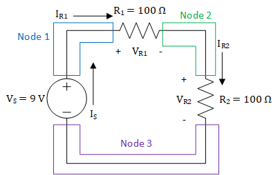
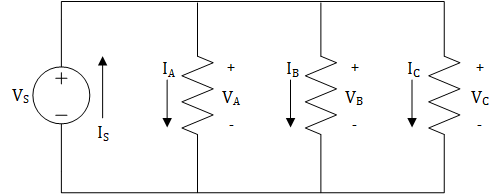
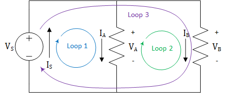
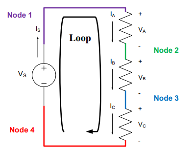
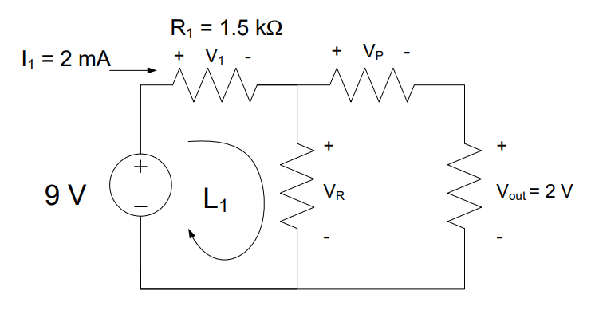

# Lesson 2 -- KVL and KCL

## Learning Objectives covered in this Lesson

1.  I can calculate the voltages, currents, and power associated with devices in a simple DC-powered circuit using tools such as KVL, KCL, voltage and current dividers, Ohm’s Law, and the power equation.

## Motivation

As we add more devices to a circuit, interesting and useful things begin
to happen. However, circuits with more devices are much more complex and
cannot be solved with Ohm's Law and the Power Equation alone.[^1] To
demonstrate this, let's start by looking at one of the circuits we
analyzed last lesson.

Figure 1: A simple circuit consisting of one voltage source and one
resistor

When analyzing the circuit shown in Figure *1*, we can say that the
voltage between the positive (+) and negative (-) terminals of the
voltage source must differ by 9 V. We can see this one of two ways: one
way from the perspective of the voltage source and the other way from
the perspective of the circuit. From the perspective of the voltage
source, the voltage source forces there to be 9 V voltage *rise* between
the negative and positive terminals, and from the perspective of the
circuit, the circuit must have a 9 V *drop* between the positive and
negative terminals. We explained this last lesson by saying that the
higher pressure will be on the positive terminal and the lower pressure
will be on the negative terminal. Nevertheless, we see that the voltage
provided by the voltage source must be dropped across the rest of the
circuit, which is only a resistor in this case. Now that we know the
voltage drop across the 100 Ω resistor is 9 V, we can use Ohm's law to
find the current through the resistor, which is 90 mA. At this point, we
know $V_{S},\ V_{R},\ and\ I_{R}$, but we do not know $I_{S}$.
Unfortunately, the ECE tools we've learned up until this point, Ohm's
Law and the Power Equation, cannot help us find $I_{S}$. To find that,
we need *Kirchhoff's Current Law*.

When we said that there must be a 9 V drop across the circuit, we didn't
fully explain why this occurs. Due to the law of conservation of energy,
any voltage rise must be accompanied by voltage drops across the devices
in a circuit. More specifically, the sum of these voltage drops must
equal the voltage rise. For the circuit in Figure 1, we can say that the
voltage drop across the resistor is the same as the voltage rise because
we only have one resistor. However, in circuits with more than one
resistor, we have to sum the voltage drops. Consider the circuit in
Figure 2. If we knew that $V_{R2}$ was equal to 4.5 V, we could use
Ohm's Law to solve for $I_{R2}$, but we cannot use Ohm's Law or the
Power Equation to solve for $V_{R1}$. For that, we need to use
*Kirchhoff's Voltage Law*. Kirchhoff's Voltage Law tells us how to sum
voltage drops, and by summing voltage drops, we can solve for $V_{R1}$.
Interestingly, we can also use Kirchhoff's Current Law to solve for
$V_{R1}$, but we will wait a bit to explain that.

Figure 2: A circuit consisting of one voltage source and two resistors

## Kirchhoff's Laws

Before getting into Kirchhoff's Voltage Law (KVL) and Kirchhoff's
Current Law (KCL), we need to cover the fundamentals of these laws and
some definitions. Kirchhoff's Laws are derived from conservation laws.
KVL is derived from the law of conservation of energy. The law of
conservation of energy tells us that energy cannot be created or
destroyed and can only be transformed from one type to another, such as
gravitational potential energy to kinetic energy or chemical energy to
kinetic energy. From last lesson, we know that voltage is the amount of
work (or energy) per charge, so we can infer that KVL will explain how
the voltage is conserved in a circuit. KCL is derived from the law of
conservation of charge. The law of conservation of charge tells us that
charge cannot be created or destroyed, meaning that the amount of charge
flowing into a region will be equal to the amount of charge flowing out
of that region. Since we know that the flow of charge (electrons) is
equal to the current, we now know that current flowing into a region
must be conserved.

KVL and KCL are concerned with how the devices in a circuit are
arranged. In contrast to Ohm's Law and the Power Law, KVL and KCL do not
tell us anything about the individual devices. Instead, they tell us how
the connections between devices impact the voltage across our devices
(KVL) and the current through our devices (KCL). In order to use KVL and
KCL, we must have a common terminology for these connections, and we
refer to these connections in terms of **nodes** and **loops** in
circuits.

A **node** is a wire, or other electrical conductor, that connects two
or more electrical devices. Nodes are just the connections between
devices, so if you have found a junction between devices, then you have
found a node. In some circuits, a node can stretch the length of the
circuit, so don't let that be a source of confusion. The circuit in
Figure 1 has two nodes: one at the top connecting the positive terminals
of both devices and one at the bottom connecting the negative terminals
of both devices. The circuit in Figure 2 has three nodes, and Figure 3
shows these nodes.

Figure 3: Nodes in a circuit with one voltage source and two resistors

It's important to be able to identify the nodes in various circuits,
regardless of the complexity of those circuits. The circuit shown in
Figure 4 has one voltage source and three resistors connected in a
parallel configuration.[^2] As shown in Figure *5*, the circuit only has
two nodes: one on the top and one on the bottom. Remember, a node is
just a conductor that connects multiple devices, and while it may seem
odd to have a node that stretches the entire circuit, this is completely
acceptable.

Figure 4: A parallel circuit with one voltage source and three resistors

Figure 5: Nodes in a parallel circuit with one voltage source and three
resistors

A **loop** is a closed path where, starting at an arbitrary node, you
can trace a path back to the original node without passing through any
other nodes more than once. We use the term "closed path" to denote a
path around a circuit that is completely enclosed by wires and starts
and ends at the same location. In this class, we will trace loops in a
clockwise manner, and oftentimes, we will start at the node above the
voltage source. The circuit shown in Figure 2 only has one loop, and
this is shown in Figure 6.

Figure 6: Loop for a circuit with one voltage source and two resistors

The loop shown in Figure 6 starts at node 1 above the voltage source
then passes through $R_{1}$, node 2, $R_{2}$, node 3, and the voltage
source before returning to node 1. We only have one loop because there
is only one distinct closed path through this circuit. Unfortunately, a
circuit with only one loop can only teach us so much about loops. Figure
7 shows a circuit that is very similar to the circuit in Figure 4, with
the exception that the right-most resistor has been removed. We can see
that the circuit has three loops: one in each "window" of the circuit
and one around the entire circuit. It is very easy to forget about the
loop around the outside of the circuit, so remember that loops are not
restricted to the "windows" in a circuit. As we get to more complex
circuits, we will see that a loop can circle around two or more
"windows".

Figure 7: Loops in a parallel circuit with one voltage source and two
resistors

Now that we have an understanding of nodes and loops in a circuit, we'll
get into the details of KVL and KCL.

## Kirchhoff's Voltage Law (KVL)

As stated earlier, KVL is based on the law of conservation of energy. We
know that voltage is energy per charge, and KVL tells us that voltages
around loops in a circuit are conserved. Put another way, voltage rises
must be accompanied by voltage drops. As we trace around a loop in our
circuit, the voltage rises and voltage drops must sum to zero. Another
way to put this is "what goes up, must come down."

**Key Concept:** KVL states that all the voltages around a loop must add
up to exactly zero.

As we trace around a loop in our circuits, we need an easy way to know
whether the voltage drops or rises across a device. To that end, we
label each of our devices with a plus (+) and a minus (-) on either end
to designate the voltage across the device. As we move clockwise through
a loop, moving from a minus to a plus results in a *voltage rise*.
Similarly, moving from a plus to a minus results in a *voltage drop*.

**KVL Analysis I**

We will use the circuit in Figure 8 to explain how KVL may be used in
circuit analysis. First, we begin by identifying the nodes and loops. As
you can see from Figure 8, there are four nodes and only one loop in the
circuit.

Figure 8: Nodes and loops for a series circuit[^3] with one voltage
source and three resistors

KVL is primarily concerned with the loops in a circuit; the nodes are
only used as a means to help identify the loops. Each loop in a circuit
can generate only one KVL equation. Since there is only one loop in the
circuit in Figure 8, KVL will only give us one equation to help analyze
this circuit. If we start in the lower left-hand corner and move
clockwise along the loop, the first thing we come to is a voltage
source. Since we move from a minus (-) to a plus (+) through the source,
Vs, it is considered a voltage rise. We will consider voltage rises as
"positive voltages" or a gain in voltage, so we will place a positive
sign in front of them in the KVL equation. Continuing around the loop,
we come to three resistors, each of which drops the voltage by *VA*,
*VB*, and *VC*, respectively. We will consider voltage drops as
"negative voltages" or a loss of voltage, so we will place a negative
sign in front of these voltages. Applying KVL to this circuit gives us
the following KVL equation:

$$V_{S} - V_{A}{- V}_{B} - V_{C} = 0$$

Another way to view KVL is to say that for any loop in a circuit:

***Total Voltage Rises = Total Voltage Drops***.

This points to something we were saying earlier: KVL is just a
specialized application of the conservation of energy. So, if we apply
this to the circuit above, we get:

$$V_{S} = V_{A}{+ \ V}_{B} + V_{C}$$

This equation is mathematically identical to the first one, but it is
usually easier to use. The very important principle to remember about
KVL is that it **only applies to loops in a circuit**.

For example, if we were using a 9 V source, then the sum of the voltage
drops must equal the 9 V increase from the source. In other words,

$${9\ V = V}_{A}{+ \ V}_{B} + V_{C}$$

If we knew VA = 2 V and VB = 4 V, then VC would have to equal 3 V
due to the following:

$$V_{C} = {9\ V - V}_{A}{- \ V}_{B} = 9V - 2V - 4V = 3V$$

### KVL Analysis II

Now, let's apply KVL to the circuit in Figure 7. Since there are three
loops in the circuit, we know there must be three KVL equations.
Traversing the loops in a clockwise manner and following our sign
convention for voltage rises and drops gives:

  -----------------------------------------------------------------------
  $$V_{S} - V_{A} = 0$$

  $$V_{A} - V_{B} = 0$$

  $$V_{S} - V_{B} = 0$$
  ----------------------- ----------------------- -----------------------

  -----------------------------------------------------------------------

The leftmost equation is for loop 1, the middle equation is for loop 2,
and the rightmost equation is for loop 3. The interesting result is all
of these equations simplify to the identity:

$$V_{S} = V_{A}{= V}_{B}$$

Again, if we were using a 9 V source, this would mean the full 9 V drops
across each of the resistors. If we were to add a fourth or a fifth or a
twentieth resistor in the same manner (known as parallel -- more on this
next lesson), each additional resistor would also get the full 9 V.

**Example Problem 1**: A 9V battery is used to power the circuit below.
The current through R1 is 2 mA and the output voltage, Vout, is 2 V.
Find the voltages VR and VP.

**Understand**: We have a circuit with four nodes, three loops, a
voltage source, and several resistors.

**Identify**:

-   **Knowns:** We know 2mA is flowing through R1 (which has a
    resistance of 1.5kΩ) and the voltage Vout is 2V. We also know
    the source voltage is 9V.

-   **Unknowns:** VR and VP. We also don't know the resistance
    values for either of those resistors.

-   **Assumptions:** None.

**Plan**: Since the circuit involves mostly voltages, we know we can use
KVL to try and find the unknown voltages. We see there are three loops;
therefore, we can find three KVL equations. However, since we don't have
the voltage values across all the resistors, we will have to use Ohm's
law to find the voltage drop V1.

**Solve:** First, we apply KVL around the loop, L1,

$$9\ V - V_{1}{- \ V}_{R} = 0$$

$${\ V}_{R} = 9V - V_{1}$$

However, we don't know V1 yet. Since we know both the resistance of
and the current through the 1.5 kΩ resistor, we can find the voltage
across it using Ohm's Law:

$$V_{1} = I_{1}R_{1} = (2\ mA)(1.5\ k\mathrm{\Omega}) = \ 3\ V$$

This allows us to easily find VR:

$${\ V}_{R} = 9V - 3V = 6V$$

To find VP, we can use the KVL equation from one of the other loops.
We'll use the outside loop, which contains the source, the two resistors
on top, and the rightmost resistor. This gives us:

$$9\ V - V_{1} - V_{P} - V_{out} = 0$$

$$V_{P} = 9\ V - V_{1} - V_{out} = 9\ V - 3\ V - 2\ V = 4\ V$$

$${\ \ V}_{P} = 4\ V$$

**Answer**: VR = 6 V and VP = 4 V.

## Kirchhoff's Current Law (KCL)

KCL is rooted in the law of conservation of charge. Since current is the
flow of charge (specifically electrons), KCL tells us that currents
entering nodes must be conserved. This means that the current entering a
node must be equal to the current leaving a node. In other words, what
goes into a node must also come out of that node. Typically, we will
phrase this slightly differently by saying that the sum of all currents
entering and leaving a node must equal zero.

**Key concept:** KCL states that the sum of all currents entering and
leaving a node is exactly zero.

Before we demonstrate KCL, let's take a look at how currents are
labelled in circuits. We label currents as emerging from the positive
terminal of voltage sources and entering the positive terminal of
resistors. This reflects our definition of current, which says that the
current flows from the positive terminal to the negative terminal of
voltage sources. Additionally, this convention helps express the fact
that voltage sources provide power while the resistors dissipate it.

Whereas KVL is concerned with loops, KCL is concerned with nodes.
Applying KCL to a circuit gives one KCL equation for each node, and when
writing those equations, we put a positive sign in front of currents
that enter nodes and a negative sign in front of currents that leave
nodes. Think of it this way: currents entering nodes *add* charge to the
node whereas currents leaving nodes *subtract* (or remove) charge from
the node. The following examples will demonstrate this.

### KCL Analysis I

Let's apply KCL to the circuit in Figure 2. The first step is to identify all of the nodes in the circuit.
Fortunately, the nodes are identified in Figure 3, so we know that there
are three nodes in the circuit. Starting with node 1 in the top
left-hand corner, we see that the only current entering the node comes
from the source, *IS*, while the only current leaving the node is the
one entering the first resistor, *IR1*. Therefore, in our KCL equation
for node 1, *IS* will be positive, and *IR1* will be negative.
Looking at node 2, we can see that *IR2* leaves the node, but it may
be difficult to see which current enters the node. Knowing that currents
travel *through* devices can shed some light on this. The current
*IR1* travels through $R_{1}$ and exits the negative terminal of
$R_{1}$, meaning it enters node 2. The same thing happens with node 3:
*IR2* enters the node and *IS* leaves it. If we write an equation
for each of these nodes, we get:

  ---------------------------------------------------------------------------
  $$I_{S} - I_{R1} = 0$$

  $$I_{R1} - I_{R2} = 0$$

  $$I_{R2} - I_{S} = 0$$
  ------------------------ ------------------------- ------------------------

  ---------------------------------------------------------------------------

These four equations can be combined into the following identity:

$$I_{S} = I_{R1}{= I}_{R2}$$

This identity demonstrates an important point: when devices are placed
one after another (known as series -- more on this next lesson), they
have the same current flowing through them.

### KCL Analysis II

The current flow in the circuit shown in Figure 4 is a bit more
complicated than the current flow in Figure 2, but as we can see from
Figure 5, we only have two nodes to deal with.

Applying KCL at node 1, we find that only one current, $I_{S}$, enters
the node and three currents, $I_{A},\ I_{B},\ and\ I_{C}$, leave the
node. This gives us the KCL equation:

$$I_{S} - I_{A}{- I}_{B} - I_{C} = 0$$

Looking at node 2, we see that everything is flipped: $I_{S}$ leaves the
node and $I_{A},\ I_{B},\ and\ I_{C}$ enter the node. This results in
the following KCL equation.

$${- I}_{S} + I_{A}{\  + \ I}_{B} + I_{C} = 0$$

This is the same equation except the signs are reversed. If we wished,
we could simplify either of these equations into:

$$I_{S} = I_{A}{+ \ I}_{B} + I_{C}$$

For any node in a circuit, KCL can also be written as

*Total Current In = Total Current Out*

By way of example, let's power the circuit in Figure 4 with a 9-V
source. If we measured the currents through each of the resistors to be
*IA* = 1 A, *IB* = 3 A, and *IC* = 2 A, then our voltage source
would have to provide 6 A of current due to the following:

$$I_{S} = I_{A}{+ \ I}_{B} + I_{C} = 1\ A + 3\ A + 2\ A = 6\ A$$

## Circuit Analysis and Examples

KVL and KCL provide sets of equations that describe the relationships of
voltages and currents within a circuit. They are powerful tools, and
when combined with Ohm's Law and the power equation, they can be used to
completely analyze any resistive circuit. The following example problems
show how this process works.

**Example Problem 2:** A 9-V battery is used to light two light bulbs,
modeled as 45-Ω resistors in the circuit below. How much current flows
through each bulb?

**Understand:** We have a source VS that is feeding two resistors R1
and R2. The circuit has one loop and three nodes.

**Identify:**

-   **Knowns:** VS, R1, and R2

-   **Unknowns:** The currents IS, I1, and I2; the voltages V1
    and V2.

-   **Assumptions:** The light bulbs can be modeled as resistors.

**Plan:** We need to find the currents through the two bulbs, labeled as
I1 and I2. We will first write the KCL equations at each node, then
use KVL to find the relationship between the voltages in the circuit.
Finally, we will use Ohm's law to tie the KCL and KVL equations
together.

**Solve:** Applying KCL to the nodes gives us the following identity:

$$I_{S} = I_{1}{= I}_{2}$$

In other words, the same current flows through every component in the
circuit (reference "KCL Analysis I" earlier if this step confused you).

Since this circuit contains one closed loop, we can apply KVL to this
loop to find the following equation:

$$9\ V - V_{1} - V_{2} = 0$$

Since we have no way to solve for the voltages or currents directly, we
will use Ohm's Law to tie the two equations together. For each of the
resistors, Ohm's Law tells us:

$$V_{1} = I_{1}R_{1} = I_{1}(45\ \Omega)$$

$$V_{2} = I_{2}R_{2} = I_{2}(45\ \Omega)$$

If we substitute these into the KVL equation, we get:

$$9\ V - I_{1}(45\ \Omega) - I_{2}(45\ \Omega) = 0$$

We know from KCL that all of the currents are the same in the circuit
$(I_{S} = I_{1}{= I}_{2})$. Therefore, this equation can be simplified
to:

$$9\ V - I_{S}(45\ \Omega) - I_{S}(45\ \Omega) = 0$$

$$9V - I_{S}(90\Omega) = 0$$

After using some algebra, we solve to find the source current, IS:

$I_{S} = \ \frac{9\ V}{90\ \mathrm{\Omega}} = \ 100 \ mA$

Since all of the currents are the same, we have that
$I_{S} = I_{1}{= I}_{2} = 100\ mA$.

**Answer:** The 9-V battery provides 100 mA of current to each bulb.

**Example Problem 3:** A car stereo (modeled as a 40-Ω resistor) and a
GPS navigation system (modeled as a 2-kΩ resistor) are connected to a
12-V car battery, shown in the circuit below. Determine how much power
is consumed by each device and how much power the source provides.

**Understand:**

-   **Knowns:** VS, RStereo, and RGPS

-   **Unknowns:** The currents IS, IStereo, and IGPS; the voltages
    VStereo and VGPS. We are required to find the power consumed
    by each device and the power produced by the voltage source.

-   **Assumptions:** None.

**Plan:** We must first find the voltage across or the current through
each resistor before we can use the power equation to find the power
consumed. Since we have three loops, KVL will give us three equations.
Similarly, the two nodes in the circuit will give us two KCL equations.
Once we have the voltage across or the current through each component,
we can use the Power Equation, in concert with Ohm's Law, to determine
how much power each component consumes. In order to find the power that
the source provides, we will need to determine the total current
provided by the source (IS). Once we have this, we can use the Power
Equation to find the power provided by the source.

**Solve:** Since we do not know any of the currents, KCL will not help
us determine the current through each resistor. However, we are given
the voltage provided by the source, so we can use KVL to solve for the
voltages. The KVL equations for this circuit are shown below.

  -------------------------------------------------------------------------------------
  $$12\ V - V_{Stereo} = 0$$
  $$V_{Stereo} - V_{GPS} = 0$$
  $$12\ V - V_{GPS} = 0$$
  ---------------------------- ------------------------------ -------------------------

We can simplify these equations into the following equation:

$$12\ V = V_{Stereo} = V_{GPS}$$

From this, KVL tells us that the voltage drop across each device is 12 V
(reference the earlier section titled "KVL Analysis II"). Now, we can
use the Power Equation and Ohm's Law to solve for the power consumed by
each device.

$$P_{Stereo} = \frac{{V_{STEREO}}^{2}}{R_{STEREO}} = \frac{(12\ V)^{2}}{40\ \Omega} = 3.6\ W$$

$$P_{GPS} = \frac{{V_{GPS}}^{2}}{R_{GPS}} = \frac{(12\ V)^{2}}{2\ k\Omega} = 72\ mW$$

Next, we need to find the current provided by the source. To start, we
will find the KCL equation for the top node. As mentioned earlier in the
section titled "KCL Analysis II", both nodes will have equivalent KCL
equations, so only one equation is needed.

$$I_{s} - I_{Stereo} - I_{GPS} = 0$$

$$I_{S} = I_{Stereo} + I_{GPS}$$

We can use Ohm's Law in concert with our KCL equation to solve for the
source current, *IS*.

$$I_{S} = \frac{V_{Stereo}}{R_{Stereo}} + \ \frac{V_{GPS}}{R_{GPS}} = \frac{12\ V}{40\ \Omega} + \frac{12\ V}{2\ k\Omega} = 300\ mA + 6\ mA = 306\ mA$$

Now that we know both the voltage and current provided by the source, we
can solve for the power provided by the source.

$${P_{S} = I}_{S}V_{S} = (306\ mA)(12\ V) = 3.672\ W$$

Looking back at the power consumed by each device, we can see that the
total power consumed by both devices is equal to $3.672\ W$ -- exactly
the same as the power provided by the source!

**Answer:** The stereo consumes 3.6 W while the GPS consumes 72 mW. The
source provides 3.672 W.

-------------------------------------------------------------------------------------------------------------------------------------------
## Conservation of Power

The last example problem touched on an important concept: **power is
conserved in circuits**. This means that the power provided by the
source must always be equal to the power consumed by the devices. You
can use this principle to check your work. If, at the conclusion of your
circuit analysis, you find that the power provided by the source is not
equal to the power consumed by the devices, then you did something wrong
in your analysis. The engineering method, most notably the "Test and
Evaluate" and "Reflection" steps, requires that we check our work, so
make a habit out of checking your work in this class!

[^1]: We can say we have "solved" a circuit once we have found the
    voltage and current for each device. Solving the circuit shown in
    Figure 1 would mean finding $V_{S},\ I_{S},\ V_{R},\ and\ I_{R}$.

[^2]: We will discuss parallel configurations in more detail next
    lesson.

[^3]: We will discuss series circuits in more detail next lesson.
