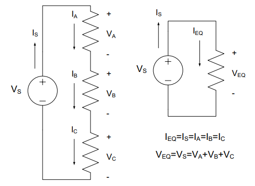
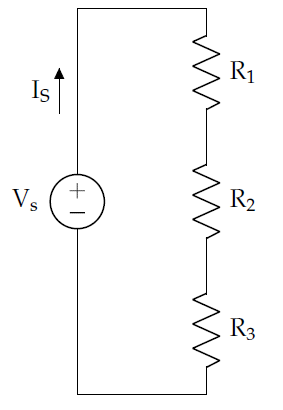

# Lesson 2 -- Series and Parallel Circuits

## Learning Objectives covered in this Lesson

1.  I can calculate the voltages, currents, and power associated with devices in a simple DC-powered circuit using tools such as KVL, KCL, voltage and current dividers, Ohm’s Law, and the power equation.

2. I can determine appropriate circuit breaker values for adequate system protection.

## Motivation

Last lesson we analyzed circuits containing two
different configurations for connecting resistors, or devices that can
be modelled as resistors, up to a voltage source. These configurations,
known as series and parallel, were deliberately chosen because they
represent fundamental ways of connecting devices. The vast majority of
circuits we'll encounter will place its components in either parallel or
series (or both) arrangements.

## Series Resistors

Looking at the circuit below, we have a "series" arrangement. The
resistors are connected end-to-end in a chain. Once those ends are
connected to a voltage source, the same amount of current flows
sequentially through each device, and each device is subjected to a
fraction of the voltage. For a long string of lights, this is a way to
apply a small voltage to each light, but a disadvantage is that one bad
light will break the circuit, preventing current from flowing.

Figure 1: A series circuit with one voltage source and three resistors

**Key Concept:** When only two components are connected at a node, those
components are in series.

Analyzing the series circuit in Figure 1, starting with KVL for the one
and only loop, we write:

$$V_{S} - V_{A} - V_{B} - V_{C} = 0$$

$$V_{S} = V_{A}\ {+ \ V}_{B} + V_{C}$$

Each voltage across a resistor can be rewritten using Ohm's Law:

$$V_{S} = I_{A}R_{A} + I_{B}R_{B} + I_{C}R_{C}$$

Using KCL at each node, we can conclude that our current terms are all
equal. A more general conclusion is that any number of resistors in
series have the same current.

$$I_{S} = I_{A}{= I}_{B} = I_{C}$$

**Key Concept:** The current flowing through series components is always
the same.

Returning to our KVL equation and substituting all current terms with
the term *IS*, we have:

$$V_{S} = I_{S}R_{A} + I_{S}R_{B} + I_{S}R_{C}$$

$${V_{S} = I}_{S}\left( R_{A} + R_{B} + R_{C} \right)$$

$${V_{S} = I}_{S}R_{EQ(SERIES)}$$

The last step above introduces the term REQ(SERIES) where EQ is an
abbreviation for "equivalent" and stands in for the sum of all
resistances. Moreover, we can replace the three resistors with an
equivalent circuit as shown below, allowing us to analyze the circuit's
behavior as if it were just one voltage source and one resistor.

Figure 2: A series circuit and its equivalent

**Key Concept:** The equivalent resistance of resistors connected in series is the sum of the individual resistances:

$$R_{EQ(SERIES)} = R_{1}{+ R}_{2} + \cdots + R_{n}$$

Figure 3: Combining resistors in series into a single resistor

At any location within a circuit, if we find two or more resistors in
series, we can simplify them without even knowing the voltage or
current. We can sum the resistances and rewrite that portion of the
circuit as a single resistor. However, we must be careful that they are
actually in series by verifying that there's nothing else attached to
the interior nodes. After all, those interior nodes will "disappear"
when the resistors are replaced.

------------
### Example Problem 1
An inertial navigation system (INS) for a UAS is
modeled as 4 resistors in series with a 28-Volt power supply. How much
power is being produced by the power supply?

**Understand:** We have a number of devices (modeled as resistors)
connected in series with a voltage source.

**Identify Key Information:**

-   **Knowns:** resistance values of each component and the source
    voltage is 28V.

-   **Unknowns:** voltage across each resistor; power produced by the
    source, PS.

-   **Assumptions:** all of the power produced by the source is consumed
    by the load resistors.

**Plan:** By consolidating the series
resistors into a single equivalent resistor, we can use the power
equation to determine the power consumed by the equivalent load. We then
assume the source is producing all of the power needed by the load.

**Solution:** Given VS = 28V, PS can be found directly from IS
using a power relationship:

$$P_{S} = I_{S}V_{S}$$

In order to find IS, we must find a component in the circuit where we
know at least two of the four parameters of power, current, voltage, and
resistance. For any single resistor, we only know the resistance, but
for all the resistors together, the voltage is known.

By simplifying the 4 resistors into single equivalent resistor, there
will be a component with enough information to analyze the circuit.
Compute equivalent resistance:

$$R_{EQ} = R_{1} + R_{2} + R_{3} + R_{4}$$

$$R_{EQ} = 100\ \Omega + 200\ \Omega + 300\ \Omega + 400\ \Omega = 1\ k\Omega$$

For descriptive purposes, we'll redraw the circuit using the equivalent
resistance and designate this device by the subscript "REQ" (referring
to the "equivalent resistance"). By KVL, VREQ = VS. We can now use
the power equation in concert with Ohm's Law to determine the power
consumed by the equivalent resistor.

$$P_{REQ} = \frac{{V_{REQ}}^{2}}{R_{EQ}} = \frac{{(28\ V)}^{2}}{1\ k\Omega} = 784\ mW$$

**Answer:** 784 mW.

------------
------------
### Example Problem 2
Two light bulbs are placed in series in the two
circuits below and are each represented by resistors R1 and R2. The
voltage source in both circuits remains the same, as well as the sum of
the resistors. In Circuit #1, the resistors are equal, but for Circuit
#2, they are different. For each circuit, how much power is consumed by
each light bulb?

**Understand:** Two light bulbs are connected in series. We want to
compare the power consumption as the resistances change between two
different circuits.

**Identify Key Information:**

-   **Knowns:** The resistance values of each bulb and the source
    voltage, VS = 9 V.

-   **Unknowns:** Power consumed (P1 and P2) for Circuits #1 and #2;
    current in the circuits

-   **Assumptions:** The bulbs can be modeled as resistors.

**Plan:** In order to find the power consumed, we must either find the
voltage or current through the resistors. Since we don't have the tools
yet to determine the voltages, we can find the current by replacing the
two series resistors with a single equivalent resistors. KVL will then
give us the voltage across the equivalent resistor.

**Solve:** The equivalent resistance of each circuit is:

**Circuit #1**

$$R_{EQ,1} = 45\Omega + 45\Omega = 90\Omega$$

**Circuit #2**

$$R_{EQ,2} = 30\Omega + 60\Omega = 90\Omega$$

The equivalent resistance for both circuits is the same: 90Ω. This means
that we can model both circuits with the circuit below.

By KVL, we see that all 9V is dropped across the 90Ω resistor.
Therefore, Ohm's Law gives the following:

$$9V = \ I_{S}(90\mathrm{\Omega})\ \ \ \ \ thus\ \ \ \ \ I_{S} = \frac{9\ V}{90\ \Omega} = 100\ mA$$

Now, we have all the information we need to calculate the voltages and
currents through each resistor in each circuit:

| **Circuit #1** | **Circuit #2** |
|----------------|----------------|
|$V_{1} = (45\ \Omega)I_{1}$| $V_{1} = (30\ \Omega)I_{1} = (30\ \Omega)(100\ mA) = 3.0\ V$|
|$V_{2} = (45\ \Omega)I_{2} = (45\ \Omega)(100\ mA) = 4.5\ V$|$V_{2} = (60\ \Omega)I_{2} = (60\ \Omega)(100\ mA) = 6.0\ V$|
|$P_{1} = I_{1}V_{1} = (4.5\ V)(100mA) = 450\ mW$|$P_{1} = I_{1}V_{1} = (3.0\ V)(100\ mA) = 300\ mW$|
|$P_{2} = I_{2}V_{2} = (4.5\ V)(100\ mA) = 450\ mW$|$P_{2} = I_{2}V_{2} = (6.0\ V)(100\ mA) = 600\ mW$|

Notice first that the distribution of power and voltage are both
proportional to the resistances. Secondly, the sum of the light bulb's
voltage and power values are the same (9V and 900mW) for each circuit
and can be checked against the supply's current and voltage:

$$P_{S} = V_{S}I_{S} = (9\ V)(100\ mA) = 900\ mW$$

**Answer:** For Circuit #1, $P_{1} = 450\ mW$ and $P_{2} = 450\ mW$. For
Circuit #2, $P_{1} = 300\ mW$ and $P_{2} = 600\ mW$.

-------------------------------------------------
## Voltage Division

For resistors in series, the respective voltages can be calculated using
a shortcut known as *voltage division*. Return to the previous example
problem's circuits depicted below:

Figure 4: Two series circuits with different resistances but same
current

|**Circuit #1**|**Circuit #2**|
|--------------|--------------|
|$V_{1} = (45\ \Omega)I_{1} = (45\ \Omega)(100\ mA) = 4.5\ V$|$V_{1} = (30\ \Omega)I_{1} = (30\ \Omega)(100\ mA) = 3.0\ V$|
|$V_{2} = (45\ \Omega)I_{2} = (45\ \Omega)(100\ mA) = 4.5\ V$|$V_{2} = (60\ \Omega)I_{2} = (60\ \Omega)(100\ mA) = 6.0\ V$|

On the left, the equal resistors drop equal voltages -- we just cut 9V
in half. One could determine this intuitively without even computing the
current. At the right, the results for voltage have the same proportion
of the resistor values, a 1:2 ratio. Therefore, we only need to know the
relationship between series resistors to analyze voltage.

For a more general case, consider the
series resistors in Figure 5 below where IS is source current,
REQ is the sum of the three resistances, and the voltage drop across
all three is called VTotal:

Figure 5: A simple series circuit

$$V_{Total} = I_{S}R_{EQ}$$

$$I_{S} = \frac{V_{Total}}{R_{EQ}}$$

Additionally, for some resistor, X, in this chain (meaning R1, R2,
or R3) Ohm's Law gives:

$$V_{X} = I_{X}R_{X}$$

By KCL, we know that IX is equal to IS, so we substitute IS for
IX and solve for VX in terms of VTotal and REQ:

$$V_{X} = I_{S}R_{X}$$

$$V_{X} = \frac{V_{Total}}{R_{EQ}}*R_{X}$$

Which is typically shown with the resistance of resistor X ($R_{X}$)
divided by the equivalent resistance ($R_{EQ}$) to highlight the fact
that voltage drop is proportional to the ratio of the resistances. This
equation, commonly known as the *voltage divider*, is shown below.

$$V_{X} = \frac{R_{X}}{R_{EQ}}V_{Total}$$

The voltage divider only works for resistors in series and is often
simpler to employ than a complete implementation of KVL and KCL.

**Key Concept:** The voltage divider equation determines how voltage is
proportionally divided between any number of series
resistors.

-------------------------------------------------
### Example Problem 3
An inertial navigation system (INS) for a UAS is modeled as 4 resistors in
series with a 28-Volt power supply. What is the voltage drop across the
laser-ring gyro, which is modeled as a 200-Ω resistor?

**Understand:** We have several resistors in series with a voltage
source. We want to know the voltage across one of the resistors in the
middle of the circuit.

**Identify Key Information:**

-   **Knowns:** VS, the resistance values

-   **Unknowns:** V200Ω

-   **Assumptions:** None.

**Plan:** We can use the voltage divider to get right to the voltage
value of the laser-ring gyro.

**Solve:** Applying the voltage divider equation with RX = 200 Ω, we
get:

$$V_{X} = \frac{200\ \Omega}{100\ \Omega + 200\ \Omega + 300\ \Omega + 400\ \Omega}(28\ V)$$

$$V_{X} = \frac{200\ \Omega}{1k\Omega}(28\ V) = 5.6\ V$$

**Answer:** The voltage drop across the laser-ring gyro is 5.6 V.

-------------------------------------------------
-------------------------------------------------
### Example Problem 4
You have two 150-Ω resistors and a third resistor of unknown value, all in series
and subjected to a 6V source. If 1 V is desired across this third unknown resistor (RA), what should the value of RA be?

**Understand:** We have three resistors in series, and need to find the
resistance that will make the circuit "work" as desired (that is, the
unknown resistor will drop 1V).

**Identify Key Information:**

-   **Knowns:** VS = 6 V, the other resistance values, VA = 1 V

-   **Unknowns:** Ra, Is

-   **Assumptions:** None.

**Plan:** Ultimately, we want to use the voltage divider to determine
the voltage proportionality between RA and the other resistors. First,
though, we can combine the two 150 Ω resistors to an equivalent 300 Ω
resistor. Then, we can use the voltage divider equation to determine the
total equivalent resistance of the circuit. Finally, since resistors in
series add, we can subtract off the 300 Ω resistor to determine the
unknown resistance.

**Solve:** Given that the source is 6V and the voltage across RA is
1V, we can use KVL to determine the remaining voltage drop (across the
equivalent 300 Ω resistor) is 5V. Now we're ready to use a voltage
divider equation, and then we'll rearrange it to solve for REQ.

$$V_{X} = \frac{R_{X}}{R_{EQ}}V_{Total}$$

$$R_{EQ} = \frac{R_{X}}{V_{X}}V_{Total}$$

Set RX to 300 Ω, VX to 5V, and VTotal to 6V.

$$R_{EQ} = \frac{300\mathrm{\Omega}}{5V}6V = 360\mathrm{\Omega}$$

Finally, since REQ =300Ω + RA = 360Ω, we can conclude RA = 60Ω.

**Answer:** A 60-Ω resistor will provide the needed 1V.

-------------------------------------------------
## Parallel Resistors

The other basic arrangement of devices is to place them in parallel.
Instead of the devices being connected end-to-end, each device shares
the same two nodes. Figure *6* below shows three resistors and a voltage
source connected in parallel.

Figure 6: A parallel circuit with one voltage source and three resistors

When we apply KVL to this circuit, we find that all the voltage drops
across all the resistors are the same:

$$V_{S} = V_{A}{= V}_{B} = V_{C}$$

This identity is the foundation of *parallel* equivalent resistance.

**Key Concept:** Devices in parallel have the same voltage drop across
them.

Inspecting either node with KCL, we find that:

$$\
I_{S} = I_{A}\ {+ \ I}_{B} + I_{C}$$

Substituting the current through each resistor using Ohm's Law, we have:

$$I_{S} = \frac{V_{A}}{R_{A}} + \frac{V_{B}}{R_{B}} + \frac{V_{C}}{R_{C}}$$

Since the voltages VA = VB = VC = VS, this equation simplifies
to:

$$I_{S} = \frac{V_{S}}{R_{A}} + \frac{V_{S}}{R_{B}} + \frac{V_{S}}{R_{C}} = V_{S}\left( \frac{1}{R_{A}} + \frac{1}{R_{B}} + \frac{1}{R_{C}} \right)$$

And rearranges to:

$$V_{S} = \frac{1}{\frac{1}{R_{A}} + \frac{1}{R_{B}} + \frac{1}{R_{C}}}I_{S} = R_{EQ(PARALLEL)}I_{S}$$

Where we have introduced *REQ(PARALLEL)* as the reciprocal of the sum
of the reciprocals of individual resistances. Much as we did with
resistors in series, we can replace the three resistors in Circuit #1
with an "equivalent" circuit as shown on the next page, giving us a much
simpler circuit to analyze.

**Key Concept:** The equivalent resistance for resistors in
**parallel** is given by

$$R_{EQ(PARALLEL)} = \frac{1}{\frac{1}{R_{1}} + \frac{1}{R_{2}} + \ldots + \frac{1}{R_{n}}}$$

We are not limited to only having three resistors in parallel; as the
parallel equivalent resistance equation above shows, we can have two or
more resistors placed in parallel.

Figure 7: A parallel circuit and its equivalent

For parallel resistors, if we specialize the equivalent resistance
equation to **only two resistors** (here, RX and RY),
we find the following equation:

$$R_{EQ(PARALLEL)} = \frac{1}{\frac{1}{R_{X}} + \frac{1}{R_{Y}}} = \frac{1}{\frac{R_{Y}}{R_{Y}R_{X}} + \frac{R_{X}}{R_{X}R_{Y}}} = \frac{1}{\frac{R_{Y} + R_{X}}{R_{X}R_{Y}}} = \frac{R_{X}R_{Y}}{R_{X} + R_{Y}}$$

This equation is a convenient shortcut when only two resistors are in
parallel. This shortcut does not extend to three or more resistors in
parallel, and in such cases, the equivalent resistance equation at the
top of this page must be used.

---------------------------
### Example Problem 5
A cooling fan, which is modeled as a 30-Ω
resistor, is powered by a 2.4-V battery. To monitor the battery, a
voltmeter with a resistance of 660 kΩ is added in parallel as shown. How
much resistance does the voltage source now see?

**Understand:** For any circuit, the amount of resistance the voltage
source "sees" is the equivalent resistance of the circuit. Therefore, we
are trying to simplify a circuit with two parallel resistors connected
to a 2.4V source. Since the resistance of the meter is significantly
larger than that of the fan, we expect the fan to consume most of the
current. We know this is true for two reasons: parallel resistors share
the same voltage and Ohm's Law tells us that, for the same voltage, a
lower resistance will have a higher current. From KCL, we know that the
currents through the fan and the meter will add at the top and bottom
nodes to become the source current. If we were to divide the source
voltage by the source current, we would get a resistance, and this
resistance would be the equivalent resistance of the circuit. Since the
fan is the primary contributor to the source current, it has the largest
impact on the equivalent resistance. Therefore, the resistance of the
fan will be most of what the source "sees".

**Identify Key Information:**

-   **Knowns:** VS = 2.4 V, Rfan = 30Ω, Rmeter= 660kΩ

-   **Unknowns:** REQ

-   **Assumptions:** None

**Plan:** We will use the equation for finding equivalent resistance of
resistors in parallel. We can either use the generic equation or the
specialized equation for only two resistors.

**Solve:** Using the specialized equation for two resistors in parallel,
we have:

$$R_{EQ(PARALLEL)} = \frac{(660\ k\Omega)(30\ \Omega)}{(660\ k\Omega) + (30\ \Omega)} = 29.9986\ \Omega = 30\Omega$$

**Answer:** The equivalent resistance of the circuit is 30 Ω.

As stated in the "Understand" section of this example, we could use the
source voltage and current to solve for the equivalent resistance of the
circuit. We will prove that here.

$$I_{S} = I_{fan} + I_{meter} = \frac{2.4\ V}{30\ \Omega} + \frac{2.4\ V}{660\ k\Omega} = 80\ mA + 3.64\ \mu A = 80.004\ mA\ $$

$$R_{EQ(PARALLEL)} = \frac{V_{S}}{I_{S}} = \frac{2.4\ V}{80.004\ mA} = 29.9985\ \Omega = 30\ \Omega$$

The equivalent resistance of a circuit is the ratio of the source
voltage to the source current; for that reason, we say that the
equivalent resistance of a circuit is what the source "sees".

Note: Because the voltmeters's resistance is 22,000 times higher than
the cooling fan's resistance, the equivalent resistance is effectively
the same as if there was no voltmeter in the circuit. An important
feature of a voltmeter and other monitoring equipment is that they don't
interfere with circuits by modifying their behavior when attached to a
circuit.

---------------------------

---------------------------
### Example Problem 6
A voltage source that supplies 6 V is used to
charge various cell phones connected in parallel. Two different types of
phones are currently being charged, one modeled as a 120-Ω resistor and
the other as a 60-Ω resistor. How much power does the voltage source
provide?

**Understand:** We have a circuit with a 6-V source connected to two
resistors in parallel.

**Identify Key Information**

-   **Knowns:** VS = 6 V, RA = 60 Ω, RB= 120 Ω

-   **Unknowns:** Power, PS, provided by the voltage source; currents
    IS, IA, and IB

-   **Assumptions:** The source provides all the power needed by the
    load.

**Plan:** We eventually want to use the power equation to determine how
much power the source is providing. Since we know the voltage of the
source and the resistances, we can use the power equation in conjuntion
with Ohm's Law ($P = \ \frac{V^{2}}{R}$). However, we need to ensure we
use the equivalent resistance for the parallel resistors
($R_{EQ} = \ \frac{R_{1}R_{2}}{R_{1} + R_{2}}).\ $

**Solve:** Using equivalent resistance, this circuit can be simplified
as shown below, replacing resistors RA and RB with REQ:

Where *REQ* is given by the equivalent resistance formula for parallel
resistors:

$$R_{EQ} = \frac{(60\ \Omega)(120\ \Omega)}{60\ \Omega + 120\ \Omega} = 40\ \Omega$$

Notice that the equivalent resistance is smaller than the smallest
resistor value.

Next, we can solve for the power provided using Ohm's Law and the Power
Equation:

$$P_{S} = \frac{{V_{S}}^{2}}{R_{EQ}} = \frac{{(6V)}^{2}}{40\Omega} = \ 900\ mW$$

**Answer:** The power provided by the source is 900 mW.

**Note**: There are other solution methods. The fact that the resistors
are in parallel tells us that:

$$6\ V = V_{A} = V_{B}$$

and since the sum of power consumed is equal to power provided:

$$P_{S} = P_{A} + P_{B} = \frac{(6\ V)^{2}}{60\ \Omega} + \frac{(6\ V)^{2}}{120\ \Omega} = 600\ mW + 300\ mW = 900\ mW$$

---------------------------
## Current Division

For resistors in parallel, we can develop a KCL-based shortcut similar
to the voltage divider introduced earlier in this reading. Consider the
circuit below:

Figure 8: A parallel circuit with two resistors and a voltage source

From KVL, we already know that each resistor has a 6-V drop. Using Ohm's
Law, we can determine which resistor has more current flowing through
it:

$$I_{A} = \frac{V_{A}}{60\ \Omega} = \frac{6\ V}{60\ \Omega} = 100\ mA$$
$$I_{B} = \frac{V_{B}}{120\ \Omega} = \frac{6V}{120\ \Omega} = 50\ mA$$

No doubt you have heard something similar to the following statement:
*Electricity prefers the path of least resistance.* We can see in the
circuit above that this is true. More current flows through the smaller
60-Ω resistor than through the larger 120-Ω resistor. In fact, twice as
much current flows through the 60-Ω resistor because it is half the size
of the 120-Ω resistor. In general, for parallel resistors RX, RY,
and RZ with equivalent resistance REQ, the voltage across resistor
RX, VX, is equal to the voltage across REQ, VTotal. This is true
because the voltages across the parallel resistors are equal:

$$V_{X} = V_{Total}$$

$$I_{X}R_{X} = \ I_{Total}R_{EQ}$$

Rearranging to find IX, we have the general *current divider*
equation:

$$I_{X} = \frac{R_{EQ}}{R_{X}}I_{Total}$$

The current divider equation only works for resistors in parallel and
may be quicker than using KVL, KCL, and Ohm's Law to solve for currents.

**Key Concept:** The current divider equation determines how current is
proportionally divided between any number of **parallel**
resistors.

Now, if there are only two resistors, REQ can be written in terms of
RX and RY giving us the two-resistor current divider equation:

$$I_{X} = \left( \frac{R_{X}R_{Y}}{R_{X} + R_{Y}} \right)\frac{1}{R_{X}}I_{Total} = \frac{R_{Y}}{R_{X} + R_{Y}}I_{Total}$$

The two-resistor current divider equation skips finding equivalent
resistance. With three or more resistors, we must find REQ and use the
general current divider.

---------------------------
### Example Problem 7
In the circuit represented below, how much
current passes through the 120-Ω resistor (IB)?

**Understand:** Instead of the typical voltage source, here we have a
current source. In this case, the source provides a constant current of
150 mA. We have two resistors in parallel and want to find the current
through one of them.

**Identify Key Information:**

-   **Knowns:** IS = 150mA, RA = 60Ω, RB= 120Ω

-   **Unknowns:** currents IA, and IB

-   **Assumptions:** None.

**Plan:** We can use a straightforward current divider (for two
resistors only) to find the desired current.

**Solution:** We can use two-resistor current division to find the
current, being careful to properly assign the values. The two resistor
current divider formula is:

$$I_{Y} = \frac{R_{X}}{R_{X} + R_{Y}}I_{Total}$$

Which, in this case, is:

$$I_{B} = \frac{R_{A}}{R_{A} + R_{B}}I_{Total}$$

$$I_{B} = \frac{60\ \Omega}{60\ \Omega + 120\ \Omega}(150\ mA) = 50\ mA$$

**Answer:** The current passing through the 120-Ω resistor is 50 mA.

Additionally, there is 100 mA of current passing through the 60-Ω
resistor. Thus, where the resistors in parallel have a 1:2 ratio of
resistance, their currents have a 2:1 ratio.

---------------------------
### Voltage Adapters

Oftentimes, in real life, we cannot control the source voltage, and our
load may require a lower voltage. What do we do with the "extra" voltage
(KVL tells us it has to go somewhere)? We can use what is called a
voltage adapter. The adapter's job is to "soak up" some of the voltage
in the circuit, thereby reducing the voltage across a particular load to
meet design criteria. Now, it may show up in our circuits as a generic
box as opposed to the traditional zig-zag resistor, such as in the
circuit below. We draw a box for convenience; since we haven't specified
the arrangement or the number of resistors to place inside, it's easier
to represent the adapter as a "black box".

### Example Problem 8
Determine the resistance required for a voltage
adapter so that it can allow a 12-V lamp (modeled as a 2-kΩ load) to be
used with an 18-V source. The voltage adapter is placed in series with
the lamp, as shown below.

**Understand:** Here, we have a lamp that has a maximum voltage rating
of 12V. We need a voltage adapter to "soak up" the extra voltage from
the voltage source. The question is asking us to find the resistance of
the voltage adapter.

**Identify Key Information:**

-   **Knowns:** VS = 18V, RLamp = 2kΩ, VLamp = 12V

-   **Unknowns:** RAdapter and VAdapter

-   **Assumptions:** None.

**Plan:** In order to find the resistance of the adapter, we will need
to use Ohm's Law. In order to use Ohm's Law, we will need to know the
current through and voltage across the adapter. We can use Ohm's Law to
find the current in the series circuit since we have the voltage and
resistance of the lamp. We can find the voltage across the adapter via
KVL. So, we will find IS by Ohm's Law, then VAdapter via KVL, and
then use that voltage to find Radapter.

**Solve:** By using Ohm's Law with the lamp voltage and resistance, we
can find the current through the lamp:

$$I_{Lamp} = \ \frac{12V}{2k\Omega} = 6\ mA$$

Since we have a series circuit, the same current must flow through the
entire circuit, so $I_{S}$ and $I_{Adapter}$ must be equal to 6 mA as
well.

Secondly, applying KVL to this circuit gives us one equation. We can use
this equation to solve for VAdapter.

$$18\ V - V_{Adapter} - V_{Lamp} = 0$$

$$V_{Adapter} = 18\ V - V_{Lamp} = 18\ V - 12\ V = 6\ V$$

Finally, we can use Ohm's Law to find the resistance RAdapter:

$$R_{Adapter} = \ \frac{V_{Adapter}}{I_{Adapter}} = \ \frac{6\ V}{6\ mA} = 1\ k\mathrm{\Omega}$$

**Answer:** A 1-kΩ resistor in series can serve as the voltage adapter.

If only 2-kΩ resistors were available, how could this be done? Placing
two 2-kΩ resistors in parallel would provide a 1-kΩ voltage adapter.

---------------------------
## Fuses and Breakers

Bad things can happen if we fail to keep electricity under control:
equipment can be damaged; buildings can catch fire; and people can be
injured, or even killed. Fortunately, using simple devices like fuses
and circuit breakers can protect us and our circuits if something goes
wrong. When selecting fuses and circuit breakers for our circuits, we
must use sound engineering analysis because selecting the wrong fuse or
circuit breaker could prevent the circuit from working or be ineffective
in protecting the circuit. The outcome will be dependent upon whether
the rating of the fuse or circuit breaker was too high or too low for
the circuit.

Many of you have probably heard of the term, "short circuit," and know
that it's "bad" (in the smoke pouring out of your electrical device kind
of "bad"). A short circuit is simply a wire that connects the positive
terminal of a voltage source directly to the negative terminal as in the
example circuit below.

Figure 9: A circuit containing a short circuit

So in this scenario, how much current will be drawn from the source?
Well, we've learned today that solving for a circuit's equivalent
resistance allows us to model the circuit as a source and a single
resistor. So what is the equivalent resistance of the circuit above? If
we model the wire as a 0-Ω resistor, we can solve for the equivalent
resistance of the circuit (you saw that they were in parallel already,
right?):

$$R_{EQ(PARALLEL)} = \frac{(1\ k\Omega)(0\ \Omega)}{(1\ k\Omega) + (0\ \Omega)} = 0\ \Omega$$

What this means is that the voltage source only "sees" the wire, which
we modelled as a 0-Ω resistor. Because of this, all of the current will
flow through the short circuit, leaving none to flow through the
resistor. Therefore, the circuit can be redrawn as:

Figure 10: An equivalent circuit for a circuit containing a short
circuit

Since the wire and the source are parallel, we know 5 V has to drop
across the wire. Using Ohm's Law to solve for current,

$$I_{S} = \frac{V_{S}}{R_{EQ}} = \frac{6\ V}{0\ \Omega} = \infty\ A$$

In reality, the current is not infinite. The wire itself has a small
amount of resistance, which will keep the current from going to
infinity.

The important point, though, is that a short circuit causes a very large
amount of current to be drawn from the source. In the wiring in a house,
for example, a short circuit can draw enough current to melt a wire's
plastic coating and cause any wood or insulation near the wire to catch
fire. This, obviously, is a bad thing. In addition to fires, short
circuits can melt wires and destroy electrical components. To prevent
this from occurring, engineers incorporate fuses and circuit breakers
into their designs.

A fuse is nothing more than a very thin wire which usually allows the
current of a circuit to flow. Under normal conditions, the current flow
is low enough for the fuse to act as a simple wire. As the current
increases, however, the wire begins to heat until at some point, the
fuse melts, severing the connection and stopping the flow of current.

The highest current a fuse can handle without melting is the rating of
the fuse. A fuse rated at 2 amps will be able to handle anything up to 2
amps. Once the current rises above 2 amps, it will melt.

Figure 11: A good fuse and blown fuses (Source:
Electronicrepairguide.com)

A circuit breaker (or breaker) has the exact same function as a fuse but
has an advantage over the fuse in that it doesn't have to be replaced
every time it "blows." Most modern house and aircraft wiring systems
have circuit breakers while most cars still have fuses. Like the fuse,
the circuit breaker protects against current surges and has its rated
capability printed on it. Circuit breakers are a more expensive
investment at first but, usually, pay for themselves over a lifetime.
Breakers generally consist of a spring-loaded switch that is held closed
by a catch. The catch is released when the current level gets too high,
opening the circuit to prevent damage. Usually, the breaker is reset by
flipping a lever or pushing a button.

So what rating do we choose for our fuse or circuit breaker? There are
two rules to consider when choosing ratings:

    1. The rating must be higher than the expected current in the circuit.

    2. The rating must be lower than the failure point of the wiring.

For ECE 315, we will calculate fuse or circuit breaker ratings in a very
specific way. First, we will calculate the maximum current that could be
flowing through the fuse or circuit breaker under normal operating
conditions. Next, we will multiply this current by 1.1 (adding 10% to
the current), and then we will round that up to the nearest whole or
half number within the units dictated by proper engineering notation.
This means that if, after multiplying by 1.1, the current is in
milliamps, round up to the nearest milliamp, but if the current is in
amps, round up to the nearest amp.

---------------------------
### Example Problem 9
The internal circuitry of a battery powered
camera is modeled as the resistive circuit below. What fuse rating would
you choose to protect the circuit?

**Understand:** In order to determine the fuse rating, we must find the
current drawn from the source. We've added a switch which allows current
to flow through to the 8-kΩ resistor when it's closed and blocks the
current when it's open. And the circuit includes both series and
parallel conncections. The circuit's equivalent resistance (and thus the
source current drawn from the voltage source) will change based on
whether the switch is open or closed.

**Identify Key Information:**

-   **Knowns:** We know the values of the voltage source and the
    resistors

-   **Unknowns:** The total current drawn from the source by the load
    and the fuse rating.

-   **Assumptions:** The resistance in the wire is much smaller than
    that of the resistors.

**Plan:** We will determine the current drawn from the source when the
switch is both open and closed. The fuse rating can be determined once
we see which configuration draws more current.

**Solve:** When the switch is open, no current gets to the 8-kΩ resistor
and therefore it has no effect on the circuit. If we model the fuse as a
wire (since we will assume it is not blown) and remove all hanging
wires/components, the circuit simplifies to the circuit below: a 5.1-V
source in series with the 1.4-kΩ and the 2-kΩ resistors.

Solving for the equivalent resistance gives us:

$$R_{EQ} = 1.4\ k\Omega + 2\ k\Omega = 3.4\ k\Omega$$

Redrawing the circuit leads to:

Since we model the fuse as a wire, *REQ* drops all 5.1 volts. The
current through REQ is therefore:

$$I_{EQ} = \frac{V_{S}}{R_{EQ}} = \frac{5.1\ V}{3.4\ k\Omega} = 1.5\ mA$$

Since *REQ* is in series with the source and the fuse, all three
devices share the same current. Therefore the fuse rating has to be
greater than 1.5 mA.

Now, we will repeat the analysis with the switch closed. Note the switch
is also modeled as a wire when it's closed.

The 2 kΩ and 8 kΩ resistors are parallel, so we can combine them with
the equation:

$$R_{EQ(PARALLEL)} = \frac{(2\ k\Omega)(8\ k\Omega)}{(2\ k\Omega) + (8\ k\Omega)} = 1.6\ k\Omega$$

We can now redraw the circuit using this value:

We can now find the equivalent resistance for the entire circuit:

$$R_{EQ} = 1.4\ k\Omega + R_{EQ(PARALLEL)} = 1.4\ k\Omega + 1.6\ k\Omega = 3\ k\Omega$$

Redrawing the circuit leads to:

Again, REQ drops all 5.1 volts. The current through REQ is

$$I_{EQ} = \frac{V_{S}}{R_{EQ}} = \frac{5.1\ V}{3\ k\Omega} = 1.7\ mA$$

With the switch closed, the current through the fuse is 1.7 mA. With the
switch open, the current through the fuse is only 1.5 mA. Since we want
the circuit to work whether the switch is open or closed, we need the
fuse to be rated higher than the highest current, 1.7 mA.

Since the maximum current through the fuse under normal operating
conditions is 1.7 mA, we multiplying this by 1.1 to get 1.87 mA.
Rounding 1.87 mA up to the nearest whole or half number (also the
nearest milliamp for this problem) gives us a fuse rating of 2 mA.

**Answer:** We would choose a fuse with a 2 mA rating to protect this
circuit.

---------------------------
