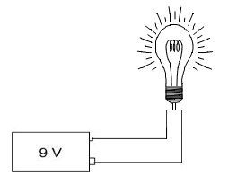
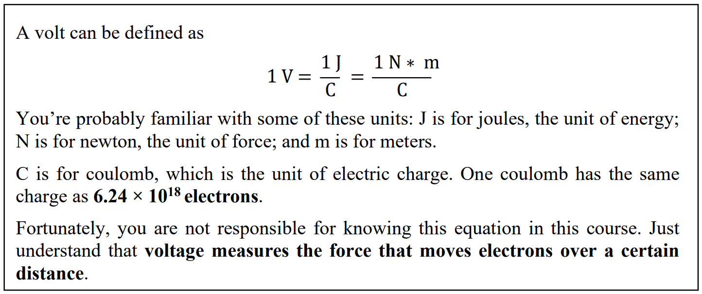
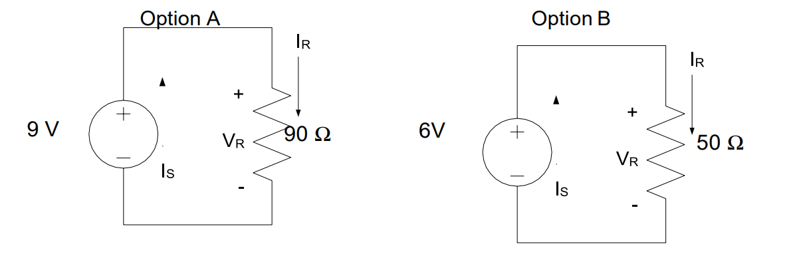
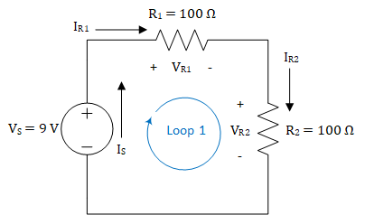
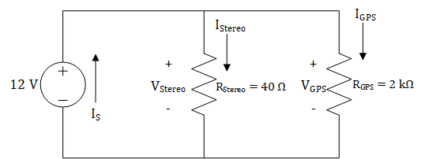
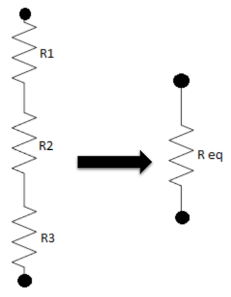
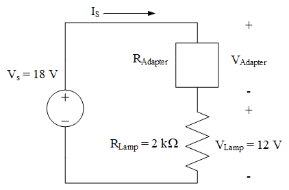

# Objective 01

The objective covered in this reading is the following:

1.  I can calculate the voltages, currents, and power associated with devices in a simple DC-powered circuit using tools such as KVL, KCL, voltage and current dividers, Ohm’s Law, and the power equation.

## Intro to Circuits

We probably don't need to convince you that electricity is useful, but
perhaps it would be helpful to spend some time thinking about why you,
as a future Air or Space Force officer, care about how electricity is
generated, how it flows in certain systems, and why you should care
about things like resistors, capacitors, inductors, transformers,
AC-to-DC converters, and all the other devices we will discuss in this
course. The most obvious example is an aircraft. Modern aircraft and
spacecraft rely heavily on electronics for control, stability,
avionics, navigation, guidance, and comfort. However, each of those
devices has their own power requirements, and designing the system is
a complex undertaking. As an Air or Space Force officer, it is
critical to understand why your cockpit or control station looks the
way it does and why the aircraft or spacecraft was built the way it
was. Furthermore, in a pinch, you'll have to do some on-the-fly load
balancing, and this course will help you understand what you're doing
as you flip those switches.

Figure 1: 787 Electrical System Overview (Source: Boeing)

> Figure 1 shows part of the electrical system of a Boeing 787
> Dreamliner, and it is typical of many different aircraft. Starting
> from the top, we see generators connected to each engine. On some
> level, it makes sense that you could connect some kind of device to an
> engine to extract electrical power from it. But, how does that
> actually work? Is that a perfectly efficient process? What is the
> difference between the type of power produced by a generator
> (Alternating Current) and the type of power required by most of the
> electronics on the aircraft (Direct Current)? The lessons on Engines,
> Generators, and AC-to-DC conversion will hit on these key topics.
>
> Moving down, we see several different voltage levels -- how do we
> design the system such that the right voltage level and type gets to
> the right electronics? Furthermore, how do we protect those
> electronics from drawing too much power? The Power I and II lessons
> will describe how this happens and discuss all the considerations of
> designing a power distribution system.
>
> Finally, when it comes to the loads (i.e., what's using the power) --
> how do we interpret quantities like voltage, current, and power? How
> can we model these loads in a meaningful way and, furthermore, how
> does the way in which we connect these loads affect the system as a
> whole? These are all things we'll discuss in the Introduction to
> Circuits lessons.

### Electric Charges and Voltage

Hopefully, you already know what would
happen if you connected a 9-Volt (V) battery to a simple light bulb.
As long as the battery was sufficiently charged and the wires
connected correctly, you would probably expect electrons to flow from
the battery and through the filament inside the bulb, causing the bulb
itself to glow.

Figure 2: 9-Volt (V) battery connected to a simple light bulb

If we were interested in the chemistry or physics involved, we could
discuss how the various metals inside the battery cause the electrons
to flow or why the flowing electrons cause the filament to glow. We
could even measure the brightness of the light and describe it using
some unit of illumination. While these things are interesting, we will
focus on applications of these principles in this course.

To understand what's going on in our light bulb circuit---or anything
else in the exciting world of electrical engineering---we need to
briefly discuss electric charges.

You probably already know electrons have a negative charge (-) and
protons have a positive charge (+). Accordingly, any atom or molecule
with *more electrons* than protons would have a negative charge while
any atom or molecule with *more protons* than electrons would have a
positive charge.

We refer to the flow of these charged particles through a conductive
medium, such as a wire, as current. It takes work (or energy) to
separate electrons from atoms, and once these electrons have been
separated from their atoms, they flow through conductive media,
thereby producing current. When we use electricity to do something,
such as turning on a light bulb or heating up our food in a microwave,
we are really just getting this energy back in a different form.

To describe how electricity can be used to do work, let's start by
taking a single negative charge and placing it near a single positive
charge:

Because the charges are opposite, they will attract, meaning there
will be a measurable force that pulls the two charges towards each
other.

*Voltage*, which is one of the fundamental concepts in electrical
engineering, is simply a way to describe this force between the
opposite charges.

To explain what we mean by this, let's
say the negative charge is actually an electron and the positive
charge is some positive ion that is fixed in place. Let's also say we
want the electron to move from point A to point B:

Like everything else in the world, an electron doesn't move unless
some energy (or work) is expended to make it move. Fortunately, in
this case, we don't have to expend energy to make the electron move
because there is already another force, known as the electromagnetic
force, that will expend the energy for us. As we said earlier,
opposite charges attract, and this attraction is due to the
electromagnetic force between the positive and negative charges. This
attraction is will expend energy to move the electron from point A to
point B. This may seem like free energy, but this is just how the
electromagnetic force works! If we carefully measured the amount of
work (or energy) expended by the electromagnetic force to move the
electron from point A to point B and divided this amount by the charge
of the electron being moved, we would get the voltage required to move
the electron from point A to B.

Mathematically, we can express this definition for voltage as

 $$V = \ \frac{dw}{dq}$$

In other words, voltage is the amount of work required ($dw$) per unit
of charge ($dq$) to move a charge from one point to another.

So what does this mean?

As it turns out, the way electricity
flows is very similar to the way water flows from the water tower to
your house. Consider what happens when you connect a hose to a water
faucet. When you turn the faucet on, the water pressure from the pipes
in your house pushes water through the hose. That pressure comes from
the water tower -- which uses the gravitational potential energy
created by holding the water hundreds of feet above the ground to
generate a city's water pressure. For this analogy, we can think of
the water tower as the voltage in a circuit because, much like how the
water tower's potential energy creates water pressure, the voltage
represents an electric potential that creates "pressure" for electrons
to move. Just as a taller water tower has a higher gravitational
potential energy and can create more water pressure, a larger voltage
level has a higher electric potential and can create more "pressure"
for electrons to move. Figure 3 demonstrates this analogy.

Figure 3: An analogy relating voltage to the height of a water tower

When you hook some wires up to a battery, the voltage "pressure"
causes electrons to flow through the wire (as long as the path makes a
complete circuit back to the other battery terminal).

We measure this "pressure" with the unit volts. As you might expect,
the more volts we have, the higher the "pressure". A 9-V battery has
twice the "pressure" of a 4.5-V battery and, therefore, causes twice
as many electrons to pass through our light bulb each second, making
it brighter.

Before we move on and talk about current, we need to stress two things
about voltage: voltage is always measured between two points and
exists even if nothing is flowing.

First, **voltage is always measured between two points**. For this
reason, we often talk about the voltage across a device. The voltage
across our light bulb, for instance, tells us how much work is
actually being done (per unit charge) to move electrons from one end
of the filament to the other. From our water analogy, we reference the
potential of the water with respect to its height above ground. In
electrical engineering, we usually measure voltage with respect to the
zero voltage point (conveniently called "ground").

Second, **voltage exists even if nothing is flowing**. This is a
subtle, but important point. Voltage doesn't measure the movement of
electrons, but rather, the pressure that causes (or would cause)
electrons to move. Put simply, voltage has the "potential" to move
electrons if we choose connect wires to the device providing the
voltage. For this reason, voltage is sometimes referred to as electric
potential. Our water analogy holds here as well. If we were to close
the pipes leading to someone's house, no water would flow into the
house, but there would still be water pressure in the pipes leading to
the house. Likewise, a battery has voltage, even if it is not
connected and no current is flowing.

### Current, Power, and Resistance

> We know that voltage applies a "pressure" to move electrons, and once
> we hook a device that supplies a voltage, such as a battery, up to a
> circuit, electrons begin to flow through the wires. This flow of
> electrons is known as *current*, and current tells us how many
> electrons actually move when a voltage is applied to a circuit. More
> specifically, current tells us how many electrons move in a set period
> of time. Mathematically, we use the letter *I* to represent current,
> which is defined by the equation
>
> $$I = \ \frac{dq}{dt}$$
>
> In words, current measures the amount of charge (dq) that passes
> through a specific point in a given amount of time (dt).
>
> If you think of current as measuring how
> many electrons flow per second, you have the right idea. The unit of
> current is the ampere (often shortened to amp) and is abbreviated as
> "A\". The more amps you have, the more electrons that flow. As you
> might expect, a current of 9 A has three times as many flowing
> electrons as a current of 3 A.
>
> In keeping with our water analogy, we can imagine placing a water flow
> meter in the middle of the pipe at the bottom of a water tower. This
> meter would tell us how many "water molecules" went by over a given
> time. This is the same as how we measure electrical current.
>
> 
>
> 
Figure 4: Current in water flow

>
>
> This brings us to a key point: **current is always measured through a
> single point**. Therefore, if we say that the current through a light
> bulb is 2 A, what we really mean is that the current through any point
> in the light bulb's filament is 2 A. There are many things that can
> affect how much current flows through a wire, and we will explore
> these things later on in this lesson and in future lessons.
>
> 
>
> When men like Benjamin Franklin were trying to make sense of
> electricity, they defined current in a way that is a bit confusing,
> and that definition has stuck to this day. When we connect a battery
> to a light bulb, we say that the current flows from the positive
> terminal (+), through the bulb, and then back to the negative terminal
> (-).
>
> The arrow in Figure 5 shows the direction of current flow in accordance
> with our definition. However, something is wrong with this. We know
> that current is the flow of electrons, and we know that electrons
> have a negative charge. Wouldn't a negatively charged electron
> be attracted to the positive terminalrather than repelled by it?
> If this is what you were thinking, then you are exactly right.
> When we connect a battery to a light bulb, what really happens is
> that the electrons leave the negative terminal (-), flow through
> the light bulb, and then return to the positive terminal (+).
>
> 
>
> 
Figure 5: Current flowing from a 9 V battery into a simple light bulb

>
>
> This can get really confusing, but the good news is that it really
> doesn't matter. We just say that the current flows in one direction
> when the electrons actually flow in the opposite direction. If you
> simply follow the convention that **current flows from positive to
> negative** (or higher voltage to lower voltage), you'll be okay.
>
> **Power and Resistance**
>
> Voltage and current are fundamental to ECE, but there is much more to
> ECE than just understanding this relationship.
>
> Think back to our water hose analogy. It's nice that we have lots of
> water pressure in our pipes, but if we never turn on the faucet,
> nothing would ever get done. Likewise, we could open the faucet to let
> water flow through the hose, but if we don't do something with the
> water, then the water is wasted.
>
> It's all about doing. We take a shower. We wash the car. We fill up a
> water balloon.
>
> In the electrical world, we use the term *power* to measure the work
> that gets done per unit time. We light up a room. We toast some bread.
> We use a computer. All of these require power, which is defined by the
> equation
>
> $$P = \ \frac{dw}{dt}$$
>
> In terms of our light bulb, power is the energy consumed ($dw$) by the
> bulb in a given amount of time ($dt$). Since energy and work use the
> same units, we can also say that power measures the work that is done
> in a given amount of time.
>
> The unit of power is the watt (W), which is equivalent to joules per
> second. Therefore, a 100-W light bulb consumes 100 joules of energy
> per second. A 50-W bulb consumes 50 joules per second.
>
> So what do current and voltage have to do with power? The short answer
> is everything. To explain, let's review the definitions for both
> current and voltage:
>
> $$I = \ \frac{dq}{dt}\ \ \ \ \ \ \ \ \ \ \ \ \ \ \ \ \ \ \ \ V = \ \frac{dw}{dq}$$
>
> Notice what happens when we multiply these together:
>
> $$IV = \ \left( \frac{dq}{dt} \right)\left( \frac{dw}{dq} \right) = \frac{dw}{dt} = P$$
>
> In other words,
>
> $$P\  = \ IV$$
>
> Power is equal to current times voltage. This equation is called the
> *Power Equation* and is very useful. You will use this equation in ECE
> and throughout your life.

**Example Problem:** The filament of a
light bulb has 9 V placed across it, which causes 90 mA to flow
through it. How much power does the bulb consume?

**Understand:** The power consumed by a light bulb depends on the
current through it and the voltage across it.

**Identify:**

-   **Knowns**: 9V of potential is lost (dropped) across the bulb and
    90mA of current is flowing through it

-   **Unknowns:** Power consumed by the bulb

-   **Assumptions:** None.

**Plan:** Since we know both the current through the filament and the
voltage across it, we can use the Power Equation to find the power:

P = IV

**Solve:**

P = IV = (90 mA)(9 V) = 810 mW

**Answer:** The light bulb consumes 810 mW of power.

This example problem illustrates the notion that power is the product
of current and voltage, but it doesn't quite explain what's actually
going on in the circuit. The scenario implies we can control both the
current through and the voltage across the light bulb, which isn't the
case. In simple circuits like these, we can control the current or the
voltage, but not both.

The key to understanding what is really going on is the concept of
*resistance*. The filament of a light bulb is designed to resist the
flow of electrons in order to generate heat, which causes the filament
to glow white-hot, thereby emitting light. This is because, as
electrons flow through the filament, they bounce off of atoms in the
filament and lose energy. When enough energy is lost to the filament,
it heats up and eventually glows. Mathematically, we use *R* for
resistance, which is defined by the equation

$$R = \ \frac{V}{I}\ $$

This equation is known as *Ohm's Law*, which is more commonly written
as,

𝑉 = 𝐼𝑅

We measure resistance using ohms (Ω). A device that has 200 Ω resists
the flow of electricity twice as much as a 100 Ω device.

What does this mean?

Think about our water tower and the pipes that carry the water to your
house. As with most faucets, we can control the flow of water
depending on how much we open the outlet valve. In other words, we
decrease the resistance to the flow of water (current) by making the
opening bigger, which allows more water to flow. When we start to
close the valve, we increase the resistance by causing the opening to
get smaller and, therefore, less water flows.

One important point about Ohm's Law is that **it only works with
devices that can be modeled as resistors**. Later on, when we start
dealing with transformers and other non-resistive devices, we will
have to use other tools to solve for voltages and currents.

**Example Problem:** The filament of a light bulb has a resistance
of 100 Ω. If 9 V are placed across it, how much power does the bulb
consume?

R = 100 Ω

**Understand:** We want to find out how much power (energy per second)
the bulb consumes.

**Identify:**

-   **Knowns**: 9V of potential is lost (dropped) across the bulb, the
    resistance of the bulb is 100 Ω

-   **Unknowns:** Power consumed by the bulb, current flow through the
    bulb

-   **Assumptions:** None.

**Plan:** We want to solve for the power using the power equation, 𝑃 =
𝐼𝑉

However, we must first find the current using Ohm's Law,
$I = \ \frac{V}{R}$

**Solve:** First, we will solve for the current.

$$I = \ \frac{V}{R} = \ \frac{9V}{100\mathrm{\Omega}} = 90\ mA$$

Then, we can use the current we found to solve for the power consumed.

$$\ P = \ IV\  = \ (90mA)(9V)\  = \ 810mW$$

**Answer:** The light bulb consumes 810 mW of power.

### Basic Electrical Devices and Examples

> Hopefully, you now understand what happens when we connect a battery
> to a light bulb -- the battery provides a voltage "pressure" that
> causes electrons to flow. The filament resists the flow, which
> determines the actual current. The voltage and current determine the
> power consumed by the bulb.
>
> Now we have to figure out how to predict what will happen when we
> start changing things. To do this, we're going to change how we model
> the devices in our circuit.
>
> First, we'll model the voltage source
> with the following symbol:
>
> 
>
> Notice the positive (+) and negative (-) terminals on the voltage
> source. As you might expect, the "pressure" at the positive terminal
> is higher than the "pressure" at the negative one. Therefore, the
> current flows out of the positive terminal and returns to the
> negative.
>
> We will model the light bulb as a
> resistor. Exactly as the name implies, a resistor is a device that
> resists the flow of electricity. As with the previous example problem,
> we'll assume the light bulb has a resistance of 100 Ω.
>
> 
>
> Using these devices, we can redraw our battery and light bulb as the
> circuit below. We added some arrows with labels to show the currents
> coming out of the voltage source and passing through the resistor. We
> also labeled the voltage across the resistor, $V$R, and the current
> through the resistor, $I$R.
>
> 
>
> Notice the polarity (where we put the + and -) of the resistor. As
> with the voltage source, we label the side with the greater pressure
> as positive (+) and the side with the lower pressure as negative (-).
>
> Also, notice the relationship between the polarity of the devices and
> the current flow. In the voltage source, current comes out of the
> positive terminal, but in the resistor, current flows into the
> positive terminal.
>
> If this isn't making sense, think about the voltage source as a water
> pump pushing water through the circuit. The resistor, then, represents
> everything that tries to slow the water down. The arrows represent the
> direction of water flow. The polarity labels (+ and -) represent
> relative pressure. The pressure is always higher coming out of a pump
> than going into it. Likewise, the pressure is always higher going into
> a resistor than coming out of it.
>
> It is important to remember that when we draw circuits, we are just
> creating models of real devices. We model an electrical device for
> what it does, rather than what it is. What a 9-V battery does is
> provide 9 volts, therefore we model it as a 9 V power source.
>
> This allows us to replace the battery with anything that provides 9 V
> without changing what happens to the circuit. For example, we could
> use multiple smaller batteries or a device called an AC-DC converter
> (more on this in Block II) to produce a 9-V output, and it wouldn't
> matter. The current and power would be the same.
>
> Unfortunately, we also lose something whenever we create models.
> Because of cost or weight or convenience constraints, it might
> actually matter what kind of power source we use. These issues are
> lost in the circuit model and need to be tracked separately.
>
> Additionally, the model doesn't fully represent what happens in a real
> circuit. First of all, there are inherent errors associated with real
> devices. A real 100 Ω resistor, for example, might have an actual
> resistance of 96.7 Ω. Likewise, even if a 9-V battery actually
> provided 9 volts, it would not do so forever. Over time, a battery
> will lose energy and the voltage will drop, if only slightly.
>
> For much of electrical engineering, modeling circuits using *ideal
> devices* helps to simplify the analysis so that we can solve a given
> problem more quickly. The term ideal implies zero error and 100%
> efficiency. Although there is always error, the error when modeling
> ideal devices is usually small enough to have negligible impacts on
> our final answer. In this course, we will mostly use ideal devices in
> our analyses.
>
> Believe it or not, you now have all the tools you need to predict what
> will happen to a wide variety circuits consisting of one voltage
> source and one light bulb.

**Example Problem:** A light bulb with a resistance of 200 Ω is
connected to a 3-V battery, as modeled in the circuit below. If the
wiring in the flashlight is limited to 20 mA, will the flashlight
function as designed?

**Understand:** The light bulb is drawing current but is limited by
how much current the wiring can support.

**Identify:**

-   **Knowns**: The light bulb is connected to a 3V voltage source and
    has a resistance of 200 Ω

-   **Unknowns:** Current flow through the bulb

-   **Assumptions:** The light bulb can be modeled as a resistor and is
    using all 3V. All the current flowing through the bulb is flowing
    through the wiring.

**Plan:** If the actual current is 20.00 mA or less, the flashlight
will work. If it is greater than 20 mA, the wire will burn up, ruining
the flashlight. So, we will find the current through the bulb using
Ohm's Law (V=IR).

**Solve:** The current drawn by the light bulb is:

$$I = \ \frac{V}{R} = \ \frac{3V}{200\mathrm{\Omega}} = 0.015\ A = 15\ mA$$

Therefore the current through the bulb (modeled as a resistor) is 15
mA.

**Answer:** Yes, the flashlight will work as designed since the
current in the circuit is only 15 mA, which is less than the 20 mA
limit.

**Example Problem:** Two competing flashlight designs are modeled
below. If the sole measure of merit is to </ins>minimize power
consumption</ins>, which of the two is the better design?

**Understand:** This problem is very similar to previous problems, but
now requires us to find the power consumed by two different flashlight
designs.

**Identify:**

-   **Knowns**: We know the voltage supplied by each source and the
    resistance of each bulb.

-   **Unknowns:** Power consumed by each bulb.

-   **Assumptions:** The light bulbs can be modeled as a resistor and
    are using all the voltage (potential) provided by the source. Since
    power consumption is our sole measure of merit, then the option with
    the lesser power consumption will be the better option.

**Plan:** We could calculate the current through each bulb, and then
the power, but there is a quicker way. If we substitute Ohm's Law into
the Power Equation, we can arrive at an equation that solves for power
in terms of only voltage and resistance.

First, we start with both the Power Equation and Ohm's Law.

$$ P = IV; V = IR $$

Next, we solve Ohm's Law for $I$ to get:

$$ I = \ \frac{V}{R} $$

Then, we can substitute this into the Power Equation:

$$P = IV = \ \left( \frac{V}{R} \right)*V = \frac{V^{2}}{R}$$

Finally, we can compare the power consumption of the two options.

**Solve:** Let's first solve for the power consumed by Option A:

$$P = \frac{V^{2}}{R} = \frac{(9V)^{2}}{90\mathrm{\Omega}} = 0.9W = 900\ mW$$

Now, solving for the power consumed by Option B:

$$P = \frac{V^{2}}{R} = \frac{(6V)^{2}}{50\mathrm{\Omega}} = 0.720W = 720\ mW$$

**Answer:** Option B is the better design because it consumes 720 mW,
which is less than the 900 mW consumed by Option A.

For simple problems like the one we just solved, the decision is
obvious as soon as the comparison is made. However, in engineering
(and many other pursuits), it is not enough to reach the right
decision. We must also adequately articulate the decision so that
others can understand it and act accordingly. Therefore, our answer is
**not** "*Option B*," but rather "*Option B is the better design
because it consumes 720 mW, which is less than the 900 mW consumed by
Option A*." Communication is very important in all aspects of life,
especially engineering.

## KVL and KCL

As we add more devices to a circuit, interesting and useful things begin
to happen. However, circuits with more devices are much more complex and
cannot be solved with Ohm's Law and the Power Equation alone.[^1] To
demonstrate this, let's start by looking at one of the circuits we
analyzed last lesson.

Figure 1: A simple circuit consisting of one voltage source and one
resistor

When analyzing the circuit shown in Figure *1*, we can say that the
voltage between the positive (+) and negative (-) terminals of the
voltage source must differ by 9 V. We can see this one of two ways: one
way from the perspective of the voltage source and the other way from
the perspective of the circuit. From the perspective of the voltage
source, the voltage source forces there to be 9 V voltage *rise* between
the negative and positive terminals, and from the perspective of the
circuit, the circuit must have a 9 V *drop* between the positive and
negative terminals. We explained this last lesson by saying that the
higher pressure will be on the positive terminal and the lower pressure
will be on the negative terminal. Nevertheless, we see that the voltage
provided by the voltage source must be dropped across the rest of the
circuit, which is only a resistor in this case. Now that we know the
voltage drop across the 100 Ω resistor is 9 V, we can use Ohm's law to
find the current through the resistor, which is 90 mA. At this point, we
know $V_{S},\ V_{R},\ and\ I_{R}$, but we do not know $I_{S}$.
Unfortunately, the ECE tools we've learned up until this point, Ohm's
Law and the Power Equation, cannot help us find $I_{S}$. To find that,
we need *Kirchhoff's Current Law*.

When we said that there must be a 9 V drop across the circuit, we didn't
fully explain why this occurs. Due to the law of conservation of energy,
any voltage rise must be accompanied by voltage drops across the devices
in a circuit. More specifically, the sum of these voltage drops must
equal the voltage rise. For the circuit in Figure 1, we can say that the
voltage drop across the resistor is the same as the voltage rise because
we only have one resistor. However, in circuits with more than one
resistor, we have to sum the voltage drops. Consider the circuit in
Figure 2. If we knew that $V_{R2}$ was equal to 4.5 V, we could use
Ohm's Law to solve for $I_{R2}$, but we cannot use Ohm's Law or the
Power Equation to solve for $V_{R1}$. For that, we need to use
*Kirchhoff's Voltage Law*. Kirchhoff's Voltage Law tells us how to sum
voltage drops, and by summing voltage drops, we can solve for $V_{R1}$.
Interestingly, we can also use Kirchhoff's Current Law to solve for
$V_{R1}$, but we will wait a bit to explain that.

Figure 2: A circuit consisting of one voltage source and two resistors

### Kirchhoff's Laws

Before getting into Kirchhoff's Voltage Law (KVL) and Kirchhoff's
Current Law (KCL), we need to cover the fundamentals of these laws and
some definitions. Kirchhoff's Laws are derived from conservation laws.
KVL is derived from the law of conservation of energy. The law of
conservation of energy tells us that energy cannot be created or
destroyed and can only be transformed from one type to another, such as
gravitational potential energy to kinetic energy or chemical energy to
kinetic energy. From last lesson, we know that voltage is the amount of
work (or energy) per charge, so we can infer that KVL will explain how
the voltage is conserved in a circuit. KCL is derived from the law of
conservation of charge. The law of conservation of charge tells us that
charge cannot be created or destroyed, meaning that the amount of charge
flowing into a region will be equal to the amount of charge flowing out
of that region. Since we know that the flow of charge (electrons) is
equal to the current, we now know that current flowing into a region
must be conserved.

KVL and KCL are concerned with how the devices in a circuit are
arranged. In contrast to Ohm's Law and the Power Law, KVL and KCL do not
tell us anything about the individual devices. Instead, they tell us how
the connections between devices impact the voltage across our devices
(KVL) and the current through our devices (KCL). In order to use KVL and
KCL, we must have a common terminology for these connections, and we
refer to these connections in terms of **nodes** and **loops** in
circuits.

A **node** is a wire, or other electrical conductor, that connects two
or more electrical devices. Nodes are just the connections between
devices, so if you have found a junction between devices, then you have
found a node. In some circuits, a node can stretch the length of the
circuit, so don't let that be a source of confusion. The circuit in
Figure 1 has two nodes: one at the top connecting the positive terminals
of both devices and one at the bottom connecting the negative terminals
of both devices. The circuit in Figure 2 has three nodes, and Figure 3
shows these nodes.

Figure 3: Nodes in a circuit with one voltage source and two resistors

It's important to be able to identify the nodes in various circuits,
regardless of the complexity of those circuits. The circuit shown in
Figure 4 has one voltage source and three resistors connected in a
parallel configuration.[^2] As shown in Figure *5*, the circuit only has
two nodes: one on the top and one on the bottom. Remember, a node is
just a conductor that connects multiple devices, and while it may seem
odd to have a node that stretches the entire circuit, this is completely
acceptable.

Figure 4: A parallel circuit with one voltage source and three resistors

Figure 5: Nodes in a parallel circuit with one voltage source and three
resistors

A **loop** is a closed path where, starting at an arbitrary node, you
can trace a path back to the original node without passing through any
other nodes more than once. We use the term "closed path" to denote a
path around a circuit that is completely enclosed by wires and starts
and ends at the same location. In this class, we will trace loops in a
clockwise manner, and oftentimes, we will start at the node above the
voltage source. The circuit shown in Figure 2 only has one loop, and
this is shown in Figure 6.

Figure 6: Loop for a circuit with one voltage source and two resistors

The loop shown in Figure 6 starts at node 1 above the voltage source
then passes through $R_{1}$, node 2, $R_{2}$, node 3, and the voltage
source before returning to node 1. We only have one loop because there
is only one distinct closed path through this circuit. Unfortunately, a
circuit with only one loop can only teach us so much about loops. Figure
7 shows a circuit that is very similar to the circuit in Figure 4, with
the exception that the right-most resistor has been removed. We can see
that the circuit has three loops: one in each "window" of the circuit
and one around the entire circuit. It is very easy to forget about the
loop around the outside of the circuit, so remember that loops are not
restricted to the "windows" in a circuit. As we get to more complex
circuits, we will see that a loop can circle around two or more
"windows".

Figure 7: Loops in a parallel circuit with one voltage source and two
resistors

Now that we have an understanding of nodes and loops in a circuit, we'll
get into the details of KVL and KCL.

### Kirchhoff's Voltage Law (KVL)

As stated earlier, KVL is based on the law of conservation of energy. We
know that voltage is energy per charge, and KVL tells us that voltages
around loops in a circuit are conserved. Put another way, voltage rises
must be accompanied by voltage drops. As we trace around a loop in our
circuit, the voltage rises and voltage drops must sum to zero. Another
way to put this is "what goes up, must come down."

**Key Concept:** KVL states that all the voltages around a loop must add
up to exactly zero.

As we trace around a loop in our circuits, we need an easy way to know
whether the voltage drops or rises across a device. To that end, we
label each of our devices with a plus (+) and a minus (-) on either end
to designate the voltage across the device. As we move clockwise through
a loop, moving from a minus to a plus results in a *voltage rise*.
Similarly, moving from a plus to a minus results in a *voltage drop*.

**KVL Analysis I**

We will use the circuit in Figure 8 to explain how KVL may be used in
circuit analysis. First, we begin by identifying the nodes and loops. As
you can see from Figure 8, there are four nodes and only one loop in the
circuit.

Figure 8: Nodes and loops for a series circuit[^3] with one voltage
source and three resistors

KVL is primarily concerned with the loops in a circuit; the nodes are
only used as a means to help identify the loops. Each loop in a circuit
can generate only one KVL equation. Since there is only one loop in the
circuit in Figure 8, KVL will only give us one equation to help analyze
this circuit. If we start in the lower left-hand corner and move
clockwise along the loop, the first thing we come to is a voltage
source. Since we move from a minus (-) to a plus (+) through the source,
Vs, it is considered a voltage rise. We will consider voltage rises as
"positive voltages" or a gain in voltage, so we will place a positive
sign in front of them in the KVL equation. Continuing around the loop,
we come to three resistors, each of which drops the voltage by *VA*,
*VB*, and *VC*, respectively. We will consider voltage drops as
"negative voltages" or a loss of voltage, so we will place a negative
sign in front of these voltages. Applying KVL to this circuit gives us
the following KVL equation:

$$V_{S} - V_{A}{- V}_{B} - V_{C} = 0$$

Another way to view KVL is to say that for any loop in a circuit:

***Total Voltage Rises = Total Voltage Drops***.

This points to something we were saying earlier: KVL is just a
specialized application of the conservation of energy. So, if we apply
this to the circuit above, we get:

$$V_{S} = V_{A}{+ \ V}_{B} + V_{C}$$

This equation is mathematically identical to the first one, but it is
usually easier to use. The very important principle to remember about
KVL is that it **only applies to loops in a circuit**.

For example, if we were using a 9 V source, then the sum of the voltage
drops must equal the 9 V increase from the source. In other words,

$${9\ V = V}_{A}{+ \ V}_{B} + V_{C}$$

If we knew VA = 2 V and VB = 4 V, then VC would have to equal 3 V
due to the following:

$$V_{C} = {9\ V - V}_{A}{- \ V}_{B} = 9V - 2V - 4V = 3V$$

#### KVL Analysis II

Now, let's apply KVL to the circuit in Figure 7. Since there are three
loops in the circuit, we know there must be three KVL equations.
Traversing the loops in a clockwise manner and following our sign
convention for voltage rises and drops gives:

  -----------------------------------------------------------------------
  $$V_{S} - V_{A} = 0$$

  $$V_{A} - V_{B} = 0$$

  $$V_{S} - V_{B} = 0$$
  ----------------------- ----------------------- -----------------------

  -----------------------------------------------------------------------

The leftmost equation is for loop 1, the middle equation is for loop 2,
and the rightmost equation is for loop 3. The interesting result is all
of these equations simplify to the identity:

$$V_{S} = V_{A}{= V}_{B}$$

Again, if we were using a 9 V source, this would mean the full 9 V drops
across each of the resistors. If we were to add a fourth or a fifth or a
twentieth resistor in the same manner (known as parallel -- more on this
next lesson), each additional resistor would also get the full 9 V.

**Example Problem**: A 9V battery is used to power the circuit below.
The current through R1 is 2 mA and the output voltage, Vout, is 2 V.
Find the voltages VR and VP.

**Understand**: We have a circuit with four nodes, three loops, a
voltage source, and several resistors.

**Identify**:

-   **Knowns:** We know 2mA is flowing through R1 (which has a
    resistance of 1.5kΩ) and the voltage Vout is 2V. We also know
    the source voltage is 9V.

-   **Unknowns:** VR and VP. We also don't know the resistance
    values for either of those resistors.

-   **Assumptions:** None.

**Plan**: Since the circuit involves mostly voltages, we know we can use
KVL to try and find the unknown voltages. We see there are three loops;
therefore, we can find three KVL equations. However, since we don't have
the voltage values across all the resistors, we will have to use Ohm's
law to find the voltage drop V1.

**Solve:** First, we apply KVL around the loop, L1,

$$9\ V - V_{1}{- \ V}_{R} = 0$$

$${\ V}_{R} = 9V - V_{1}$$

However, we don't know V1 yet. Since we know both the resistance of
and the current through the 1.5 kΩ resistor, we can find the voltage
across it using Ohm's Law:

$$V_{1} = I_{1}R_{1} = (2\ mA)(1.5\ k\mathrm{\Omega}) = \ 3\ V$$

This allows us to easily find VR:

$${\ V}_{R} = 9V - 3V = 6V$$

To find VP, we can use the KVL equation from one of the other loops.
We'll use the outside loop, which contains the source, the two resistors
on top, and the rightmost resistor. This gives us:

$$9\ V - V_{1} - V_{P} - V_{out} = 0$$

$$V_{P} = 9\ V - V_{1} - V_{out} = 9\ V - 3\ V - 2\ V = 4\ V$$

$${\ \ V}_{P} = 4\ V$$

**Answer**: VR = 6 V and VP = 4 V.

### Kirchhoff's Current Law (KCL)

KCL is rooted in the law of conservation of charge. Since current is the
flow of charge (specifically electrons), KCL tells us that currents
entering nodes must be conserved. This means that the current entering a
node must be equal to the current leaving a node. In other words, what
goes into a node must also come out of that node. Typically, we will
phrase this slightly differently by saying that the sum of all currents
entering and leaving a node must equal zero.

**Key concept:** KCL states that the sum of all currents entering and
leaving a node is exactly zero.

Before we demonstrate KCL, let's take a look at how currents are
labelled in circuits. We label currents as emerging from the positive
terminal of voltage sources and entering the positive terminal of
resistors. This reflects our definition of current, which says that the
current flows from the positive terminal to the negative terminal of
voltage sources. Additionally, this convention helps express the fact
that voltage sources provide power while the resistors dissipate it.

Whereas KVL is concerned with loops, KCL is concerned with nodes.
Applying KCL to a circuit gives one KCL equation for each node, and when
writing those equations, we put a positive sign in front of currents
that enter nodes and a negative sign in front of currents that leave
nodes. Think of it this way: currents entering nodes *add* charge to the
node whereas currents leaving nodes *subtract* (or remove) charge from
the node. The following examples will demonstrate this.

#### KCL Analysis I

Let's apply KCL to the circuit in Figure 2. The first step is to identify all of the nodes in the circuit.
Fortunately, the nodes are identified in Figure 3, so we know that there
are three nodes in the circuit. Starting with node 1 in the top
left-hand corner, we see that the only current entering the node comes
from the source, *IS*, while the only current leaving the node is the
one entering the first resistor, *IR1*. Therefore, in our KCL equation
for node 1, *IS* will be positive, and *IR1* will be negative.
Looking at node 2, we can see that *IR2* leaves the node, but it may
be difficult to see which current enters the node. Knowing that currents
travel *through* devices can shed some light on this. The current
*IR1* travels through $R_{1}$ and exits the negative terminal of
$R_{1}$, meaning it enters node 2. The same thing happens with node 3:
*IR2* enters the node and *IS* leaves it. If we write an equation
for each of these nodes, we get:

  ---------------------------------------------------------------------------
  $$I_{S} - I_{R1} = 0$$

  $$I_{R1} - I_{R2} = 0$$

  $$I_{R2} - I_{S} = 0$$
  ------------------------ ------------------------- ------------------------

  ---------------------------------------------------------------------------

These four equations can be combined into the following identity:

$$I_{S} = I_{R1}{= I}_{R2}$$

This identity demonstrates an important point: when devices are placed
one after another (known as series -- more on this next lesson), they
have the same current flowing through them.

#### KCL Analysis II

The current flow in the circuit shown in Figure 4 is a bit more
complicated than the current flow in Figure 2, but as we can see from
Figure 5, we only have two nodes to deal with.

Applying KCL at node 1, we find that only one current, $I_{S}$, enters
the node and three currents, $I_{A},\ I_{B},\ and\ I_{C}$, leave the
node. This gives us the KCL equation:

$$I_{S} - I_{A}{- I}_{B} - I_{C} = 0$$

Looking at node 2, we see that everything is flipped: $I_{S}$ leaves the
node and $I_{A},\ I_{B},\ and\ I_{C}$ enter the node. This results in
the following KCL equation.

$${- I}_{S} + I_{A}{\  + \ I}_{B} + I_{C} = 0$$

This is the same equation except the signs are reversed. If we wished,
we could simplify either of these equations into:

$$I_{S} = I_{A}{+ \ I}_{B} + I_{C}$$

For any node in a circuit, KCL can also be written as

*Total Current In = Total Current Out*

By way of example, let's power the circuit in Figure 4 with a 9-V
source. If we measured the currents through each of the resistors to be
*IA* = 1 A, *IB* = 3 A, and *IC* = 2 A, then our voltage source
would have to provide 6 A of current due to the following:

$$I_{S} = I_{A}{+ \ I}_{B} + I_{C} = 1\ A + 3\ A + 2\ A = 6\ A$$

### Circuit Analysis and Examples

KVL and KCL provide sets of equations that describe the relationships of
voltages and currents within a circuit. They are powerful tools, and
when combined with Ohm's Law and the power equation, they can be used to
completely analyze any resistive circuit. The following example problems
show how this process works.

**Example Problem:** A 9-V battery is used to light two light bulbs,
modeled as 45-Ω resistors in the circuit below. How much current flows
through each bulb?

**Understand:** We have a source VS that is feeding two resistors R1
and R2. The circuit has one loop and three nodes.

**Identify:**

-   **Knowns:** VS, R1, and R2

-   **Unknowns:** The currents IS, I1, and I2; the voltages V1
    and V2.

-   **Assumptions:** The light bulbs can be modeled as resistors.

**Plan:** We need to find the currents through the two bulbs, labeled as
I1 and I2. We will first write the KCL equations at each node, then
use KVL to find the relationship between the voltages in the circuit.
Finally, we will use Ohm's law to tie the KCL and KVL equations
together.

**Solve:** Applying KCL to the nodes gives us the following identity:

$$I_{S} = I_{1}{= I}_{2}$$

In other words, the same current flows through every component in the
circuit (reference "KCL Analysis I" earlier if this step confused you).

Since this circuit contains one closed loop, we can apply KVL to this
loop to find the following equation:

$$9\ V - V_{1} - V_{2} = 0$$

Since we have no way to solve for the voltages or currents directly, we
will use Ohm's Law to tie the two equations together. For each of the
resistors, Ohm's Law tells us:

$$V_{1} = I_{1}R_{1} = I_{1}(45\ \Omega)$$

$$V_{2} = I_{2}R_{2} = I_{2}(45\ \Omega)$$

If we substitute these into the KVL equation, we get:

$$9\ V - I_{1}(45\ \Omega) - I_{2}(45\ \Omega) = 0$$

We know from KCL that all of the currents are the same in the circuit
$(I_{S} = I_{1}{= I}_{2})$. Therefore, this equation can be simplified
to:

$$9\ V - I_{S}(45\ \Omega) - I_{S}(45\ \Omega) = 0$$

$$9V - I_{S}(90\Omega) = 0$$

After using some algebra, we solve to find the source current, IS:

$I_{S} = \ \frac{9\ V}{90\ \mathrm{\Omega}} = \ 100 \ mA$

Since all of the currents are the same, we have that
$I_{S} = I_{1}{= I}_{2} = 100\ mA$.

**Answer:** The 9-V battery provides 100 mA of current to each bulb.

**Example Problem:** A car stereo (modeled as a 40-Ω resistor) and a
GPS navigation system (modeled as a 2-kΩ resistor) are connected to a
12-V car battery, shown in the circuit below. Determine how much power
is consumed by each device and how much power the source provides.

**Understand:**

-   **Knowns:** VS, RStereo, and RGPS

-   **Unknowns:** The currents IS, IStereo, and IGPS; the voltages
    VStereo and VGPS. We are required to find the power consumed
    by each device and the power produced by the voltage source.

-   **Assumptions:** None.

**Plan:** We must first find the voltage across or the current through
each resistor before we can use the power equation to find the power
consumed. Since we have three loops, KVL will give us three equations.
Similarly, the two nodes in the circuit will give us two KCL equations.
Once we have the voltage across or the current through each component,
we can use the Power Equation, in concert with Ohm's Law, to determine
how much power each component consumes. In order to find the power that
the source provides, we will need to determine the total current
provided by the source (IS). Once we have this, we can use the Power
Equation to find the power provided by the source.

**Solve:** Since we do not know any of the currents, KCL will not help
us determine the current through each resistor. However, we are given
the voltage provided by the source, so we can use KVL to solve for the
voltages. The KVL equations for this circuit are shown below.

  -------------------------------------------------------------------------------------
  $$12\ V - V_{Stereo} = 0$$
  $$V_{Stereo} - V_{GPS} = 0$$
  $$12\ V - V_{GPS} = 0$$
  ---------------------------- ------------------------------ -------------------------

We can simplify these equations into the following equation:

$$12\ V = V_{Stereo} = V_{GPS}$$

From this, KVL tells us that the voltage drop across each device is 12 V
(reference the earlier section titled "KVL Analysis II"). Now, we can
use the Power Equation and Ohm's Law to solve for the power consumed by
each device.

$$P_{Stereo} = \frac{{V_{STEREO}}^{2}}{R_{STEREO}} = \frac{(12\ V)^{2}}{40\ \Omega} = 3.6\ W$$

$$P_{GPS} = \frac{{V_{GPS}}^{2}}{R_{GPS}} = \frac{(12\ V)^{2}}{2\ k\Omega} = 72\ mW$$

Next, we need to find the current provided by the source. To start, we
will find the KCL equation for the top node. As mentioned earlier in the
section titled "KCL Analysis II", both nodes will have equivalent KCL
equations, so only one equation is needed.

$$I_{s} - I_{Stereo} - I_{GPS} = 0$$

$$I_{S} = I_{Stereo} + I_{GPS}$$

We can use Ohm's Law in concert with our KCL equation to solve for the
source current, *IS*.

$$I_{S} = \frac{V_{Stereo}}{R_{Stereo}} + \ \frac{V_{GPS}}{R_{GPS}} = \frac{12\ V}{40\ \Omega} + \frac{12\ V}{2\ k\Omega} = 300\ mA + 6\ mA = 306\ mA$$

Now that we know both the voltage and current provided by the source, we
can solve for the power provided by the source.

$${P_{S} = I}_{S}V_{S} = (306\ mA)(12\ V) = 3.672\ W$$

Looking back at the power consumed by each device, we can see that the
total power consumed by both devices is equal to $3.672\ W$ -- exactly
the same as the power provided by the source!

**Answer:** The stereo consumes 3.6 W while the GPS consumes 72 mW. The
source provides 3.672 W.

-------------------------------------------------------------------------------------------------------------------------------------------
### Conservation of Power

The last example problem touched on an important concept: **power is
conserved in circuits**. This means that the power provided by the
source must always be equal to the power consumed by the devices. You
can use this principle to check your work. If, at the conclusion of your
circuit analysis, you find that the power provided by the source is not
equal to the power consumed by the devices, then you did something wrong
in your analysis. The engineering method, most notably the "Test and
Evaluate" and "Reflection" steps, requires that we check our work, so
make a habit out of checking your work in this class!

[^1]: We can say we have "solved" a circuit once we have found the
    voltage and current for each device. Solving the circuit shown in
    Figure 1 would mean finding $V_{S},\ I_{S},\ V_{R},\ and\ I_{R}$.

[^2]: We will discuss parallel configurations in more detail next
    section.

[^3]: We will discuss series circuits in more detail next section.

## Series and Parallel Circuits

Last lesson we analyzed circuits containing two
different configurations for connecting resistors, or devices that can
be modelled as resistors, up to a voltage source. These configurations,
known as series and parallel, were deliberately chosen because they
represent fundamental ways of connecting devices. The vast majority of
circuits we'll encounter will place its components in either parallel or
series (or both) arrangements.

### Series Resistors

Looking at the circuit below, we have a "series" arrangement. The
resistors are connected end-to-end in a chain. Once those ends are
connected to a voltage source, the same amount of current flows
sequentially through each device, and each device is subjected to a
fraction of the voltage. For a long string of lights, this is a way to
apply a small voltage to each light, but a disadvantage is that one bad
light will break the circuit, preventing current from flowing.

Figure 1: A series circuit with one voltage source and three resistors

**Key Concept:** When only two components are connected at a node, those
components are in series.

Analyzing the series circuit in Figure 1, starting with KVL for the one
and only loop, we write:

$$V_{S} - V_{A} - V_{B} - V_{C} = 0$$

$$V_{S} = V_{A}\ {+ \ V}_{B} + V_{C}$$

Each voltage across a resistor can be rewritten using Ohm's Law:

$$V_{S} = I_{A}R_{A} + I_{B}R_{B} + I_{C}R_{C}$$

Using KCL at each node, we can conclude that our current terms are all
equal. A more general conclusion is that any number of resistors in
series have the same current.

$$I_{S} = I_{A}{= I}_{B} = I_{C}$$

**Key Concept:** The current flowing through series components is always
the same.

Returning to our KVL equation and substituting all current terms with
the term *IS*, we have:

$$V_{S} = I_{S}R_{A} + I_{S}R_{B} + I_{S}R_{C}$$

$${V_{S} = I}_{S}\left( R_{A} + R_{B} + R_{C} \right)$$

$${V_{S} = I}_{S}R_{EQ(SERIES)}$$

The last step above introduces the term REQ(SERIES) where EQ is an
abbreviation for "equivalent" and stands in for the sum of all
resistances. Moreover, we can replace the three resistors with an
equivalent circuit as shown below, allowing us to analyze the circuit's
behavior as if it were just one voltage source and one resistor.

Figure 2: A series circuit and its equivalent

**Key Concept:** The equivalent resistance of resistors connected in series is the sum of the individual resistances:

$$R_{EQ(SERIES)} = R_{1}{+ R}_{2} + \cdots + R_{n}$$

Figure 3: Combining resistors in series into a single resistor

At any location within a circuit, if we find two or more resistors in
series, we can simplify them without even knowing the voltage or
current. We can sum the resistances and rewrite that portion of the
circuit as a single resistor. However, we must be careful that they are
actually in series by verifying that there's nothing else attached to
the interior nodes. After all, those interior nodes will "disappear"
when the resistors are replaced.

------------
**Example Problem:** An inertial navigation system (INS) for a UAS is
modeled as 4 resistors in series with a 28-Volt power supply. How much
power is being produced by the power supply?

**Understand:** We have a number of devices (modeled as resistors)
connected in series with a voltage source.

**Identify Key Information:**

-   **Knowns:** resistance values of each component and the source
    voltage is 28V.

-   **Unknowns:** voltage across each resistor; power produced by the
    source, PS.

-   **Assumptions:** all of the power produced by the source is consumed
    by the load resistors.

**Plan:** By consolidating the series
resistors into a single equivalent resistor, we can use the power
equation to determine the power consumed by the equivalent load. We then
assume the source is producing all of the power needed by the load.

**Solution:** Given VS = 28V, PS can be found directly from IS
using a power relationship:

$$P_{S} = I_{S}V_{S}$$

In order to find IS, we must find a component in the circuit where we
know at least two of the four parameters of power, current, voltage, and
resistance. For any single resistor, we only know the resistance, but
for all the resistors together, the voltage is known.

By simplifying the 4 resistors into single equivalent resistor, there
will be a component with enough information to analyze the circuit.
Compute equivalent resistance:

$$R_{EQ} = R_{1} + R_{2} + R_{3} + R_{4}$$

$$R_{EQ} = 100\ \Omega + 200\ \Omega + 300\ \Omega + 400\ \Omega = 1\ k\Omega$$

For descriptive purposes, we'll redraw the circuit using the equivalent
resistance and designate this device by the subscript "REQ" (referring
to the "equivalent resistance"). By KVL, VREQ = VS. We can now use
the power equation in concert with Ohm's Law to determine the power
consumed by the equivalent resistor.

$$P_{REQ} = \frac{{V_{REQ}}^{2}}{R_{EQ}} = \frac{{(28\ V)}^{2}}{1\ k\Omega} = 784\ mW$$

**Answer:** 784 mW.

------------
------------
**Example Problem:** Two light bulbs are placed in series in the two
circuits below and are each represented by resistors R1 and R2. The
voltage source in both circuits remains the same, as well as the sum of
the resistors. In Circuit #1, the resistors are equal, but for Circuit
#2, they are different. For each circuit, how much power is consumed by
each light bulb?

**Understand:** Two light bulbs are connected in series. We want to
compare the power consumption as the resistances change between two
different circuits.

**Identify Key Information:**

-   **Knowns:** The resistance values of each bulb and the source
    voltage, VS = 9 V.

-   **Unknowns:** Power consumed (P1 and P2) for Circuits #1 and #2;
    current in the circuits

-   **Assumptions:** The bulbs can be modeled as resistors.

**Plan:** In order to find the power consumed, we must either find the
voltage or current through the resistors. Since we don't have the tools
yet to determine the voltages, we can find the current by replacing the
two series resistors with a single equivalent resistors. KVL will then
give us the voltage across the equivalent resistor.

**Solve:** The equivalent resistance of each circuit is:

**Circuit #1**

$$R_{EQ,1} = 45\Omega + 45\Omega = 90\Omega$$

**Circuit #2**

$$R_{EQ,2} = 30\Omega + 60\Omega = 90\Omega$$

The equivalent resistance for both circuits is the same: 90Ω. This means
that we can model both circuits with the circuit below.

By KVL, we see that all 9V is dropped across the 90Ω resistor.
Therefore, Ohm's Law gives the following:

$$9V = \ I_{S}(90\mathrm{\Omega})\ \ \ \ \ thus\ \ \ \ \ I_{S} = \frac{9\ V}{90\ \Omega} = 100\ mA$$

Now, we have all the information we need to calculate the voltages and
currents through each resistor in each circuit:

| **Circuit #1** | **Circuit #2** |
|----------------|----------------|
|$V_{1} = (45\ \Omega)I_{1}$| $V_{1} = (30\ \Omega)I_{1} = (30\ \Omega)(100\ mA) = 3.0\ V$|
|$V_{2} = (45\ \Omega)I_{2} = (45\ \Omega)(100\ mA) = 4.5\ V$|$V_{2} = (60\ \Omega)I_{2} = (60\ \Omega)(100\ mA) = 6.0\ V$|
|$P_{1} = I_{1}V_{1} = (4.5\ V)(100mA) = 450\ mW$|$P_{1} = I_{1}V_{1} = (3.0\ V)(100\ mA) = 300\ mW$|
|$P_{2} = I_{2}V_{2} = (4.5\ V)(100\ mA) = 450\ mW$|$P_{2} = I_{2}V_{2} = (6.0\ V)(100\ mA) = 600\ mW$|

Notice first that the distribution of power and voltage are both
proportional to the resistances. Secondly, the sum of the light bulb's
voltage and power values are the same (9V and 900mW) for each circuit
and can be checked against the supply's current and voltage:

$$P_{S} = V_{S}I_{S} = (9\ V)(100\ mA) = 900\ mW$$

**Answer:** For Circuit #1, $P_{1} = 450\ mW$ and $P_{2} = 450\ mW$. For
Circuit #2, $P_{1} = 300\ mW$ and $P_{2} = 600\ mW$.

-------------------------------------------------
### Voltage Division

For resistors in series, the respective voltages can be calculated using
a shortcut known as *voltage division*. Return to the previous example
problem's circuits depicted below:

Figure 4: Two series circuits with different resistances but same
current

|**Circuit #1**|**Circuit #2**|
|--------------|--------------|
|$V_{1} = (45\ \Omega)I_{1} = (45\ \Omega)(100\ mA) = 4.5\ V$|$V_{1} = (30\ \Omega)I_{1} = (30\ \Omega)(100\ mA) = 3.0\ V$|
|$V_{2} = (45\ \Omega)I_{2} = (45\ \Omega)(100\ mA) = 4.5\ V$|$V_{2} = (60\ \Omega)I_{2} = (60\ \Omega)(100\ mA) = 6.0\ V$|

On the left, the equal resistors drop equal voltages -- we just cut 9V
in half. One could determine this intuitively without even computing the
current. At the right, the results for voltage have the same proportion
of the resistor values, a 1:2 ratio. Therefore, we only need to know the
relationship between series resistors to analyze voltage.

For a more general case, consider the
series resistors in Figure 5 below where IS is source current,
REQ is the sum of the three resistances, and the voltage drop across
all three is called VTotal:

Figure 5: A simple series circuit

$$V_{Total} = I_{S}R_{EQ}$$

$$I_{S} = \frac{V_{Total}}{R_{EQ}}$$

Additionally, for some resistor, X, in this chain (meaning R1, R2,
or R3) Ohm's Law gives:

$$V_{X} = I_{X}R_{X}$$

By KCL, we know that IX is equal to IS, so we substitute IS for
IX and solve for VX in terms of VTotal and REQ:

$$V_{X} = I_{S}R_{X}$$

$$V_{X} = \frac{V_{Total}}{R_{EQ}}*R_{X}$$

Which is typically shown with the resistance of resistor X ($R_{X}$)
divided by the equivalent resistance ($R_{EQ}$) to highlight the fact
that voltage drop is proportional to the ratio of the resistances. This
equation, commonly known as the *voltage divider*, is shown below.

$$V_{X} = \frac{R_{X}}{R_{EQ}}V_{Total}$$

The voltage divider only works for resistors in series and is often
simpler to employ than a complete implementation of KVL and KCL.

**Key Concept:** The voltage divider equation determines how voltage is
proportionally divided between any number of series
resistors.

-------------------------------------------------
**Example Problem:** An inertial navigation system (INS) for a UAS is modeled as 4 resistors in
series with a 28-Volt power supply. What is the voltage drop across the
laser-ring gyro, which is modeled as a 200-Ω resistor?

**Understand:** We have several resistors in series with a voltage
source. We want to know the voltage across one of the resistors in the
middle of the circuit.

**Identify Key Information:**

-   **Knowns:** VS, the resistance values

-   **Unknowns:** V200Ω

-   **Assumptions:** None.

**Plan:** We can use the voltage divider to get right to the voltage
value of the laser-ring gyro.

**Solve:** Applying the voltage divider equation with RX = 200 Ω, we
get:

$$V_{X} = \frac{200\ \Omega}{100\ \Omega + 200\ \Omega + 300\ \Omega + 400\ \Omega}(28\ V)$$

$$V_{X} = \frac{200\ \Omega}{1k\Omega}(28\ V) = 5.6\ V$$

**Answer:** The voltage drop across the laser-ring gyro is 5.6 V.

-------------------------------------------------
-------------------------------------------------
**Example Problem:** You have two 150-Ω resistors and a third resistor of unknown value, all in series
and subjected to a 6V source. If 1 V is desired across this third unknown resistor (RA), what should the value of RA be?

**Understand:** We have three resistors in series, and need to find the
resistance that will make the circuit "work" as desired (that is, the
unknown resistor will drop 1V).

**Identify Key Information:**

-   **Knowns:** VS = 6 V, the other resistance values, VA = 1 V

-   **Unknowns:** Ra, Is

-   **Assumptions:** None.

**Plan:** Ultimately, we want to use the voltage divider to determine
the voltage proportionality between RA and the other resistors. First,
though, we can combine the two 150 Ω resistors to an equivalent 300 Ω
resistor. Then, we can use the voltage divider equation to determine the
total equivalent resistance of the circuit. Finally, since resistors in
series add, we can subtract off the 300 Ω resistor to determine the
unknown resistance.

**Solve:** Given that the source is 6V and the voltage across RA is
1V, we can use KVL to determine the remaining voltage drop (across the
equivalent 300 Ω resistor) is 5V. Now we're ready to use a voltage
divider equation, and then we'll rearrange it to solve for REQ.

$$V_{X} = \frac{R_{X}}{R_{EQ}}V_{Total}$$

$$R_{EQ} = \frac{R_{X}}{V_{X}}V_{Total}$$

Set RX to 300 Ω, VX to 5V, and VTotal to 6V.

$$R_{EQ} = \frac{300\mathrm{\Omega}}{5V}6V = 360\mathrm{\Omega}$$

Finally, since REQ =300Ω + RA = 360Ω, we can conclude RA = 60Ω.

**Answer:** A 60-Ω resistor will provide the needed 1V.

-------------------------------------------------
### Parallel Resistors

The other basic arrangement of devices is to place them in parallel.
Instead of the devices being connected end-to-end, each device shares
the same two nodes. Figure *6* below shows three resistors and a voltage
source connected in parallel.

Figure 6: A parallel circuit with one voltage source and three resistors

When we apply KVL to this circuit, we find that all the voltage drops
across all the resistors are the same:

$$V_{S} = V_{A}{= V}_{B} = V_{C}$$

This identity is the foundation of *parallel* equivalent resistance.

**Key Concept:** Devices in parallel have the same voltage drop across
them.

Inspecting either node with KCL, we find that:

$$\
I_{S} = I_{A}\ {+ \ I}_{B} + I_{C}$$

Substituting the current through each resistor using Ohm's Law, we have:

$$I_{S} = \frac{V_{A}}{R_{A}} + \frac{V_{B}}{R_{B}} + \frac{V_{C}}{R_{C}}$$

Since the voltages VA = VB = VC = VS, this equation simplifies
to:

$$I_{S} = \frac{V_{S}}{R_{A}} + \frac{V_{S}}{R_{B}} + \frac{V_{S}}{R_{C}} = V_{S}\left( \frac{1}{R_{A}} + \frac{1}{R_{B}} + \frac{1}{R_{C}} \right)$$

And rearranges to:

$$V_{S} = \frac{1}{\frac{1}{R_{A}} + \frac{1}{R_{B}} + \frac{1}{R_{C}}}I_{S} = R_{EQ(PARALLEL)}I_{S}$$

Where we have introduced *REQ(PARALLEL)* as the reciprocal of the sum
of the reciprocals of individual resistances. Much as we did with
resistors in series, we can replace the three resistors in Circuit #1
with an "equivalent" circuit as shown on the next page, giving us a much
simpler circuit to analyze.

**Key Concept:** The equivalent resistance for resistors in
**parallel** is given by

$$R_{EQ(PARALLEL)} = \frac{1}{\frac{1}{R_{1}} + \frac{1}{R_{2}} + \ldots + \frac{1}{R_{n}}}$$

We are not limited to only having three resistors in parallel; as the
parallel equivalent resistance equation above shows, we can have two or
more resistors placed in parallel.

Figure 7: A parallel circuit and its equivalent

For parallel resistors, if we specialize the equivalent resistance
equation to **only two resistors** (here, RX and RY),
we find the following equation:

$$R_{EQ(PARALLEL)} = \frac{1}{\frac{1}{R_{X}} + \frac{1}{R_{Y}}} = \frac{1}{\frac{R_{Y}}{R_{Y}R_{X}} + \frac{R_{X}}{R_{X}R_{Y}}} = \frac{1}{\frac{R_{Y} + R_{X}}{R_{X}R_{Y}}} = \frac{R_{X}R_{Y}}{R_{X} + R_{Y}}$$

This equation is a convenient shortcut when only two resistors are in
parallel. This shortcut does not extend to three or more resistors in
parallel, and in such cases, the equivalent resistance equation at the
top of this page must be used.

---------------------------
**Example Problem:** A cooling fan, which is modeled as a 30-Ω
resistor, is powered by a 2.4-V battery. To monitor the battery, a
voltmeter with a resistance of 660 kΩ is added in parallel as shown. How
much resistance does the voltage source now see?

**Understand:** For any circuit, the amount of resistance the voltage
source "sees" is the equivalent resistance of the circuit. Therefore, we
are trying to simplify a circuit with two parallel resistors connected
to a 2.4V source. Since the resistance of the meter is significantly
larger than that of the fan, we expect the fan to consume most of the
current. We know this is true for two reasons: parallel resistors share
the same voltage and Ohm's Law tells us that, for the same voltage, a
lower resistance will have a higher current. From KCL, we know that the
currents through the fan and the meter will add at the top and bottom
nodes to become the source current. If we were to divide the source
voltage by the source current, we would get a resistance, and this
resistance would be the equivalent resistance of the circuit. Since the
fan is the primary contributor to the source current, it has the largest
impact on the equivalent resistance. Therefore, the resistance of the
fan will be most of what the source "sees".

**Identify Key Information:**

-   **Knowns:** VS = 2.4 V, Rfan = 30Ω, Rmeter= 660kΩ

-   **Unknowns:** REQ

-   **Assumptions:** None

**Plan:** We will use the equation for finding equivalent resistance of
resistors in parallel. We can either use the generic equation or the
specialized equation for only two resistors.

**Solve:** Using the specialized equation for two resistors in parallel,
we have:

$$R_{EQ(PARALLEL)} = \frac{(660\ k\Omega)(30\ \Omega)}{(660\ k\Omega) + (30\ \Omega)} = 29.9986\ \Omega = 30\Omega$$

**Answer:** The equivalent resistance of the circuit is 30 Ω.

As stated in the "Understand" section of this example, we could use the
source voltage and current to solve for the equivalent resistance of the
circuit. We will prove that here.

$$I_{S} = I_{fan} + I_{meter} = \frac{2.4\ V}{30\ \Omega} + \frac{2.4\ V}{660\ k\Omega} = 80\ mA + 3.64\ \mu A = 80.004\ mA\ $$

$$R_{EQ(PARALLEL)} = \frac{V_{S}}{I_{S}} = \frac{2.4\ V}{80.004\ mA} = 29.9985\ \Omega = 30\ \Omega$$

The equivalent resistance of a circuit is the ratio of the source
voltage to the source current; for that reason, we say that the
equivalent resistance of a circuit is what the source "sees".

Note: Because the voltmeters's resistance is 22,000 times higher than
the cooling fan's resistance, the equivalent resistance is effectively
the same as if there was no voltmeter in the circuit. An important
feature of a voltmeter and other monitoring equipment is that they don't
interfere with circuits by modifying their behavior when attached to a
circuit.

---------------------------

---------------------------
**Example Problem:** A voltage source that supplies 6 V is used to
charge various cell phones connected in parallel. Two different types of
phones are currently being charged, one modeled as a 120-Ω resistor and
the other as a 60-Ω resistor. How much power does the voltage source
provide?

**Understand:** We have a circuit with a 6-V source connected to two
resistors in parallel.

**Identify Key Information**

-   **Knowns:** VS = 6 V, RA = 60 Ω, RB= 120 Ω

-   **Unknowns:** Power, PS, provided by the voltage source; currents
    IS, IA, and IB

-   **Assumptions:** The source provides all the power needed by the
    load.

**Plan:** We eventually want to use the power equation to determine how
much power the source is providing. Since we know the voltage of the
source and the resistances, we can use the power equation in conjuntion
with Ohm's Law ($P = \ \frac{V^{2}}{R}$). However, we need to ensure we
use the equivalent resistance for the parallel resistors
($R_{EQ} = \ \frac{R_{1}R_{2}}{R_{1} + R_{2}}).\ $

**Solve:** Using equivalent resistance, this circuit can be simplified
as shown below, replacing resistors RA and RB with REQ:

Where *REQ* is given by the equivalent resistance formula for parallel
resistors:

$$R_{EQ} = \frac{(60\ \Omega)(120\ \Omega)}{60\ \Omega + 120\ \Omega} = 40\ \Omega$$

Notice that the equivalent resistance is smaller than the smallest
resistor value.

Next, we can solve for the power provided using Ohm's Law and the Power
Equation:

$$P_{S} = \frac{{V_{S}}^{2}}{R_{EQ}} = \frac{{(6V)}^{2}}{40\Omega} = \ 900\ mW$$

**Answer:** The power provided by the source is 900 mW.

**Note**: There are other solution methods. The fact that the resistors
are in parallel tells us that:

$$6\ V = V_{A} = V_{B}$$

and since the sum of power consumed is equal to power provided:

$$P_{S} = P_{A} + P_{B} = \frac{(6\ V)^{2}}{60\ \Omega} + \frac{(6\ V)^{2}}{120\ \Omega} = 600\ mW + 300\ mW = 900\ mW$$

---------------------------
### Current Division

For resistors in parallel, we can develop a KCL-based shortcut similar
to the voltage divider introduced earlier in this reading. Consider the
circuit below:

Figure 8: A parallel circuit with two resistors and a voltage source

From KVL, we already know that each resistor has a 6-V drop. Using Ohm's
Law, we can determine which resistor has more current flowing through
it:

$$I_{A} = \frac{V_{A}}{60\ \Omega} = \frac{6\ V}{60\ \Omega} = 100\ mA$$
$$I_{B} = \frac{V_{B}}{120\ \Omega} = \frac{6V}{120\ \Omega} = 50\ mA$$

No doubt you have heard something similar to the following statement:
*Electricity prefers the path of least resistance.* We can see in the
circuit above that this is true. More current flows through the smaller
60-Ω resistor than through the larger 120-Ω resistor. In fact, twice as
much current flows through the 60-Ω resistor because it is half the size
of the 120-Ω resistor. In general, for parallel resistors RX, RY,
and RZ with equivalent resistance REQ, the voltage across resistor
RX, VX, is equal to the voltage across REQ, VTotal. This is true
because the voltages across the parallel resistors are equal:

$$V_{X} = V_{Total}$$

$$I_{X}R_{X} = \ I_{Total}R_{EQ}$$

Rearranging to find IX, we have the general *current divider*
equation:

$$I_{X} = \frac{R_{EQ}}{R_{X}}I_{Total}$$

The current divider equation only works for resistors in parallel and
may be quicker than using KVL, KCL, and Ohm's Law to solve for currents.

**Key Concept:** The current divider equation determines how current is
proportionally divided between any number of **parallel**
resistors.

Now, if there are only two resistors, REQ can be written in terms of
RX and RY giving us the two-resistor current divider equation:

$$I_{X} = \left( \frac{R_{X}R_{Y}}{R_{X} + R_{Y}} \right)\frac{1}{R_{X}}I_{Total} = \frac{R_{Y}}{R_{X} + R_{Y}}I_{Total}$$

The two-resistor current divider equation skips finding equivalent
resistance. With three or more resistors, we must find REQ and use the
general current divider.

---------------------------
**Example Problem:** In the circuit represented below, how much
current passes through the 120-Ω resistor (IB)?

**Understand:** Instead of the typical voltage source, here we have a
current source. In this case, the source provides a constant current of
150 mA. We have two resistors in parallel and want to find the current
through one of them.

**Identify Key Information:**

-   **Knowns:** IS = 150mA, RA = 60Ω, RB= 120Ω

-   **Unknowns:** currents IA, and IB

-   **Assumptions:** None.

**Plan:** We can use a straightforward current divider (for two
resistors only) to find the desired current.

**Solution:** We can use two-resistor current division to find the
current, being careful to properly assign the values. The two resistor
current divider formula is:

$$I_{Y} = \frac{R_{X}}{R_{X} + R_{Y}}I_{Total}$$

Which, in this case, is:

$$I_{B} = \frac{R_{A}}{R_{A} + R_{B}}I_{Total}$$

$$I_{B} = \frac{60\ \Omega}{60\ \Omega + 120\ \Omega}(150\ mA) = 50\ mA$$

**Answer:** The current passing through the 120-Ω resistor is 50 mA.

Additionally, there is 100 mA of current passing through the 60-Ω
resistor. Thus, where the resistors in parallel have a 1:2 ratio of
resistance, their currents have a 2:1 ratio.

---------------------------
#### Voltage Adapters

Oftentimes, in real life, we cannot control the source voltage, and our
load may require a lower voltage. What do we do with the "extra" voltage
(KVL tells us it has to go somewhere)? We can use what is called a
voltage adapter. The adapter's job is to "soak up" some of the voltage
in the circuit, thereby reducing the voltage across a particular load to
meet design criteria. Now, it may show up in our circuits as a generic
box as opposed to the traditional zig-zag resistor, such as in the
circuit below. We draw a box for convenience; since we haven't specified
the arrangement or the number of resistors to place inside, it's easier
to represent the adapter as a "black box".

**Example Problem:** Determine the resistance required for a voltage
adapter so that it can allow a 12-V lamp (modeled as a 2-kΩ load) to be
used with an 18-V source. The voltage adapter is placed in series with
the lamp, as shown below.

**Understand:** Here, we have a lamp that has a maximum voltage rating
of 12V. We need a voltage adapter to "soak up" the extra voltage from
the voltage source. The question is asking us to find the resistance of
the voltage adapter.

**Identify Key Information:**

-   **Knowns:** VS = 18V, RLamp = 2kΩ, VLamp = 12V

-   **Unknowns:** RAdapter and VAdapter

-   **Assumptions:** None.

**Plan:** In order to find the resistance of the adapter, we will need
to use Ohm's Law. In order to use Ohm's Law, we will need to know the
current through and voltage across the adapter. We can use Ohm's Law to
find the current in the series circuit since we have the voltage and
resistance of the lamp. We can find the voltage across the adapter via
KVL. So, we will find IS by Ohm's Law, then VAdapter via KVL, and
then use that voltage to find Radapter.

**Solve:** By using Ohm's Law with the lamp voltage and resistance, we
can find the current through the lamp:

$$I_{Lamp} = \ \frac{12V}{2k\Omega} = 6\ mA$$

Since we have a series circuit, the same current must flow through the
entire circuit, so $I_{S}$ and $I_{Adapter}$ must be equal to 6 mA as
well.

Secondly, applying KVL to this circuit gives us one equation. We can use
this equation to solve for VAdapter.

$$18\ V - V_{Adapter} - V_{Lamp} = 0$$

$$V_{Adapter} = 18\ V - V_{Lamp} = 18\ V - 12\ V = 6\ V$$

Finally, we can use Ohm's Law to find the resistance RAdapter:

$$R_{Adapter} = \ \frac{V_{Adapter}}{I_{Adapter}} = \ \frac{6\ V}{6\ mA} = 1\ k\mathrm{\Omega}$$

**Answer:** A 1-kΩ resistor in series can serve as the voltage adapter.

If only 2-kΩ resistors were available, how could this be done? Placing
two 2-kΩ resistors in parallel would provide a 1-kΩ voltage adapter.

