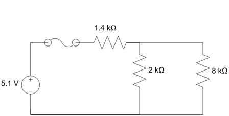
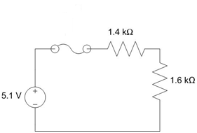

# Objective 1.2

| LO# | Description |
|----------|----------|
| 1.2 | I can determine appropriate circuit breaker values for adequate system protection. |

## Circuit Protection

Bad things can happen if we fail to keep electricity under control:
equipment can be damaged; buildings can catch fire; and people can be
injured, or even killed. Fortunately, using simple devices like fuses
and circuit breakers can protect us and our circuits if something goes
wrong. When selecting fuses and circuit breakers for our circuits, we
must use sound engineering analysis because selecting the wrong fuse or
circuit breaker could prevent the circuit from working or be ineffective
in protecting the circuit. The outcome will be dependent upon whether
the rating of the fuse or circuit breaker was too high or too low for
the circuit.

### Fuses and Breakers

Many of you have probably heard of the term, "short circuit," and know
that it's "bad" (in the smoke pouring out of your electrical device kind
of "bad"). A short circuit is simply a wire that connects the positive
terminal of a voltage source directly to the negative terminal as in the
example circuit below.

Figure 9: A circuit containing a short circuit

So in this scenario, how much current will be drawn from the source?
Well, we've learned today that solving for a circuit's equivalent
resistance allows us to model the circuit as a source and a single
resistor. So what is the equivalent resistance of the circuit above? If
we model the wire as a 0-Ω resistor, we can solve for the equivalent
resistance of the circuit (you saw that they were in parallel already,
right?):

$$R_{EQ(PARALLEL)} = \frac{(1\ k\Omega)(0\ \Omega)}{(1\ k\Omega) + (0\ \Omega)} = 0\ \Omega$$

What this means is that the voltage source only "sees" the wire, which
we modelled as a 0-Ω resistor. Because of this, all of the current will
flow through the short circuit, leaving none to flow through the
resistor. Therefore, the circuit can be redrawn as:

Figure 10: An equivalent circuit for a circuit containing a short
circuit

Since the wire and the source are parallel, we know 5 V has to drop
across the wire. Using Ohm's Law to solve for current,

$$I_{S} = \frac{V_{S}}{R_{EQ}} = \frac{6\ V}{0\ \Omega} = \infty\ A$$

In reality, the current is not infinite. The wire itself has a small
amount of resistance, which will keep the current from going to
infinity.

The important point, though, is that a short circuit causes a very large
amount of current to be drawn from the source. In the wiring in a house,
for example, a short circuit can draw enough current to melt a wire's
plastic coating and cause any wood or insulation near the wire to catch
fire. This, obviously, is a bad thing. In addition to fires, short
circuits can melt wires and destroy electrical components. To prevent
this from occurring, engineers incorporate fuses and circuit breakers
into their designs.

A fuse is nothing more than a very thin wire which usually allows the
current of a circuit to flow. Under normal conditions, the current flow
is low enough for the fuse to act as a simple wire. As the current
increases, however, the wire begins to heat until at some point, the
fuse melts, severing the connection and stopping the flow of current.

The highest current a fuse can handle without melting is the rating of
the fuse. A fuse rated at 2 amps will be able to handle anything up to 2
amps. Once the current rises above 2 amps, it will melt.

Figure 11: A good fuse and blown fuses (Source:
Electronicrepairguide.com)

A circuit breaker (or breaker) has the exact same function as a fuse but
has an advantage over the fuse in that it doesn't have to be replaced
every time it "blows." Most modern house and aircraft wiring systems
have circuit breakers while most cars still have fuses. Like the fuse,
the circuit breaker protects against current surges and has its rated
capability printed on it. Circuit breakers are a more expensive
investment at first but, usually, pay for themselves over a lifetime.
Breakers generally consist of a spring-loaded switch that is held closed
by a catch. The catch is released when the current level gets too high,
opening the circuit to prevent damage. Usually, the breaker is reset by
flipping a lever or pushing a button.

So what rating do we choose for our fuse or circuit breaker? There are
two rules to consider when choosing ratings:

    1. The rating must be higher than the expected current in the circuit.

    2. The rating must be lower than the failure point of the wiring.

You have learned how to calculate the expected current at a point in a circuit, so you know how to apply Rule 1. Finding the failure point of the wiring for Rule 2 involves knowing the wire size, or gauge, and material. The larger the diameter of the wire is the more current the wire can safely support, and copper wire can support more current than aluminum wire of the same dimensions. In the United States, we use standard American wire gauges, or AWG, as shown in the chart below from Home Depot. Once you have the values for Rules 1 and 2, you simply pick a fuse or circuit breaker rated in between those values. Stores and websites that sell these parts have many ratings available. For instance, one industry supplier, DigiKey, has well over 100 different fuse ratings for you to choose from. 

Figure 12: Home Depot wire gauge chart (Source: [The Home Depot](https://www.homedepot.com/c/ab/how-to-read-a-wire-gauge-chart/9ba683603be9fa5395fab9015a6d2c99))

Now you may be thinking, "Great, now I know how to design circuit protection in real life!" You are welcome. However, you may also be wondering, "In this class do I have to consult an AWG chart and look up an electronics supply website every time I do a fuse or circuit breaker problem?!" No, in this class you will not need to worry about the wire gauges. Instead, after you find the expected, or nominal, current value for Rule 1, you will add 10% and 50% more to it. Then, in lieu of checking what values a company has available, you will select from a provided table of potential ratings for your fuse or circuit breaker.

As a simple example, say you calculated the nominal current to be 10A in a given problem. You then multiply 10A by 1.1 and 1.5 to get a range of 11A-15A. You will then check the table provided for that problem and choose the appropriate one.

| Fuse Ratings | 
|----------|
| 10A    | 
| 12A    | 
| 14A    | 
| 16A    | 

For this simple example, both 12A and 14A fall within your 11A-15A range, so either rating would be acceptable.

---------------------------
**Example Problem:** The internal circuitry of a battery powered
camera is modeled as the resistive circuit below. What fuse rating would
you choose to protect the circuit?

**Understand:** In order to determine the fuse rating, we must find the
current drawn from the source. We've added a switch which allows current
to flow through to the 8-kΩ resistor when it's closed and blocks the
current when it's open. And the circuit includes both series and
parallel conncections. The circuit's equivalent resistance (and thus the
source current drawn from the voltage source) will change based on
whether the switch is open or closed.

**Identify Key Information:**

-   **Knowns:** We know the values of the voltage source and the
    resistors

-   **Unknowns:** The total current drawn from the source by the load
    and the fuse rating.

-   **Assumptions:** The resistance in the wire is much smaller than
    that of the resistors.

**Plan:** We will determine the current drawn from the source when the
switch is both open and closed. The fuse rating can be determined once
we see which configuration draws more current.

**Solve:** When the switch is open, no current gets to the 8-kΩ resistor
and therefore it has no effect on the circuit. If we model the fuse as a
wire (since we will assume it is not blown) and remove all hanging
wires/components, the circuit simplifies to the circuit below: a 5.1-V
source in series with the 1.4-kΩ and the 2-kΩ resistors.

Solving for the equivalent resistance gives us:

$$R_{EQ} = 1.4\ k\Omega + 2\ k\Omega = 3.4\ k\Omega$$

Redrawing the circuit leads to:

Since we model the fuse as a wire, *REQ* drops all 5.1 volts. The
current through REQ is therefore:

$$I_{EQ} = \frac{V_{S}}{R_{EQ}} = \frac{5.1\ V}{3.4\ k\Omega} = 1.5\ mA$$

Since *REQ* is in series with the source and the fuse, all three
devices share the same current. Therefore the fuse rating has to be
greater than 1.5 mA.

Now, we will repeat the analysis with the switch closed. Note the switch
is also modeled as a wire when it's closed.

The 2 kΩ and 8 kΩ resistors are parallel, so we can combine them with
the equation:

$$R_{EQ(PARALLEL)} = \frac{(2\ k\Omega)(8\ k\Omega)}{(2\ k\Omega) + (8\ k\Omega)} = 1.6\ k\Omega$$

We can now redraw the circuit using this value:

We can now find the equivalent resistance for the entire circuit:

$$R_{EQ} = 1.4\ k\Omega + R_{EQ(PARALLEL)} = 1.4\ k\Omega + 1.6\ k\Omega = 3\ k\Omega$$

Redrawing the circuit leads to:

Again, REQ drops all 5.1 volts. The current through REQ is

$$I_{EQ} = \frac{V_{S}}{R_{EQ}} = \frac{5.1\ V}{3\ k\Omega} = 1.7\ mA$$

With the switch closed, the current through the fuse is 1.7 mA. With the
switch open, the current through the fuse is only 1.5 mA. Since we want
the circuit to work whether the switch is open or closed, we need the
fuse to be rated higher than the highest current, 1.7 mA.

Since the maximum current through the fuse under normal operating
conditions is 1.7 mA, we multiplying this by 1.1 to get 1.87 mA.
Rounding 1.87 mA up to the nearest whole or half number (also the
nearest milliamp for this problem) gives us a fuse rating of 2 mA.

**Answer:** We would choose a fuse with a 2 mA rating to protect this
circuit.

---------------------------
