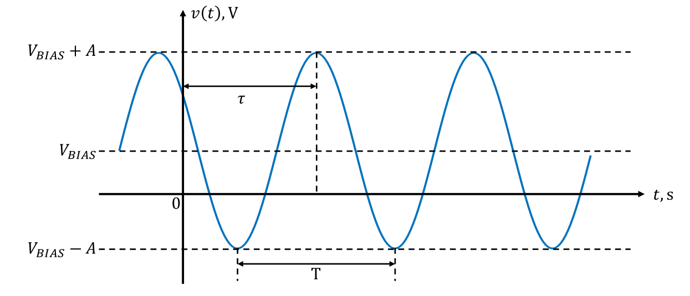

# Objective 1.3

| LO# | Description |
|----------|----------|
| 1.3 | I can calculate the voltages, currents, instantaneous power, and average power associated with devices in a simple AC-powered circuit using tools such as KVL, KCL, voltage and current dividers, Ohm’s Law, RMS values, and the power equation.  |  

## Electrical Signals

Our world is filled with signals. We raise our hand to signal the
instructor when we know the answer to a question. The light turns red to
signal we should stop. The phone rings to signal we should answer it.
Generally, a signal is something that conveys information.

In the world of electrical engineering, we use signals to convey
information and transmit power. The TV signal that comes to our homes
via cable, satellite dish, or old-fashioned antenna, is an electrical
signal that contains video images and the sound that goes with them.
When we click our mouse, an electrical signal is processed by our
computer's microprocessor to tell the correct program what to do. In our
combat aircraft, electrical signals are used to release bombs and
missiles at the proper time to cause the most damage to our adversaries.
Our communication systems use electrical signals to link weapon systems
and warfighters, thereby maintaining battlefield situational awareness.
Our power grid uses a very specific signal to transmit power efficiently
over long distances.

In the previous lessons, we examined how an electrical signal may be
used to deliever power to a load, such as a light bulb, and in doing so,
we used voltage sources that always provided the same voltage to the
circuit. However, in this lesson, we will introduce a voltage source
that can change its voltage over time. This new voltage source will
allow us to send different electrical signals to our load in order to
transmit power or convey information. This lesson will focus on using
these new electrical signals to transmit power, while blocks 3 and 4
will focus on how these signals may be used to convey information.

### Example Problem 1:
A programmable laser pointer is modeled as the
following circuit. Graph the current provided by the voltage source as a
signal with respect to time.

**Understand:** This is a review of material from the last lesson. We
have a source connected to a load, which consists of multiple resistors
in both series and parallel.

**Identify Key Information:**

-   **Knowns:** VS = 1.5 V, and the resistances in the load.

-   **Unknowns:** REQ and IS.

-   **Assumptions:** The source provides all the current needed by the
    load.

**Plan:** Before we can graph the source current with respect to time,
we need to calculate it. First, we will find the equivalent resistance,
then we can use Ohm's Law to find the current provided by the source.

**Solve:** *R2* and *R3* are connected in parallel. We can combine
them using the two-resistor equation for equivalent resistance:

$$R_{23} = \frac{(500\ \Omega)(500\ \Omega)}{(500\ \Omega) + (500\ \Omega)} = 250\ \Omega$$

This resultant 250-Ω resistor is now in series with *R1*. The
equivalent resistance is:

$$R_{EQ} = R_{1} + R_{23} = 50\ \Omega + 250\ \Omega = 300\ \Omega$$

We can now redraw the simplified circuit:

Since, by KVL, all 1.5 V drops across *REQ*, the current through
*REQ* is

$$I_{S} = \frac{V_{S}}{R_{EQ}} = \frac{1.5\ V}{300\ \Omega} = 5\ mA$$

**Answer:** Since there is nothing in the circuit to make the current
change over time, the graph of the current signal is:

The first thing to notice about this graph is that it is boring -- it
never changes over all time. This is because it is a DC signal, where DC
stands for *Direct Current*. DC signals, by definition, do not change
over time; their voltages and currents stay the same for all time. So
far, all of the voltages and currents we have used have been DC signals.

Although they are boring, DC signals are very useful. Many of the
electrical and electronic devices in our lives run off of DC power,
including flashlights, cell phones, and laptops. In general, if it has a
battery, it is DC-powered. Also, if it requires an AC adapter (like your
computer), it is DC powered. AC stands for *Alternating Current*, and as
the name suggests, AC signals change over time. In circuits with AC
signals, the voltage and current will change over time. As we will see
in block 2, AC signals enable efficient transmission of electrical
power. For this reason, the power grid uses AC signals, resulting in AC
signals coming out of your wall outlet and requiring that you use an AC
adapter with your computer.

Some devices only use DC power while some use only AC; it largely
depends on the device, its purpose, and how it operates.

Were we to graph the DC signals from any of these devices, the graph
would look nearly identical to the one above. The units and values might
change, but otherwise, it would be the same boring straight line.

### AC Signals

On the other hand, AC signals are more interesting to examine since they
vary with time. Frequently, AC signals are sinusoidal; therefore, we use
the following standard equation form to describe them:

$$v(t) = V_{Bias} + V_{m}\ cos(360{^\circ}*f*t - \phi)\ V$$

Where:

*-* $V_{Bias}$ is the DC component of the signal, also known as the
average value (*Vavg*);

\- $V_{m}$ is the amplitude of the signal, or maximum excursion from the
average value;

\- 360° is used to convert the argument of the cosine into an angle in
degreees. This could alternatively be shown as a radian conversion (2π);

\- *f* is the frequency of the signal or the number of times it cycles
in a second. Frequency has units of Hertz (Hz)[^1] and, oftentimes, will
be preceded by a "k" or an "M" for kilohertz or megahertz. Note: Hertz
is equal to$\ 1/sec$;

\- *t* is time (in seconds) and serves as the independent variable in
the equation;

\- *φ* is the phase shift and defines how far shifted (in time) the
cosine's peak is from zero seconds. This variable is nearly always zero
in this text and therefore usually omitted;

\- V is the signal's units. In this equation, the signal is a voltage,
but it could be a current.

We will also use the same format for current; however, in doing so, we
need to replace $v(t)$ with $i(t)$, $V_{Bias}$ with $I_{Bias}$, and
units of volts with amps.

This standard format is portrayed graphically in Figure 1.

Figure 1: Graphical representation of the AC standard form

In order to graph the signal, we must introduce two more parameters.
First, the period of the signal, *T*, is the time the signal takes to
complete a cycle and is given by:

$$T = \frac{1}{f}$$

As mentioned on the previous page, frequency has units of Hertz, which
is equivalent to 1/*sec*. Therefore, units of time are given when
dividing by frequency.

Secondly, the time delay, *τ*, is the amount of time between the first
positive peak and the origin (*t* = 0 s). This variable is found by
converting the phase shift (if there is one) from an angle (in degrees)
to time (in seconds):

$$\tau = T\frac{\phi}{360{^\circ}}$$

In the phase shift equation, dividing the phase shift by 360° produces a
ratio, and this ratio represents the delay within one period (remember
360° is the amount of degrees in one period). Multiplying this ratio by
the period, $T$, gives us the time delay.

### Example Problem 2:
A building is wired with AC power with a voltage of:

$$v_{s}(t) = 170\cos(360{^\circ}*60\ Hz*t)V$$

If two 200-Ω light bulbs are connected in parallel to this source, graph
the signal of the current drawn from the source.

**Understand:** Although we are dealing with a sinusoidal input signal,
all of the rules we've learned for resistive circuits still apply!
Therefore, we can solve this problem by finding the equivalent
resistance and using Ohm's Law to find the source current.

**Identify:**

-   **Knowns:** The input signal is sinusoidal, *v*(t) = 170 cos(360° \*
    60 Hz \* t) V, the resistances of the load are also known.

-   **Unknowns:** The source current, *is*(*t*).

-   **Assumptions:** Our tools for analyzing resistive circuits still apply.

**Plan:** Although a sinusoidal input signal seems much more daunting
than any of the DC voltages we've been using, the math is fairly
straightforward. We will find the equivalent resistance of the load,
then use Ohm's Law to find the source current, *is*(*t*). Finally,
we will use the standard equation to draw the graph of the current.

**Solve:** The equivalent resistance of the two resistors is:

$$R_{EQ} = \frac{(200\ \Omega)(200\ \Omega)}{(200\ \Omega) + (200\ \Omega)} = 100\ \Omega$$

This result leads us to an interesting shortcut: two resistors of the
same value in parallel always simplify to half of their resistance. Now,
we can redraw the circuit as we have been doing:

Since these two devices are in parallel, we know that all of the source
voltage drops across *REQ*. In other words,

$$v_{R_{EQ}}(t) = 170\cos(360{^\circ}*60Hz*t)V\ $$

Applying Ohm's Law, gives us:

$$i_{s}(t) = \frac{v_{R_{EQ}}(t)}{R_{EQ}} = \frac{v_{s}(t)}{R_{EQ}} = \frac{170\cos(360{^\circ}*60Hz*t)V}{100\ \Omega} = 1.70\cos(360{^\circ}*60Hz*t)A$$

We now need to graph the current. Let's compare it to the standard
equation format:

$$i(t) = I_{Bias} + I_{m}\ cos(360{^\circ}*f*t - \phi)\ A$$

$$i(t) = 1.70\cos(360{^\circ}*60*t)A$$

Notice the current doesn't have a bias (*IBias*, DC component) or
phase shift so we don't need to worry about them. Since the original
voltage source didn't have a bias, the current doesn't have a bias.

The amplitude is 1.70 A, which is a measure of how far the signal gets
from the average value. Since the average value (*IBias*) for this
signal is zero, we know that the signal will vary from -1.70 A to 1.70
A. This is a direct result of the fact the cosine itself varies from -1
to 1.

The frequency of the signal is 60 Hz. We can quickly solve for the
signal's period:

$$T = \frac{1}{60\ Hz} = 16.67\ ms$$

**Answer:** The graph of the source current signal is

In the previous example, the signal did not have a bias, and we could
determine the amplitude by knowing that the cosine function varies from
-1 to 1. However, calculating these parameters are slightly more
difficult when we have a bias. Assuming we have a voltage signal, we can
use the following equation to solve for the bias.

$$V_{Bias} = \frac{v_{\max} + v_{\min}}{2}$$

In this equation, $v_{\max}$ and $v_{\min}$ are the maximum and minimum
values, respectively, for the signal. The bias is just the average value
of the signal, and for that reason, the bias equation is just the
average of the maximum and minium values. The following equation is
helpful in solving for the amplitude, $V_{m}$.

$$V_{m} = \frac{v_{\max} - v_{\min}}{2}$$

By subtracting the minimum value from the maximum value, the amplitude
equation calculates the total spread of the signal, and dividing the
total spread by 2 gives us half of the spread, which is the maximum
excursion from the average value.

Before moving on, let's expand a little on the standard equation for a
more complex sinusoidal voltage signal.

$$v(t) = V_{Bias} + V_{m1}\ cos\left( 360{^\circ}*f_{1}*t - \phi_{1} \right) + V_{m2}\ cos\left( 360{^\circ}*f_{2}*t - \phi_{2} \right)\ V$$

Notice this is the same thing we had before, but now we allow for more
than one cosine term. Most real-world signals, including voice and music
signals, can be represented by a sum of many cosine terms. However, as
you can imagine, plotting more than one term at a time can become
extremely complicated. In all reality, we will rely on computer tools
like MATLAB® to do this. In a future lessons, we will learn a technique
that simplifies *interpreting* and *processing* these more complicated
expressions.

## AC Power

The concept of power for AC signals can be difficult to understand
because the voltages and currents are constantly changing, meaning the
power is always chaning as well. If we simply take the voltage across
and the current through a device and multiply them together, we get
something known as *instantaneous power*:

$$p(t) = i(t)\ v(t)$$

Let's use the values from the example above to explain this concept.
Looking at the voltage and current at *t* = 0 s, we have *v*(0) = 170 V
while *i*(0) = 1.70 A. At this instant in time, the power output from
the source is:

$$p(0) = i(0)\ v(0) = (1.70\ A)(170\ V) = 289\ W$$

As time progresses, both the voltage and the current drop off. At *t* =
4.167 ms, both the current and voltage have gone to zero and the power
output at that instant is also zero. Continuing onward, at *t* = 8.333
ms, the voltage and current have reached their negative peaks. The power
at that instant is:

$$p(8.333\ ms) = i(8.333\ ms)\ v(8.333\ ms) = ( - 1.70\ A)( - 170\ V) = 289\ W$$

If we graph the function *p*(*t*), we get

Figure 2: Voltage, current, and power over time for an AC signal

Figure *2* shows that the power of an AC signal varies over time and
even drops to 0 W at regular intervals. Interestingly, the AC signal
plotted here is the same as the one used in our power grid. You may be
thinking, "I can't see the lights in my room flickering as the power
graph suggests.". Fortunately, you can test this if you have a smart
phone with slow motion recording capabilities[^2]. Take a "SLO-MO"
recording of the lights in your dorm room for a few seconds, and then
play the video back to yourself. Hopefully, you can see the lights
flickering. This is visual proof that AC signals exist in real life!

While we might occasionally want to know the power output at specific
points in time, generally it's not what we need. What we want is a way
to measure the *average power*.

Unfortunately, we can't simply multiply the average voltage by the
average current to get average power. Doing this would result in an
average power of 0 W because the average voltage and current, as seen in
Figure *2*, are both zero. We know this can't be true because we just
saw the lights flickering in the "SLO-MO" recording. Also, the power
signal in Figure *2* is centered above 0 W, meaing the correct average
power has to be some positive number.

In order to calculate average power, we must introduce a new concept -
the *root-mean-square* (RMS) value. The RMS value for a voltage signal
is defined as follows:

$$V_{RMS} = \sqrt{\frac{1}{T}\int_{0}^{T}{v^{2}(t)dt}}$$

In AC electrical circuits, the RMS value represents the magnitude of the
equivalent DC voltage (or current) that would dissipate the same amount
of power in a resistor. Sometimes, we will refer to the RMS value as the
*effective* value because it is the effective DC value for that AC
voltage or current. For sinusoidal signals, the effective value or RMS
value can be simplified as follows:

$$V_{RMS} = \sqrt{{(V_{Bias})}^{2} + \frac{\left( V_{m} \right)^{2}}{2}}$$

where the *Vm* stands for amplitude of the sinusoidal signal. The same
equation is also used to calculate the RMS value for current; all we
have to do is replace the $V_{RMS}$ with $I_{RMS}$, $V_{BIAS}$ with
$I_{BIAS}$, and the voltage amplitude with the current amplitude. For
nearly all of our signals, the bias will be zero, which gives us:

$$V_{RMS} = \sqrt{{(V_{Bias})}^{2} + \frac{\left( V_{m} \right)^{2}}{2}} = \sqrt{{(0\ V)}^{2} + \frac{{(V_{m})}^{2}\ }{2}} = \sqrt{\frac{\left( V_{m} \right)^{2}}{2}} = \frac{V_{m}}{\sqrt{2}}$$

Now we can use these values to calculate the average power produced by
the system. The equation for power is the same as before, but now we use
the RMS values to get average power:

$$P_{AVG} = I_{RMS}V_{RMS}$$

So for our example above,

$$V_{RMS} = \frac{A}{\sqrt{2}} = \frac{170}{\sqrt{2}} = 120.2\ V_{RMS}$$

$$I_{RMS} = \frac{A}{\sqrt{2}} = \frac{1.70}{\sqrt{2}} = 1.20{2\ A}_{RMS}$$

$$P_{AVG} = I_{RMS}V_{RMS} = 144.5\ W$$

This answer makes perfect sense! Look at the graph of the power in
Figure *2*. If you had to choose an average value, what value would you
choose? Around 150 W? If we could zoom in on the graph, we would see
that the average value is exactly 144.5 W.

The voltage used in Example Problem 2 has a frequency of 60 Hz and a
voltage of 120 VRMS (after rounding down from 120.2 VRMS). As stated
earlier, this is exactly the voltage we get out of our wall outlets in
the United States. When we say the wall outlet gives us 120 volts, what
we really mean is that it gives 120 volts RMS. In actuality, the voltage
signal varies from 170 V to -170 V, at a frequency of 60 cycles per
second (Hz).

[^1]: The unit of Hertz is named after Heinrich Hertz (1857-1894). He
    was a German physicist and the first person to prove the existence
    of electromagnetic waves.

[^2]: To properly test this, you need to have a camera capable of
    recording at 240fps. This is possible for the iPhone 8 or newer
    <https://www.apple.com/newsroom/2017/09/iphone-8-and-iphone-8-plus-a-new-generation-of-iphone/>.
