# Objective 1.5

| LO# | Description |
|----------|----------|
| 1.5 | I can calculate the efficiency of a system modeled as an electrical circuit.  |  

## Power Generation and Motors

We're fortunate to live in a society that has electrical power at our
disposal. The simplicity of plugging a device into an outlet makes it
all too easy to take this for granted. However, this is a very modern
convenience made possible by many advancements at the end of the 19^th^
century and throughout the 20^th^ century. The most notable advancements
were those in generators and motors at the end of the 19^th^ century by
the electrical engineer Nikola Tesla[^1] and others that paved the way
for reliable and cheap electrical power. Due to the importance of motors
and generators in power generation and distribution, we will cover the
principles of motors and generators before discussing their efficiencies
and various sources of electrical power. Interestingly, generators are
not restricted to powerplants; generators are attached to the turbines
in many modern aircraft and provide all of the usable electricity for
the aircraft and its passengers.

### Motors and Generators

Motors allow us to convert electrical energy into rotational mechanical
energy. They consume electrical energy and output rotational mechanical
energy in the form of a rotating shaft which can do work. From there,
mechanical engineers can convert it into all sorts of other mechanical
work such as moving a vehicle, raising an elevator, or pumping water.
Generators simply reverse this process: mechanical energy is used to
turn a shaft, which outputs electrical energy as it rotates.

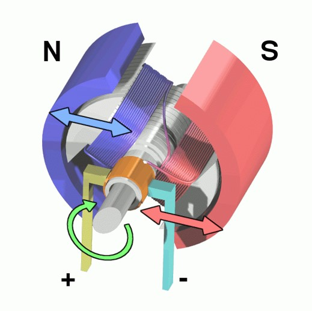

Figure 1: A 3D cross-section of a DC motor.

The basic principles of motors are fairly
straightforward. When two magnets are near each other, they naturally
want to line up so the "North" end is near the "South" end of the other.
To leverage this effect, we place a magnet on a shaft that can rotate,
inside another magnet that stays stationary. In this case, the rotating
magnet, called the *rotor*, will perform work in rotating to align
itself with the outer magnet, called the *stator*. This can be
visualized in Figure 1 and Figure 2.

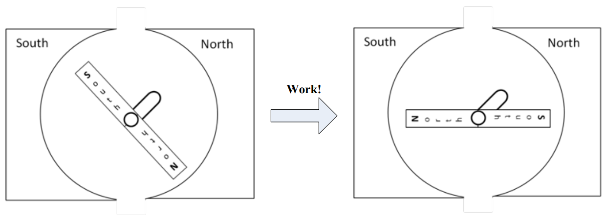

Figure 2: A motor consisting of a rotor and stator

According to Ampere's Law, a wire with an electric current going through
it creates a magnetic field around it. Furthermore, if we coil that wire
around a ferromagnetic material, such as a block of iron, it strengthens
the field and makes a magnet with a North and South pole. In fact, it is
possible to make a very simple electromagnet by wrapping a wire around a
large nail and then connecting the wire to a battery. However, the most
useful thing about electromagnets in motors is this: if the direction of
the current is reversed, the polarity of the magnet switches. This is
shown in Figure 3 below.

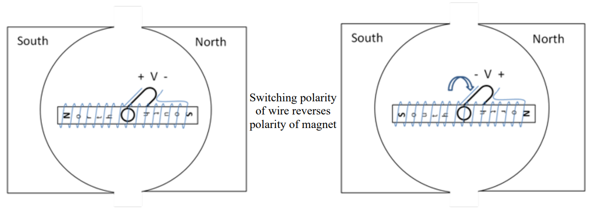

Figure 3: A DC motor with permanent magnet stators and an
electromagnetic rotor

When we reverse the polarity, the North and South poles on the rotor
switch sides, causing a force that tries to place the rotor in the
opposite position. If we properly time the polarity reversal while the
rotor is in motion, the rotor tries to align to a new position, creating
torque as it tries to reach the new position. In essence, a DC motor
turns by changing the poles on the rotor while the poles on the stator
are held constant. This effect is visualized in Figure 3.

In order to properly coordinate the timing of this effect, a DC motor
uses a commutator and brushes to both transfer the electricity and
reverse the polarity. A *commutator* is a metal strip on the outside of
the shaft which provides metal conductivity from the rotating shaft to
the coils on the rotor. *Brushes* are metal strips (or a roller) that
touch the commutator and provide the electric source. While not
completely accurate, think of the commutator and brushes as the voltage
source (+ V -- and -- V +) in Figure 3. Every time the shaft completes
half a rotation, the commutators switch which charged brush (positive or
negative) they are connected to. Therefore, the current is reversed and
so is the polarity of the electromagnet, and the motor continues to
spin. The brushes, commutator, and rotor of a DC motor are shown in
Figure 4.

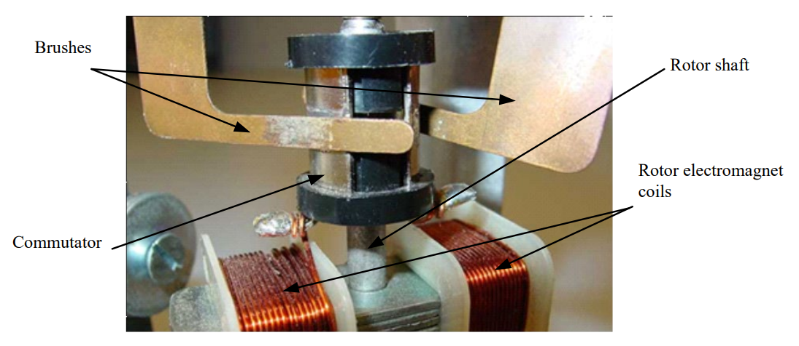

Figure 4: A view of the commutator and brushes

Motors can work on either AC or DC electricity, and within each of those
groups, there are several different designs. However, all are based on
the concept of magnetic fields trying to align.

One last note on motors: as with all electrical machines, they are rated
in how much work they can do per unit time. However, while electrical
engineers use Watts to rate power, motors are rated in *horsepower*.
Horsepower was used for motors and engines before electricity was
discovered, and the convention stuck. The conversion is one horsepower
(hp) to 745.7 Watts.

### Efficiency ($\mathbf{\eta)}$

As we prepare to move into more real-world scenarios, we need to
introduce the concept of *efficiency*. Efficiency is a measure of how
much power is wasted when we use electricity to do useful tasks. If we
don't waste any power, or we use all the power we produce, the
efficiency of our system is 100%. If we only waste a little power, then
our efficiency is high (usually, above 95%). If we waste a lot of power,
our efficiency is low. There are a number of ways to calculate
efficiency; the one you use depends on what you know about the system at
hand.

$$
\eta = \frac{P_{OUT}}{P_{IN}} = \ \frac{P_{USEFUL}}{P_{PRODUCED}} = \ \frac{P_{PRODUCED} - P_{LOSS}}{P_{PRODUCED}} = \frac{P_{USEFUL}}{P_{USEFUL} + P_{LOSS\ }}
$$

In the above equation, POUT or PUSEFUL is the power consumed doing
useful work, while PIN or PPRODUCED is the total amount of power the
source needs to supply to meet the needs of the load and the loss
(PLOSS). Up until this point, we have presented ideal circuits (100%
efficient) where all of the devices were performing useful functions.
Most electrical circuits actually lose power somewhere - think of the
heat radiating off of your laptop after it has run for a while. We can
model these losses fairly easily by including an additional resistor in
series with our load. This resistor doesn't physically exist in the
circuit, but is useful for helping us understand where the power is
going. The circuit in Figure 5 illustrates this concept:

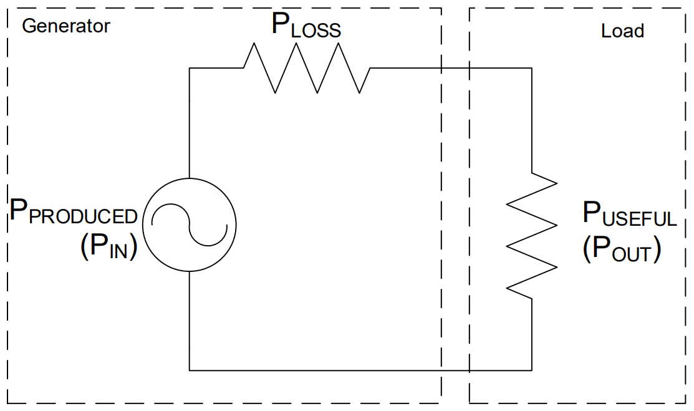

Figure 5: Modeling losses in a system with a series resistor

-------------------------------------------------------------------------------------------------------------------------------
### Example Problem 1

An AC-powered rotating beacon, modeled as a $120 kΩ$ resistor, is to be installed on an aircraft.
Since the beacon requires $40 V_{RMS}$ to operate, a resistor is
placed in series to act as a voltage divider. The aircraft generator
produces a voltage of $v(t) = 84.85*\cos(360°*400*t)V_{RMS}$. If the
required efficiency for this circuit is 85%, is this a viable option?

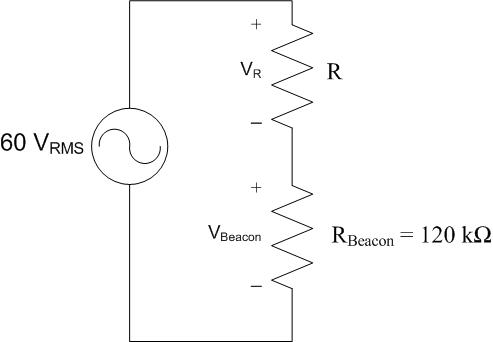

**Understand:** This is a voltage division problem where the resistor
$R$ will drop voltage so the beacon only receives $40 V_{RMS}$. In the
circuit, we want the rotating beacon to operate, so the power consumed
by the beacon itself is useful. The power consumed by the resistor $R$,
however, is wasted. The power dissipated by the resistor is a loss that
lowers efficiency. The source needs to provide both the useful power and
the wasted power to make the circuit work. We can model this scenario as
the circuit to the right.

**Identify Key Information:**

- **Knowns:** We know the voltage provided to the circuit is
    $v(t) = 84.85*\cos(360°*400*t)V_{RMS}$ and the beacon needs $40 V_{RMS}$
    , but the efficiency of the overall system needs to be 85%.

- **Unknowns:** The current in the circuit, the resistance of the
    "loss resistor", the voltage dropped across the "loss resistor".

- **Assumptions:** None.

**Solve:** The first thing we need to do is convert the source voltage
into RMS. Since no $V_{Bias}$ was mentioned, we will assume it is zero and
that the $V_{RMS}$ is:

$$
V_{RMS} = \frac{V_{m}}{\sqrt{2}} = \frac{84.85}{\sqrt{2}} = 60\ V_{RMS}
$$

We know that the source produces $60 V_{RMS}$ and the beacon drops $40 V_{RMS}$
KVL tells us that $R$ must drop $20 V_{RMS}$.

Since we know that the current in series components is the same, we can
determine $I$ (in $A_{RMS}$) from Ohm's Law at the beacon:

$$
I_{RMS} = \frac{V_{Beacon}}{R_{Beacon}} = \frac{40{\ V}_{RMS}}{120\ k\Omega} = 333.3\ \mu A_{RMS}
$$

We can now determine the power produced by the source:

$$
P_{S,AVG} = I_{RMS}V_{RMS}
$$

$$= \left( 333.3\ \mu A_{RMS} \right)\left( 60{\ V}_{RMS} \right)$$

$$= 20\ mW$$

The power consumed by the beacon is:

$$P_{BEACON,AVG} = I_{RMS}V_{RMS} = \left( 333.3\ \mu A_{RMS} \right)\left( 40\ V_{RMS} \right) = 13.33\ mW$$

Finally, the efficiency is

$$\eta = \frac{P_{USEFUL}}{P_{PRODUCED}} = \frac{13.33\ mW}{20\ mW} = 0.6667 = 66.67\%$$

**Answer:** No, this is not a viable option since the efficiency is only
66.67%, which is less than the required 85%.

### Motor Efficiency

Now let's look at how conservation of power applies within a DC motor.
Figure 6 shows the relationship between the input electrical power we
supply to the motor compared to the output power. The input power will
be the voltage we provide across the terminal of the motor, $V_T$,
times the current going into the motor.

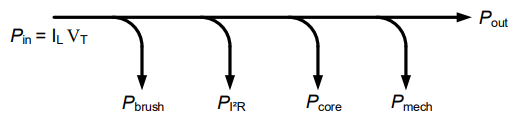

Figure 6: Relationship between input and output power

Before the electricity gets to the coils on the rotor to create the
electromagnet, it must pass across the brushes/commutator. As those
connections are made and switched, there is typically a little sparking.
This is energy that is lost to heat/light, and we will call this
$P_{brush}$. Within the motor there are resistive (heat) losses due to
the current flowing through components that have resistance, such as the
copper wires in the coils. These are called copper losses or $I^{2}R$
losses for this reason. There are core losses within the electromagnet,
such as the magnetic flux leaking outside the motor and molecules within
the electromagnet consuming energy. These are lumped as *core losses*.
Also, some power is lost to friction of the rotor spinning as well as
air resistance. These mechanical losses are lumped together as
$P_{mech}$. All that is left is the power transferred out of the motor as
torque.

If we model this discussion as a circuit with lossy devices, we would
get circuit below, where:

$$P_{losses} = P_{brush} + P_{i^{2}R} + P_{core} + P_{mech}$$

$$P_{useful} = \ P_{out}$$

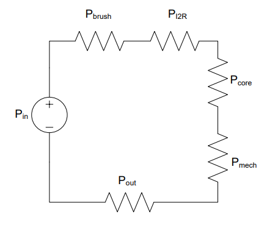

Figure 7: A circuit modeling the losses in a motor

| **Symbol**    | **Description**                                     |
|---------------|-----------------------------------------------------|
| $P_{brush}$   | Loss due to sparking during commutation             |
| $P_{I^2R}$    | Loss due to resistance of copper wires              |
| $P_{core}$    | Loss due to magnetic flux leaking outside the motor |
| $P_{mech}$    | Loss due to friction                                |

We can use the input and output power to determine the efficiency of the
motor. The efficiency tells us the percent of the input power that can
be used at the output.

$$\eta = \frac{P_{out}}{P_{in}} = \frac{P_{in} - P_{losses}}{P_{in}}$$

---------------------------------------------------------------------------------------------------------------
### Example Problem 2:
An 87% efficient, 40-hp motor is plugged into a
standard electrical outlet. How much power will it consume and how much
current will it draw when operating at rated conditions?

**Understand:** By definition, a motor of a given rated horsepower is
expected to deliver that quantity of power in a mechanical form at the
motor shaft. Since the motor is not 100% efficient, we will need to
supply more power to the motor in order to account for the losses.

**Identify Key Information:**

-   **Knowns:** We know the horsepower rating and the efficiency. We
    also know the outlet is providing 120VRMS.

-   **Unknowns:** The power and current drawn by the motor.

-   **Assumptions:** None.

**Plan:** First, we need to convert the power from hp to W. Then, we
need to use the efficiency equation to determine the required input
power. Finally, use the power law to determine the current drawn by the
motor.

**Solve:** Determine the power delivered to the shaft, in Watts:

$$P_{out} = \ 40\ hp = 40\ hp\frac{745.7\ W}{1\ hp} = \ 29.83\ kW$$

Then use the efficiency equation to determine the motor's power
requirement.

$$\eta = \frac{P_{out}}{P_{in}}$$

$$P_{in} = \frac{P_{out}}{\eta} = \frac{29.83\ kW}{0.87} = 34.29\ kW$$

Since a standard electrical outlet delivers 120 VRMS, we can use the
average power equation to determine current draw:

$$I_{RMS} = \frac{P_{in}}{V_{RMS}} = \frac{34.29\ kW}{120\ V_{RMS}} = 286\ A_{RMS}$$

**Answer:** The motor will consume $34.29 kW$ and draw $286 A_{RMS}$ when
running at rated conditions.

### Generators

Thus far, we've exclusively discussed motors and have not really
mentioned generators. However, generators, except in some very
specialized cases, look exactly like motors, as illustrated in Figure 8.
Physically, they are the same. Instead of applying a voltage and
watching the rotor spin, we can physically spin the rotor to extract
electrical energy. When the coils of wire on the rotor spin through the
magnetic field of the stator, a voltage is induced in the coils of wire!

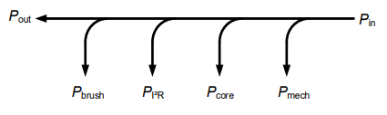

Figure 8: Generator power flow

In an aircraft, an AC generator is driven by the rotation of the engine,
and Figure 9 shows the myriad of different generators and motors found
on a standard aircraft. These generators are typically used to provide
$115 V_{RMS}$ running at $400 Hz$ to the devices on board with some of it
converted to DC voltage (we'll talk about how to do that later in this
block).

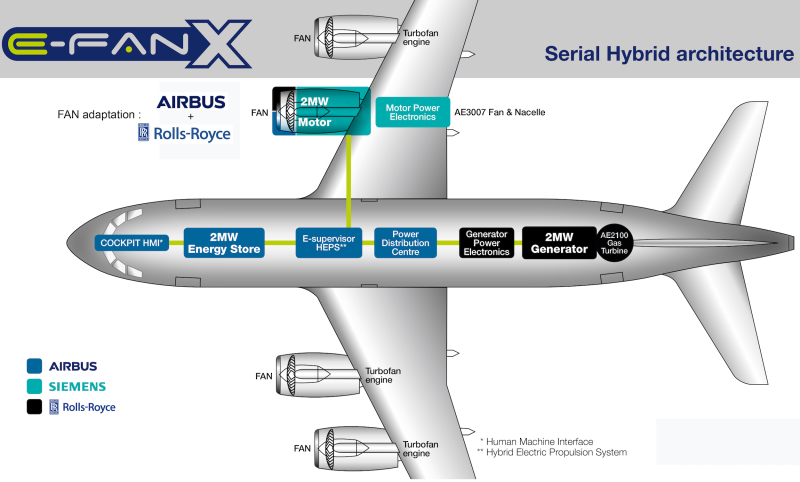

Figure 9: An example of the power architecture of a commercial aircraft.

Source: https://www.greencarcongress.com/2017/11/20171128-efanx.html

#### Power Generation

Although electricity is all around us, very few of us give much thought
to where it comes from. The power plants are usually, but not always,
far removed from the population so we simply do not have to deal with
them on a regular basis.

This was not always true though. In the late 1800's, when electricity
was first beginning to be used, multiple power stations were spread out
through population centers due to the power losses (in the form of heat)
caused by resistance in the wires travelling over long distances. The
advent of transformers helped solve that problem, although it was a
fierce battle between Thomas Edison and George Westinghouse/Nikola
Tesla. The next lesson is devoted to explaining how transformers enable
efficient transmission of power.

There are many advantages to having power plants far removed from
population centers. This allows them to:

-   Be closer to the fuel/resources which generate the electricity

-   Be large plants which are more efficient due to economy of scale

-   Minimize the impact of exhaust/pollution within the community

As you would expect, power needs vary throughout the day, and those
needs are classified into into three categories: base power,
intermediate power, and peak power. Base power is the minimum required
power to meet the needs of an area. Intermediate power is a predictable
increase in power demand throughout the day due to normal activities,
such as lights and kitchen appliances being turned on in the evenings
when people return home from work. Peak power is the absolute maximum
power needed to fill unforeseen requirements, such as an especially hot
or cold day (which means more air conditioners or furnaces are
operating).

Almost all electrical power plants share one thing in common:
electricity is generated by turning the shaft of a generator. The most
common type of power plant is a *thermal power plant*. In these types of
plants, water is heated to steam, which then passes through a turbine
connected to the shaft of the generator. As the steam passes through the
turbine, it causes the turbine and shaft to rotate, producing electrical
energy. This process is seen in Figure 10.

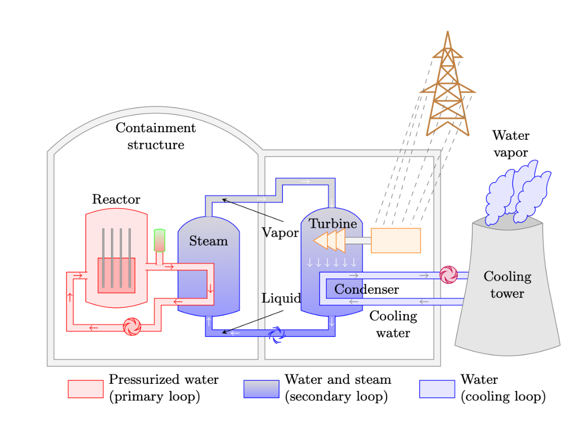

Figure 10: A nuclear power plant is an example of a thermal power plant.

Steam is not the only way the shaft can be turned. Wind, water, expanded
air, or mechanical energy from a motor can turn the shaft, generating
electricity. However, more than 70% of our electricity is generated
using steam to turn large turbines.

Electricity can be generated by several different sources, but the
following six sources provide about 96% of our electricity.

**Natural Gas.** Natural gas plants use the expansion of the gas when it
is burned to turn turbines (though some hybrid plants exist which also
use steam) and provide approximately 40% of US electricity. Since they
do not need to heat water for steam, they are very responsive to
changing power needs and are often used to provide intermediate and peak
power. While they are not as clean as nuclear plants, they have fewer
emissions than coal plants. Their most severe disadvantage comes from
the difficulty and high cost of transporting and storing natural gas in
bulk due to its low density and instability (it's prone to erupting into
flames).

**Nuclear.** These thermal plants provide approximately 20% of US
electricity and are also used for base loads since they cannot change
their output quickly. Their primary advantages are that they provide a
consistent amount of power and tend to be very cost effective. Similar
to coal plants, they are poor candidates for filling intermediate and
peak power requirements because they require more than a day to start
up. In contrast to coal plants, nuclear plants do not emit contaminants
into the atmosphere. However, the large amount of water required for
cooling can have an environmental impact. Nuclear plants are a very
popular electricity source in Europe, where France receives 80% of its
electricity from nuclear production. On the other hand, construction of
nuclear plants in the U.S. has stalled due to concerns about radiation
accidents, such as the one from Three Mile Island in 1979. Furthermore,
finding a long-term, safe method of disposing of waste products,
especially for the enriched uranium used to make nuclear weapons, has
been a significant problem.

**Coal**. These thermal plants are used for base loads since they cannot
change their output quickly. Coal power plants provide 19% of U.S.
electricity. Their primary advantages are that they provide a consistent
amount of power and tend to be very cost effective, especially here in
the U.S. where coal is relatively plentiful. They are poor candidates
for filling intermediate and peak power requirements because they
require more than a day to start up. They are also a source of
pollution, which can damage the environment. The Clean Air Act of 1970
eliminated a significant amount of pollution caused by coal power
plants, and now, they are now required to install equipment to limit
contaminants.

**Wind.** Generating power by using wind to
turn a turbine accounts for approximately 8% (and rising) of US
electricity. Wind turbines tend to be cost effective because of their
use of a renewable resource and are also "clean" (though many detractors
point to their destruction of landscapes and impact on bird populations
as environmental concerns). Because power generation is highly variable
and completely unrelated to power needs, they are not reliable for
meeting base or peak power needs. Additionally, in order for them to be
useful in helping with intermediate loads, storage mechanisms are needed
to keep the energy for periods when it is needed. For example, some wind
turbine farms can redirect power to move water uphill into tanks where
it can be released when required to generate hydroelectric power.

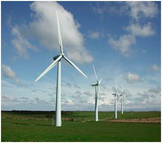

Figure 11: Wind turbines

**Hydroelectric.** Dams in the U.S. provide 7% of the country's
electricity by using moving water to turn a turbine. Once built,
hydroelectric plants are relatively cost effective (so long as water
continues to flow) and do not emit contaminants. They are very
responsive to peak and intermediate power needs because of their ability
to ramp up power generation by increasing water flow through the plant.
These advantages make hydroelectric plants extremely popular; however,
there are a limited number of locations where they can be built. Since
we have no control over the location of a hydroelectric dam, they can be
far from population centers, requiring significant infrastructure in
order to transmit the power.

**Solar.**
Solar power provides less than 2% of US electricity. There are two types
of solar energy: thermal and photovoltaic. Thermal, like other thermal
plants, uses the sun's energy to heat oil which is then used to boil
water. Photovoltaic, however, directly uses photons from the sun to
excite materials like silicon to release electrons, directly creating
electricity. Since clouds and storms can greatly reduce the power
generated by solar power, it cannot be used for base or intermediate
power loads. Even though solar power can be variable, it is used to help
meet peak demand needs because peak demand tends to occur when the sun
is at its strongest: during the day and in the summer. The benefits of
solar are that it is a renewable resource and that it has a low
operational cost. However, even though efforts are being made to reduce
the costs associated with solar power, solar panels are expensive and
require a large initial investment. Also, there are negative
environmental impacts associated with manufacturing solar panels.
Lastly, in contrast to wind farms where the land may be used for cattle
grazing, it is difficult to repurpose the land once a solar farm has
been built on it.

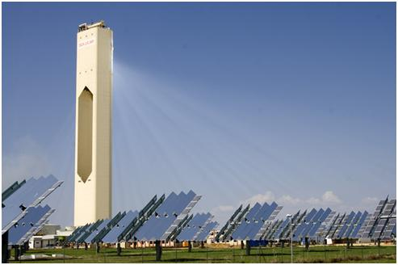

Figure 12: A photovoltaic solar energy farm.

[^1]: For those interested in the history of technology, we highly
    recommend reading *Tesla: Inventor of the Electrical Age* by W.
    Bernard Carlson.
