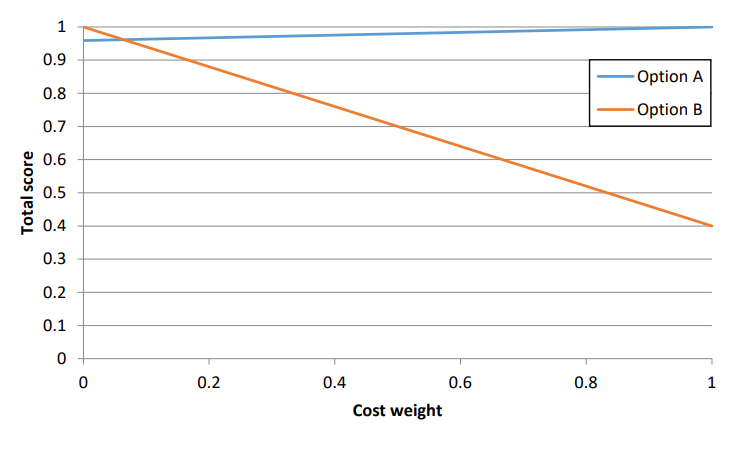

# Objective 1.8

| LO# | Description |
|----------|----------|
| 1.8 | I can use a decision matrix to quantitatively compare various measures of merit.  |  

## Decision Matrices

Oftentimes, you find yourself trying to make a decision based on two
or more different criteria or parameters. For example, suppose you
want to use your cadet loan to buy a new car. You're having
difficulties making a choice, but you know that you want to make a
decision based solely on cost and fuel economy. In order to decide
which car is the best for you, you must either convert both parameters
to a common metric (e.g., cost *or* fuel economy) or find a way to
combine the two measures into a single score. The danger of converting
to a common metric is that, while the measures may seem the same,
their importance may vary. For example, depending on the situation you
are in, the one-time cost of buying a car may be more important to you
than the recurring cost of fuel economy, and vice versa. Common
metrics don't allow us to compare the importance of the various
metrics, and for that reason, we will not be using common metrics in
ECE 215. In this class, we will be combining the two metrics into a
single score, and we will do that with *decision matrices*.

Decision matrices are tables that allow us to systematically work
through the metrics of each options to arrive at a single quantified
score for each option. Once we've identified each option's final
score, it will be a simple matter to select the option with the best
score. This is done by following a 5-step process:

### **Step 1: Identify the Measures of Merit**

The first thing you need to do is list the metrics we want to use in
our decision. These metrics are called *measures of merit* since each
one should have some sort of quantifiable value for each option under
consideration. In our car-buying example, the cost of the car will be
in units of dollars (\$), and the value will be somewhere in the
thousands of dollars. On the other hand, the fuel economy will be in
units of miles per gallon, and the value will be somewhere in the tens
of miles per gallon. These values for each option will be need to be
listed in the decision matrix.

### **Step 2: Normalization**

 Once you have identified all measures of merit and listed their values
 in the decision matrix, the next step will be convert these values
 into a unit-less range of scores. This process is known as
 *normalization*. If we think of the different measure of merit values
 as raw values, then normalization works to convert all the raw values
 to normalized scores that do not have units and fall somewhere between
 0 and 1. To begin normalization, we must determine whether to
 *maximize* or *minimize* each measure of merit. Going back to our car
 buying example, we would prefer a smaller cost, so we would minimize
 that measure of merit. On the other hand, we would prefer a larger
 fuel economy, so we want to maximize that measure of merit. From this,
 we will be able to see that the "best raw value" for cost will be the
 smallest cost among all of the cars you are considering, and the "best
 raw value" for fuel economy will be the largest fuel economy. Then, we
 can use the following equations to find the normalized scores. In the
 following equations, the "raw value" refers to the value of the
 measure of merit being normalized for each of the options being
 considered.

**Minimize:** ${Score}_{norm} = \ \ \frac{Best\ Raw\ Value}{Raw\ Value}$

**Maximize:**${\ Score}_{norm} = \ \ \frac{Raw\ Value}{Best\ Raw\ Value}$

As you can see from the minimizing equation, we will have a smaller
value (the best raw value) divided by a larger value (the raw value), so
that should make the normalized score less than 1. With the maximizing
equation, we will always have a smaller value (the raw value) divided by
a larger value (the best raw value), resulting in a normalized score
less than 1. To create a normalized score for the option that has the
best raw value, we plug the best raw value in for the raw value in these
equations, leading to a normalized score of 1 in both cases.

> **Key Concept**: When normalizing, the score should **always** be less
> than or equal to one. If you end up with a normalized score greater
> than one, then you used the wrong equation.

### **Step 3: Weighting**

 Once you have normalized all your measures of merit, you still need to
 combine them into a single score. This combination step gives us the
 opportunity to increase the value of one measure over the other by
 assigning *weights* to the measures of merit. In our car-buying
 example, if you would prefer to pay more now in order to save in
 future gasoline costs, you should give fuel economy a higher weight
 than cost. You could give cost a weight of 40%, or 0.4, and fuel
 economy a weight of 60%, or 0.6. Therefore, we assign weights to each
 measure of merit based on their relative importance where the weights
 must total to 100%, or 1.0. In our example, we could have picked any
 weights for cost and fuel economy as long as they summed to 100%.

> **Key Concept**: When assigning weights to measures of merits, the
> weights must sum to 100%.

> **Note:** Assigning weights can be a subjective process, and for this
> reason, you need to clearly state the weights you chose and fully
> justify why you chose those weights. This is all a part of sound
> engineering analysis!

 Once we have assigned the weights, we calculate the weighted score for
 each measure of merit for each option. We do this by multiplying the
 normalized score by the measure of merit's weight.

 $$Score_{weighted} = Score_{norm} \times Weight$$

 The weights for each measure of merit and the weighted scores for each
 option's measures of merit can now be entered into the decision
 matrix.

### **Step 4: Calculate Each Option's Final Score**

 Now that you have all the weighted scores for each option, you'll need
 to sum up the weighted scores for each option to determine the
 option's total score as follows:

$$Score_{total} = \ Scor{e_{weighted}}_{1} + Scor{e_{weighted}}_{2} + \ldots + \ Scor{e_{weighted}}_{N}$$

 At the end of this step, we should have a final score for each option
 that falls somewhere between 1 and 0 which will go in the last column
 of the decision matrix.

### **Step 5: Select the Best Option**

 The final step is to compare each options final score to pick out the
 best option. In this class, the option with the highest score final
 score will be the best option.

 ## Examples
 Let's now look at some examples for how we can use a decision matrix
 to pick the best option for a given situation.

> **Example Problem 1:** A team has identified two options for the power
> supply of a UAS. After finding the efficiencies of the two options,
> you research the costs for each option. Since Option B requires a
> larger transformer and more efficient converter, it costs more. If
> Option A costs \$600 and Option B costs \$1500, which should the
> government buy? Assume the two measures of merit are cost and
> efficiency and are equally important.
>
> ***Step 1: Identify***
> 
> -   **Knowns**: Measures of merit for the options we are comparing are
>     summarized in the following table:
> 
>  
Table 1: UAS power supply options

>  
>  

>  
>  |              | **Cost** | **Efficiency** |
>  | :----------- | :------: | :------------: |
>  | **Option A** | \$600    | 95.13%         |
>  | **Option B** | \$1500   | 99.19%         |
>  
>  

> 
> -   **Unknowns:**
> 
>       -   What is the best solution?
> 
>       -   Normalized Cost and Efficiency scores for both systems
> 
>       -   Weighted Cost and Efficiency scores for both systems
> 
>       -   Total Cost and Efficiency scores for both systems
> 
> -   **Assumptions:** Since the measures are equally important, each
>         will have a weight of 50%, or 0.5.
> 
> In order to determine which power supply the Government
> should buy, we must determine the normalized and weighted for the
> measures of merit for each option then use the weighted scores to
> calculate the total score for each option. The following expansion of
> the decision matrix is helpful in doing so.
> 
>  
Table 2: Empty decision matrix for UAS power supply

>  
>  

>   
>  |              |           | **Cost**       |                  |           |**Efficiency**  |                  | **Total** |
> | :----------- | :-------: | :------------: | :--------------: | :-------: | :------------: | :--------------: | :-------: |
> | **Weight**   |           | 0.5            |                  |           | 0.5            |                  |           |
> |              | **Value** | **Norm Score** | **Weight Score** | **Value** | **Norm Score** | **Weight Score** |           |
> | **Option A** | \$600     |                |                  | 95.13%    |                |                  |           |
> | **Option B** | \$1500    |                |                  | 99.19%    |                |                  |           |
> 
> 

> 
> To populate this table, we should calculate the normalized score for
> each option first, then the weighted score for each option, then the
> total scores.
> 
> ***Step 2: Normalization***
>
> 
 
>
> **Minimize:** ${Score}_{norm} = \ \ \frac{Best\ Raw\ Value}{Raw\ Value}$
> 
> **Maximize:**${\ Score}_{norm} = \ \ \frac{Raw\ Value}{Best\ Raw\ Value}$
> 
> 

>
> **Cost**: We recognize that cost should be minimized; therefore, the
>     best cost is option A, which receives a normalized cost score of
>     1.0.
>
> $${Score}_{Norm_{A,cost}} = \frac{Best\ Raw\ Value_{cost}}{Raw\ Value_{A,cost}} = \ \frac{600}{600} = 1.0$$
>
> To calculate Option B's cost score, we use the same equation, except
> we use Option B's cost for the raw value:
>
> $${Score}_{Norm_{B,cost}} = \frac{Best\ Raw\ Value_{cost}}{Raw\ Value_{B,cost}} = \ \frac{600}{1500} = 0.4$$
>
> One way to view this number is that in terms of cost, Option B is only
> 40% as good as Option A.
> 
> **Efficiency**: Since we want to maximize efficiency, the best
>     efficiency is Option B, so it receives a normalized score of 1.0.
>     What about Option A's efficiency score? If we use the wrong equation
>     for efficiency (the one for minimizing a measure), we have:
> 
> $${Score}_{Norm_{A,efficiency}} = \frac{Best\ Raw\ Value_{efficiency}}{Raw\ Value_{A,efficiency}} = \ \frac{99.19\%}{95.13\%} = 1.043$$
>
> Clearly, something is wrong since the answer is above 1. We need to be
> maximizing efficiency, but we used the equation to minimize it.
> Looking at the values given to us, Option B has the better efficiency,
> but we just gave a higher score to Option A. We should use the correct
> equation for maximizing a measure:
>
> $${Score}_{Norm_{A,efficiency}} = \frac{Raw\ Value_{A,efficiency}}{Best\ Raw\ Value_{efficiency}} = \ \frac{95.13\%}{99.19\%} = 0.959$$
>
> This time, the value is less than 1. This result makes more sense.
> 
> ***Step 3: Weighting*** 
> 
> To get the weighted score, we multiply the normalized score by the weighting: 
>
> $${Score}_{weighted} = {Score}_{norm}*Weight$$
> 
>
> In our assumptions, we noted that each has a weighting of 0.5. Therefore, we have:
> 
> **Cost**:
>
> $${Score}_{weighted_{A,cost}} = {Score}_{Norm_{A,cost}}*Weight_{cost} = 1.0*0.5 = 0.5$$
>
> $${Score}_{weighted_{B,cost}} = {Score}_{Norm_{B,cost}}*Weight_{cost} = 0.4*0.5 = 0.2$$
>
> **Efficiency**:
>
> $${Score}_{weighted_{A,efficiency}} = {Score}_{Norm_{A,efficiency}}*Weight_{efficiency} = 0.959*0.5 = 0.480$$
>
> $${Score}_{weighted_{B,efficiency}} = {Score}_{Norm_{B,efficiency}}*Weight_{efficiency} = 1.0*0.5 = 0.5$$
>
> ***Step 4: Total Score*** 
>
> This is simply the sum of the weighted scores:
>
> $$Score_{total_{A}} = Score_{weighted_{A,cost}} + Score_{weighted_{A,efficiency}} = 0.5 + 0.480 = 0.980$$
> 
> $$Score_{total_{B}} = Score_{weighted_{B,cost}} + Score_{weighted_{B,efficiency}} = 0.2 + 0.5 = 0.7$$
> 
> Now, we can populate our decision matrix:
> 
> 
Table 3: Populated decision matrix for UAS power supply

> 
> |              |           | **Cost**       |                  |           |**Efficiency**  |                  | **Total** |
> | :----------- | :-------: | :------------: | :--------------: | :-------: | :------------: | :--------------: | :-------: |
> | **Weight**   |           | 0.5            |                  |           | 0.5            |                  |           |
> |              | **Value** | **Norm Score** | **Weight Score** | **Value** | **Norm Score** | **Weight Score** |           |
> | Option A | \$600     | 1              | 0.500            | 95.13%    | 0.959          | 0.480            | 0.980     |
> | Option B | \$1500    | 0.4            | 0.200            | 99.19%    | 1.000          | 0.500            | 0.700     |
> 
> ***Step 5: Select the Best Option*** 
>
> Option A has the highest score and is the best choice. The Government should buy Option A.

> **Example Problem 2:** Let's do the same analysis but this time, we'll
> account for a difference in importance by assigning a weight of 70% to
> efficiency (since it's a long-term recurring cost) and only 30% to the
> cost.
> 
> We have the cost and efficiency raw values from the previous problem, and we can also reuse the normalized scores since those raw values did not change. 
> We know the cost and efficiency weights should be updated to 0.3 and 0.7, respectively. 
> Then we simply recalculate new weighted and total scores for the decision matrix. 
> Since we did this in the previous example problem, the calculations are left as an exercise for the reader. 
> We will jump straight to the answers.
> 
> We have the new decision matrix as:
> 
> 
Table 5: Populated Decision Matrix for UAS Power Supply with Updated Weights

> 
> |              |           | **Cost**       |                  |           | **Efficiency** |                  | **Total** |
> | :----------- | :-------: | :------------: | :--------------: | :-------: | :------------: | :--------------: | :-------: |
> | **Weight**   |           | 0.3            |                  |           | 0.7            |                  |           |
> |              | **Value** | **Norm Score** | **Weight Score** | **Value** | **Norm Score** | **Weight Score** |           |
> | **Option A** | \$600     | 1              | 0.300            | 95.13%    | 0.959          | 0.671            | 0.971     |
> | **Option B** | \$1500    | 0.4            | 0.120            | 99.19%    | 1.000          | 0.700            | 0.820     |
> 
> **Answer**: When we compare the scores, we find that Option A is still the best choice.
> 
> Our use of normalized scores and weighted scores kept us from assuming
> that the more efficient system was automatically the best choice. If
> we do some more calculations (as shown in Figure 1 below), we find
> that Option B won't be chosen until we assign a weight of 94% to
> efficiency and 6% to cost! The difference in efficiency from option A
> to option B is small, but if you plan to run this system for 50 years,
> the cost savings may become that important!
> 
> 
> 
> 
Figure 1: Cost weight vs. total score for Options A and B

> 