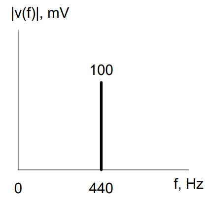
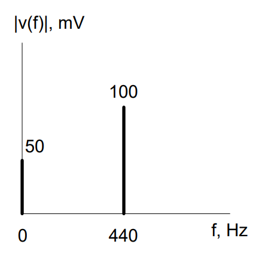

| LO# | Description |
|----------|----------|
| 2.1 | I can graph a given sinusoidal signal, including DC components, in both the time and frequency domains and determine its bandwidth. |

## Motivation

So far, we've only looked at very simple AC signals -- sinusoids.
However, real signals are inherenetly complex. Consider your favorite
song - at any one point in time you will hear several instruments, which
produce a range of frequencies. Can you imagine how difficult it would
be to analyze the signal in the time domain? This is why, for highly
complex signals, we typically analyze the signal with respect to
frequency instead of time. Frequency domain representations allow us to
view and manipulate signals in a more intuitive way. For example, if you
wanted to add more bass and less treble to your song, you would use an
equalizer. In essence, an equalizer is a simple filter -- one that
allows us to boost specific frequencies and reduce others. If you wanted
more bass, then you could reduce the volume of the high frequencies
while keeping the volume of the low frequencies the same. In this
lesson, we will look at signals in the frequency domain.

### Frequency Domain

In Block I, we explained how the frequency of a sinusoid tells us the number of times the signal repeated
(or "cycled") in a second. To graph the signal as a function of time (or
in the *time domain*), we translated the frequency into a period using
the following equation:

$$T = \frac{1}{f}$$

When we start looking at moving information around, we will see that
understanding how fast a signal changes is often more important than
being able to trace it as it changes. Fast changing signals (with high
frequencies) require us to collect more data to fully capture them.

The technique we will use to represent the frequency content of a
message is known as an *amplitude spectrum*, or a plot or graph that
describes a signal's power or energy as a function of frequency. It is
important to realize a signal does not exist exclusively in the time or
frequency domain -- those are simply different ways we choose to
represent the signal. We can represent any signal as an equation, or as
a combination of sines and cosines, which can then be viewed as a time
domain waveform, or as an frequency spectrum plot. As we proceed
further, it will become clearer there is a definite relationship between
the two domains and each has its own usefulness. It is similar to
looking at an object through regular binoculars or through night vision
goggles -- we see the same object, but it appears differently.

Let's look at a sinusoid first. Electrical engineers like sinusoids
because they are mathematically straightforward and very easy to
analyze. In fact, in frequency domain there's only one value on the
x-axis instead of the infinite number of values for time we needed when
we graphed sinusoids in time. So, for an amplitude spectrum, instead of
plotting the function's value on the y-axis and time on the x-axis, we
will plot amplitude on the y-axis and frequency on the x-axis. To
translate a signal from the time domain to the frequency domain, we only
need to gather two pieces of information from the equation (or plot):
amplitude and frequency. For example, if we wanted to graph the
amplitude spectrum of the monotone signal:

$$v(t) = \mathbf{100}\cos{\left( 360{^\circ}\mathbf{440}t \right)mV,}$$

we simply draw a vertical line at 440 Hz (the frequency of the cosine
term), with an amplitude of 100mV, as shown below. What this means is
that the signal, v(t), oscillates at a single frequency (400Hz) and we
assume it never changes.

Figure 1: Frequency domain graph of a sinusoid with a frequency of 440
Hz

If we don't worry about any phase shifts (and we won't for the sake of
this lesson), then we can say the graph above contains exactly the same
information as the original equation. This is an important point. We now
have three distinct and useful ways of representing an electrical
signal:

-   An equation

-   A waveform (graphing voltage/current/power with respect to time)

-   An amplitude spectrum (graphing voltage/current/power with respect
    to frequency).

Now we can complicate things a little bit. True monotone (one single
frequency) sinusoids don't happen very often in the physical world. Even
just a single note on an instrument contains to some additional tones,
which are slightly above and below the primary frequency. Also, if we
were to play the same note on a piano, it contains more than one
harmonic (higher frequency). These harmonics give each instrument it's
unique sound. This is the reason why a piano sounds like a piano.

So, when we play an A above middle C on the piano, we get a signal with
a fundamental frequency of 440 Hz, plus a series of harmonic
frequencies, each one at a multiple of 440 Hz. Each successive harmonic
exists at a lower amplitude than the one before it.

It is easy to imagine how graphing this signal in the time domain would
become very complicated very quickly. But just to drive the point home,
the figures on the next page show the first five harmonics of the 440Hz
note in both the time domain (left) and frequency domain (right):

Figure 3: Frequency domain of first five harmonics of 440 Hz note

In theory, these harmonics continue out to infinity, each one located at
a multiple of 440 Hz, but as we add more notes from more instruments,
the signal becomes even more complex. If we really wanted, we could
write the signal above as an equation:

$$v_{music}(t) = \mathbf{100}\cos{(360{^\circ}*\mathbf{440}t)} + \mathbf{91}\cos{(360{^\circ}*\mathbf{880}t)} + \mathbf{86}\cos{(360{^\circ}*\mathbf{1320}t)} + \mathbf{71}\cos{(360{^\circ}*\mathbf{1760}t)} + \mathbf{68}\cos{(360{^\circ}*\mathbf{2200}t)}\  + \ldots\ \ mV$$

Hopefully, you can see three things from this equation:

-   First, the time domain plot doesn't give much useful information

-   Second, the equation is fairly tedious and not that easy to digest

-   Third, each vertical line in the graph corresponds to a single
    cosine term in the equation

### DC Signals in the Frequency Domain

DC signals in the
frequency domain are important because sometimes we will want
to add a bias to a signal. For example, let's say that we want to add a
DC bias of 50 mV to the 440Hz signal. The resulting formula for the
voltage would be:

$$v(t) = \mathbf{50}mV + \mathbf{100}\cos{\left( 360{^\circ}\mathbf{440}t \right)mV,}$$

At first glance, this does not appear helpful, as the bias term has no
cosine, and thus, no frequency. However, if we think of the DC voltage
as not fluctuating with time, hence having a frequency of 'zero' hertz
(0 Hz), and we keep in mind that the a cos(0) equals "1", we could
rewrite the above equation like this:

$$v(t) = \mathbf{50}\cos{\left( 360{^\circ}\mathbf{0}t \right)mV}\mathbf{+ 100}\cos{\left( 360{^\circ}\mathbf{440}t \right)mV,}$$

Now we see that we can simply draw a spike at 'zero' to represent the DC
voltage.

Figure 4: Frequency domain graph of signal with DC bias and 440 Hz
sinusoid

### Bandwidth

*Bandwidth* is a very important term in ECE, and it refers to the range
of frequencies that a signal or system contains. Many people like to use
bandwidth to refer to cell phone or internet data rates, but for this
class, we will keep these notions separate. A range of frequencies will
be the bandwidth, and the speed at which you can transfer information on
a computer or cell phone will be the data rate.

We can calculate the bandwidth of a signal or system by subtracting the
lowest frequency from the highest frequency, as shown in the following
equation.

$$BW = f_{high} - f_{low}$$

For example, the bandwidth of the signal in Figure 4 is 440 Hz because
$f_{high} = 440\ Hz$ and $f_{low} = 0\ Hz.$ For the signal in Figure 3,
$f_{high} = 2.2\ kHz$ and $f_{low} = 440\ Hz$, so the bandwidth is 1.76
kHz. This brings us to two points. First, frequency domain graphs are
very helpful for calculating the bandwidth of a signal. Second, the
lowest frequency of a signal, $f_{low}$, will only be 0 Hz if the signal
has a DC bias.