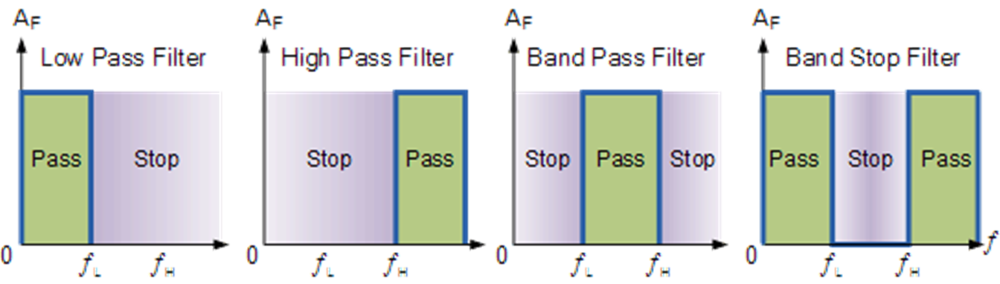
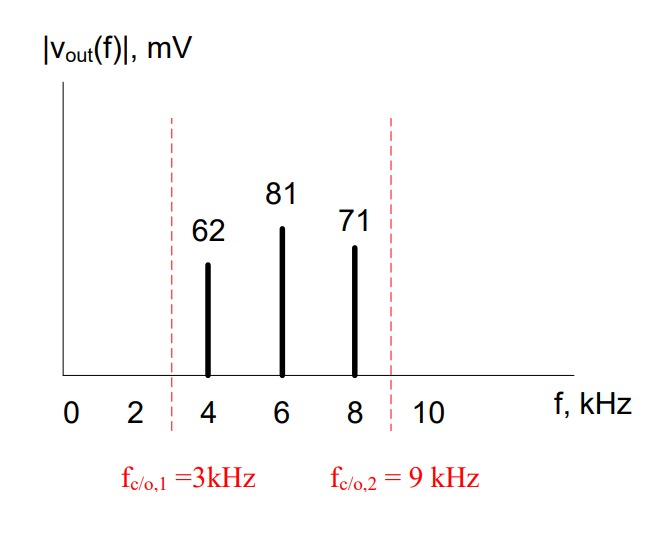

# Objective 2.2

| LO# | Description |
|----------|----------|
| 2.2 | I can identify types of ideal filters, determine their cutoff frequencies, and analyze their output given an input sinusoidal signal or signal spectrum. |

## Motivation

Now that we understand analyzing a time-domain signal in the frequency domain, we can look at ideal filters. Ideal filters operate in the frequency domain and can help us keep and remove certain parts of a signal. For example, if you
wanted to add more bass and less treble to a song, you would use an
equalizer. In essence, an equalizer is a simple filter -- one that
allows us to boost specific frequencies and reduce others. If you wanted
more bass, then you could reduce the volume of the high frequencies
while keeping the volume of the low frequencies the same. In this
lesson, we will look at signals in the frequency domain and learn the
basic functions of filters.

### Electronic Filters

The bandwidth of a signal drives our information processing and
transmission systems. We will often reduce the bandwidth of our signals
using a device known as an *electronic filter* which only allows certain
frequencies to pass through the device and rejects all of the other
frequencies. While we need to be careful in how we do this (because we
can drastically change the original signal if we do too much filtering),
it can help us communicate information faster, by reducing the size of
the signal we need to process and transmit.

The telephone is a good example of what happens to a signal when a
signal is filtered too much. When we speak on the phone, our voice is
converted into an signal limited to a bandwidth of 4 kHz, even though
human voices commonly include frequencies greater than 10 kHz. The phone
companies figured out the lower 4 kHz of your voice is enough to
understand what is being said and even recognize the voice of the
speaker. This meant they could save bandwidth by filtering out those
higher frequencies. However, since those high frequencies are missing,
we can clearly tell the difference between someone speaking to us in
person and when that same someone speaking to us over the phone.

There are four basic types of ideal electronic filters:

-   *Low Pass Filters* (LPF) which only allow frequencies below a
    specific cutoff frequency (fc/o) to pass

-   *High Pass Filters* (HPF) which only allow frequencies above a
    specific cutoff frequency (fc/o) to pass

-   *Band Pass Filters* (BPF) which only allow frequencies between two
    specific cutoff frequencies (fc/o,1 and fc/o,2) to pass

-   *Band Reject Filters* (BRF) which block frequencies between two
    specific cutoff frequencies (fc/o,1 and fc/o,2).

Figure 5: The four basic types of filters

For the purposes of this course, you may assume the ideal filter does
not change the amplitude or phase of the input, and all frequencies
outside of the pass range are eliminated, starting at the cutoff
frequency. Returning to the telephone example, telephone companies use a
*LPF* with a cutoff of 4 kHz to eliminate the upper frequencies in your
voice and limit the amount of bandwidth they must transmit to 4 kHz.

### Example Problem 1
Design a filter system for a stereo to allow only
high frequency signals (≥ 1.5 kHz) to be sent to the tweeter and only
low frequency signals (≤ 1.5 kHz) to be sent to the woofer.

**Understand**: Tweeters are speakers designed to reproduce high
frequency sounds, while woofers are speakers designed to reproduce low
frequency sounds.

**Identify Key Information:**

-   **Knowns:** The frequency at which we want split our signal into to
    around is 1.5kHz.

-   **Unknowns:** The type cutoff frequency

-   **Assumptions:** None

**Plan**: We want to divide our music signal into two pieces. We can do
this by using two filters in parallel:

The low pass filter (LPF) is used to feed the woofer, since it blocks
the high frequencies and allows low frequencies to pass. Likewise, we
use the high pass filter (HPF) to feed the tweeter, since it passes the
high frequencies and blocks the low.

**Solve:** Since the problem specifies a cross-over frequency of 1.5
kHz, we simply choose filters with cutoff frequencies of 1.5 kHz. The
following filter system can be used to feed the woofer and tweeter:

### Example Problem 2
A signal passes through a band pass filter (BPF).
What is the output signal?

**Understand**: The BPF eliminates frequencies outside the depicted
cutoff frequencies and allows the frequencies within the band to pass.

**Identify Key Information:**

-   **Knowns:** The two cutoff frequencies and the BPF. We also know the
    input signal.

-   **Unknowns:** The output signal.

-   **Assumptions:** The BPF will cut off frequencies starting at 3kHz
    and 9kHz.

**Plan**: Plot the cutoff frequencies and eliminate frequencies outside
of that band.

**Solve**: The output signal from the depicted band pass filter is shown
in the frequency spectrum graph below:

