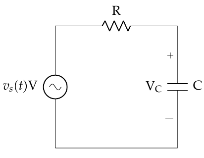
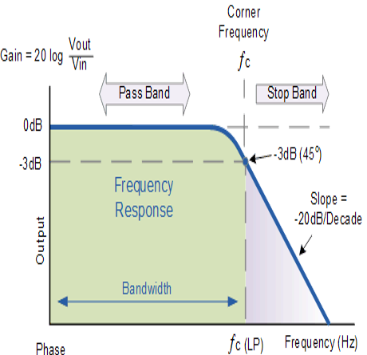
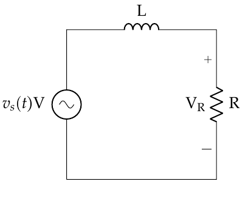
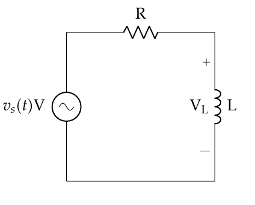
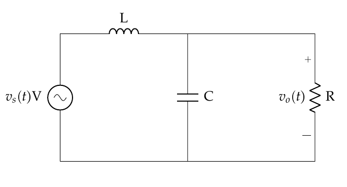

# Objective 2.4

| LO# | Description |
|----------|----------|
| 2.4 | I can determine the filter type, gain, and cutoff frequency of simple series circuits containing a resistor, capacitor, and/or inductor.  |

## Passive Filters Using RLC Circuits

If you recall the lesson on RLC circuits, we learned how to use
impedance to treat inductors and capacitors like resistors. During that
lesson, we calculated impedance at a specific angular frequency, ω. We
often want to know how a circuit would respond over a wide range of
frequencies. Therefore, we often keep ω as a variable when calculating
impedances, and then see how the output voltage behaves over the
frequency spectrum. Let's start by taking a look at an R-C
(resistor-capacitor) circuit and keep all the quantities generic (VS­,
R, C, f, etc.) as shown in Figure 1:

Figure 1: A circuit containing a series resistor and capacitor.

The impedance of the capacitor is:

$$Z_{C} = - \frac{j}{\omega C}\ \Omega$$

Which makes the equivalent impedance the sum of the resistor and
capacitor (since they're in series):

$$Z_{EQ} = R - \frac{j}{\omega C}\Omega$$

Therefore, the voltage across the capacitor is:

$$V_{C} = V_{S}\left( \frac{Z_{C}}{Z_{EQ}} \right) = V_{S}\left( \frac{\frac{- j}{\omega C}}{R - \frac{j}{\omega C}} \right) = \ V_{S}\left( \frac{1}{j\omega RC + 1} \right)\ $$

Often, in the circuits world, we're interested in the ratio of the
output voltage to the input voltage (this is called the gain), so we
write the equation:

$$\frac{V_{C}}{V_{S}} = \left( \frac{1}{j\omega RC + 1} \right) = \left( \frac{1}{j2\pi fRC + 1} \right)\ $$

For the last step we took advantage of the fact $\omega = 2\pi f$ so we
could express the gain in terms of frequency. Now that we have this
final form, let's take a look at what happens in different regions of
the spectrum. For very small frequencies, as $f\  \rightarrow \ 0$, we
see that the right side of the equation goes to 1:

$$\lim_{f \rightarrow 0}\frac{V_{C}}{V_{S}} = \lim_{f \rightarrow 0}\left( \frac{1}{j2\pi fRC + 1} \right) = \ \frac{1}{0 + 1} = 1$$

This indicates that a DC ($f = 0\ Hz$) input signal is passed through
with no loss. The converse of this is when we have very large
frequencies, that is when $f\  \rightarrow \ \infty$. In this case, the
ratio $\frac{V_{C}}{V_{S}}$ goes to 0:

$$\lim_{f \rightarrow \infty}\frac{V_{C}}{V_{S}} = \lim_{f \rightarrow \infty}\left( \frac{1}{j2\pi fRC + 1} \right) = \ \left( \frac{1}{j\infty + 1} \right) = \frac{1}{\infty} = 0$$

Therefore, higher frequencies are blocked using this circuit
configuration. Clearly, this represents a low pass filter, but what is
the cutoff frequency? With analog filters like this, we have to consider
the real behavior of circuit components. In the ideal filter lesson, we
assumed the output of a filter is binary around the cutoff frequency
(meaning, everything on one side of the cutoff frequency passes, while
everything on the other side is blocked). In reality, it's not as clear
cut.

### Non Ideality

Since analog circuit components like capacitors and inductors have a
finite and measureable response time -- it takes them some time to
charge and discharge -- the output of a filter rolls off slowly, rather
than "falling off a cliff" like they did in the ideal filter of the last
lesson. Figure 2 shows an example of how a real filter behaves. Note
that the y-axis has units of decibels (dB) -- that is essentially a way
of representing the ratio of the output to input on a logarithmic scale.
What is important, though, is that the amplitude of the output signal
(Vout­) decreases slowly, rather than going immediately to zero. This
gives us some difficulty in defining the exact cutoff frequency, because
there are frequencies in the "stop band" with a measurable (non-zero)
amplitude. If we aren't careful, we won't block out all the frequencies
we meant to block. Specifics of dB aside, what we are essentially
looking for is the "3dB point", which means the ***output power*** (not
voltage!) ***is half the power of the input***. Generally, engineers
agree this is the cutoff frequency of a filter.

Figure 2: The frequency response of a real LPF filter.

Since the power in a signal is proportional to the square of its voltage
(or current) the cutoff frequency is where the amplitude of the voltage
(or current) output is reduded to 70.7% of the input. Shown
mathematically, this is where

$$P_{out} = \frac{P_{in}}{2} \propto \frac{V_{in}^{2}}{2} = \left( \frac{V_{in}}{\sqrt{2}} \right)^{2} = \left( 0.707V_{in} \right)^{2} = V_{out}^{2}$$

For a simple circuit with a series capacitor and resistor, as shown in
Figure 1, we can find the cutoff frequency by finding where the
***magnitude*** of $\frac{V_{C}}{V_{S}} = \frac{1}{\sqrt{2}}$. Note that
we only care about **magnitude** at this point, because all the phase
tells us is how much the signal delayed in time.

Remember, we find the magnitude (denoted by vertical bars) of a complex
number by:

$$|A| = \sqrt{{Re}^{2} + {Im}^{2}\ }$$

Therefore, if we want to rewrite the expression for the gain, we can
find the magnitude of the numerator and the denominator separately:

$$\left| \frac{V_{C}}{V_{S}} \right| = \frac{\left| V_{C} \right|}{\left| V_{S} \right|} = \frac{|1|}{|j2\pi fRC + 1|} = \ \frac{1}{\sqrt{1^{2} + (2\pi fRC)^{2}}}\ $$

Remember that at the cutoff frequency we want
$\left| \frac{V_{C}}{V_{S}} \right| = \ \frac{1}{\sqrt{2}}$, so we can
use the equation above to write:

$$\left| \frac{V_{C}}{V_{S}} \right| = \frac{1}{\sqrt{2}} = \ \frac{1}{\sqrt{1^{2} + (2\pi fRC)^{2}}}$$

Now, solving for f, we find the cutoff frequency!

$$f_{cutoff} = \ \frac{1}{2\pi RC}$$

Recognizing that was a lot of math, it's important to understand how we
arrived at the cutoff frequency for an R-C circuit.

### C-R Circuit

Now, we can repeat this process for a C-R circuit, where we have
switched the capacitor and resistor and measure the output voltage
across the resistor (Figure 3).

Figure 3: A circuit containing a capacitor and resistor in series.

Here, the output voltage can be found through the impedances, just as
before:

$$\frac{V_{R}}{V_{S}} = \left( \frac{R}{R - j\frac{1}{\omega C}} \right) = \left( \frac{1}{1 - j\frac{1}{2\pi fRC}} \right)\ $$

In this case, we find the frequency behavior to be as follows:

$$\lim_{f \rightarrow 0}{\frac{V_{R}}{V_{S}} = \ }\lim_{f \rightarrow 0}\left( \frac{1}{1 - j\frac{1}{2\pi fRC}} \right) = \ \left( \frac{1}{1 - j\frac{1}{0}} \right) = \left( \frac{1}{1 - j\infty} \right) = 0$$

$$\lim_{f \rightarrow \infty}{\frac{V_{R}}{V_{S}} = \ }\lim_{f \rightarrow \infty}\left( \frac{1}{1 - j\frac{1}{2\pi fRC}} \right) = \ \left( \frac{1}{1 - j\frac{1}{\infty}} \right) = \left( \frac{1}{1} \right) = 1$$

And we recognize it's a high pass filter! Following the same methodology
as before, we find the cutoff frequency to be:

$$f_{cutoff} = \ \frac{1}{2\pi RC}$$

Which is exactly the same as the LPF!

### R-L and L-R Circuits

As you may imagine, we can achieve similar effects using inductors and
resistors, but the order of components is switched for LPF and HPFs.
Just as with the R-C and C-R circuits, for both the HPF and LPF cases,
the cutoff frequency is the same:

$$f_{cutoff} = \ \frac{R}{2\pi L}$$

|||
|------------------------------------------------------------|-------------------------------------------------|
| Figure 4: A low pass filter using an inductor and resistor.| Figure 5: A high pass filter using a resistor and inductor.|

As a final note, we could string together different configurations of
resistors, capacitors, and inductors to produce band pass and band
reject filters for a variety of applications. However, the analysis of
these higher order circuits is beyond the scope of this course.

### Practical Applications

Now that we understand how to create simple low and high pass filters,
let's take a few moments to explore the implications of this in a more
practical sense. For example, consider a basic transmission line, such
as a coaxial cable, or an Ethernet cable. We use these kinds of cable
all the time to transmit large amounts of information. Typically, when
we think about these kinds of cables, it is easy to imagine they have a
resistance, but they also contain a small amount of inductance and
capacitance. In fact, when it comes to many applications at higher
frequencies, if we do not account for this inductance and capacitance
when designing a system, our system will not behave as expected.
Although there are many facets to this issue that are beyond the scope
of this course, consider what happens when we draw an RLC circuit model
of a transmission line. In this case, we have inductors in series with
parallel capacitors and resistors:

Figure 6: A circuit containing a resistor, capacitor, and inductor.

Although we won't derive the relationships here, if we follow a method
similar to the previous sections, we can determine this is a low pass
filter. Now, if the values of the components are very small (and, for a
typical transmission line that is not overly long, they are) the cutoff
frequency is high, but it exists nonetheless. This indicates we are
limited in the frequencies we can transmit through a typical copper
transmission line. That is why we need a different material (fiber optic
cables) to transmit information at optical frequencies!

Also, when we include this miniscule inductance and capacitance in our
model of a transmission line, we also discover one key cause of latency
in a system. For example, you may press a button a experience a
noticeable delay between your input and the expected response of the
system. This is because inductors and capacitors introduce a phase delay
into the voltage, which manifests itself in the physical world as a time
delay. Also, if we are not careful in designing systems, certain very
sensitive components may "misread" an input signal, due to a transient
"ringing" and produce an unexpected response.

Finally, and likely most relevant to our lives, are the consequences of
non-ideality in filters. Recall that the cutoff frequency is not, in
reality, a sharp cutoff, but more of a slow degradation in the amplitude
of frequencies outside the pass band. In reality, if we don't account
for this when designing our information systems, channels near one
another may bleed over and interfere with each other. This means we need
to make sure:

1)  Our filters are properly designed for as steep a rolloff as
    possible, and

2)  We properly space our channels to avoid this unintended effect.

For example, if two radio channels are too close in frequency and the
filter on your communications system does not have a steep enough
rolloff, you may hear both channels at the same time. One will be softer
than the other, due to the degradation the filter provides, but it will
be noticeable.

### Example Problem 1
A signal passes through a circuit consisting of a
60-Ω resistor and a 1-μF capacitor in series. The output voltage is
across the capacitor. What kind of filter is this and what is the cutoff
frequency?

**Understand**: Since we have an R-C circuit, and we know the output
voltage will be across the capacitor, and we see it is a LPF.
Additionally, we can calculate the cutoff frequency from the component
values.

**Identify Key Information**:

-   **Knowns:** We know the component values, and we know that this
    circuit is a LPF.

-   **Unknowns:** The cutoff frequency.

-   **Assumptions:** We are dealing with steady state analysis, so we
    don't have to worry about transients.

**Plan**: Use the cutoff frequency equation.

**Solve:**

$$f_{cutoff} = \ \frac{1}{2\pi RC} = \ \frac{1}{2\pi(60\Omega)(1 \times 10^{- 6}F)} = 2.65kHz$$

**Answer**: We have a LPF with a cutoff frequency of 2.65kHz.

### Example Problem 2
You are deployed and need to design a HPF for a
field expedient radio. This radio receiver must have a cutoff frequency
of 1kHz and you have the following resistors available to you: 100 Ω,
200 Ω, 500 Ω, and 1k Ω.

**Understand**: We want to design a high pass filter, which can be done
with either a C-R or R-L configuration. Additionally, we have some
limitation on the available equipment, specifically with regards to the
resistors.

**Identify Key Information**:

-   **Knowns:** We need a HPF, with $f_{cutoff} =$ 1kHz,
    and have certain resistors available.

-   **Unknowns:** The circuit configuration, our resistor value, and our
    capacitor value.

-   **Assumptions:** We are dealing with steady state analysis, so we
    don't have to worry about transients.

**Plan**: Since we are free to choose our circuit configuration and our
capacitor and inductor values, we choose an R-L circuit. Also, we can
choose a resistor, so we arbitrarily choose the 500 Ω resistor and use
the cutoff frequency equation to find the value of the inductor.

**Solve:**

$$f_{cutoff} = \ \frac{R}{2\pi L} = \ \frac{500\Omega}{2\pi L} = 1kHz$$

$$L = \ \frac{500\Omega}{2\pi(1000Hz)} = 79.6\ mH$$

**Answer**: We design the following filter, with R=500 Ω and L=79.6mH.

