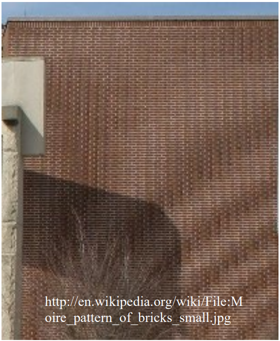
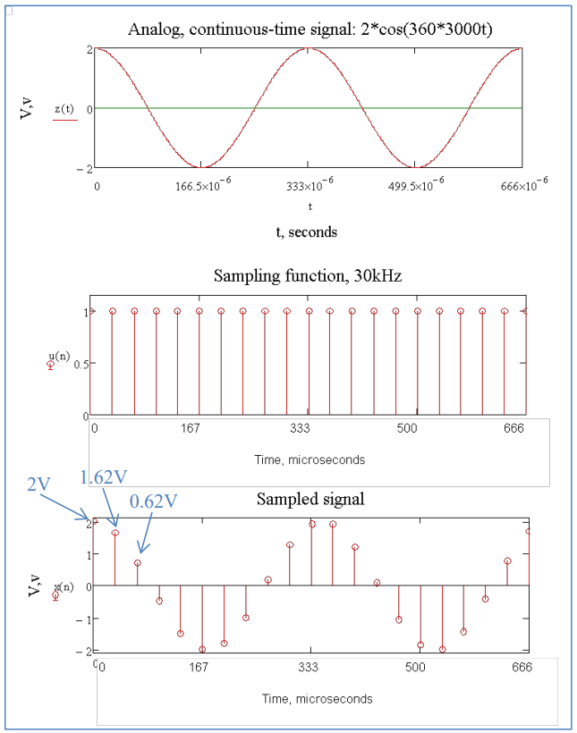
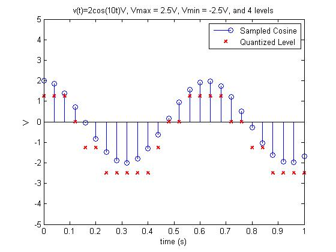
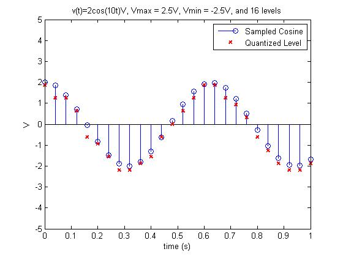
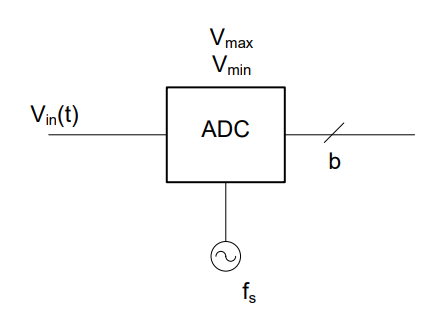

# Objective 2.5

| LO# | Description |
|----------|----------|
| 2.5 | I can calculate the ADC sampling rate, voltage resolution, and digital output based on a given input voltage and the ADC's operational parameters.  |

## Analog to Digital Conversion

As humans, we use *analog* senses to perceive the world. Our eyes detect
subtle variations in the color and intensity of light. Our ears
discriminate between a wide and continuous range of frequencies and
sound levels. Our senses of taste, touch, and smell also differentiate
between a continuous range of inputs. By definition, analog values are
continuous, where they can have any value between a defined maximum and
minimum value at any given instant in time. For example, our eyes
perceive infinite shades of gray -- this is analog. Digital means we
only allow for a signal to be expressed in terms of values from a
certain predetermined set of values. It would be akin to seeing the
world in only black and white, or perhaps only specific combinations of
red, green, and blue. Either way -- we are restricting the possible
values of our signal.

One special type of digital value is called *binary*, which only allows
two possible values. Computers (and many things we call digital) use
binary values to store and transmit information.

A huge amount of Electrical and Computer Engineering is spent bridging
the gap between the physical world's analog information and digital
technology. Consider all the technologies which have been digitized over
the last 15 years - cameras, cell phone communications, and TVs are just
a few examples. What drove us to convert these technologies to digital?

-   Digital is less susceptible to noise, which is the static that you
    hear in older radios and cell phones

-   Digital can be easily stored and recovered, because the amount of
    data is significantly reduced

-   Digital allows for easier encryption and processing by computers.

Digital signals have disadvantages, which is why many technologies start
off with analog implementations. For example, the original version of
the modern day computer was analog. When you convert your original
analog information into a digital format, you lose some fidelity of the
information. There's no way to go from a continuous range of infinite
values to discrete levels without throwing something away. Although we
can minimize information loss by increasing the number of possible
discrete values, this also increases the amount of digital information
that you have to save, process, and transmit. For example, an image from
a 12 megapixel (MP) camera is a significantly larger file size than a
photo from a 1MP camera.

As we discuss the process of converting data from analog to digital,
hopefully you'll begin to understand the tradeoffs. Digitizing a signal
consists of three basic steps: sampling, quantizing, and encoding.

### Sampling

Sampling an analog signal means taking a set number of measurements each
second. The rate at which we take these measurements, or the *sampling
rate*, is simply how often we take a snapshot of whatever it is we're
trying to sample within a second. Think about watching a show on TV.
Even though the movement on the screen looks fairly natural, it really
has a sampling rate of 60 frames per second, or 60 Hz. Every 1/60 of a
second, the TV's screen updates. In fact, if you take a slow motion
video of your TV with your camera, you will see the flickering of the
screen, which is the update rate. This is actually the fact that a slow
motion video is taking many more samples per second than the TV, so it
"sees" the update rate of the screen.

But what if our TV only updated once per second, would that be enough?
What about 1 update per minute? Obviously, there is some minimum
standard for how often we need to sample whatever we're trying to
digitize. The limit is based on the Nyquist rate, which is simply two
times the highest frequency in the signal:

$$f_{S} = 2f_{High}$$

If we sample at a frequency below the Nyquist rate, we get a distortion
in the signal known as *aliasing.* Aliasing is the cardinal sin of ADC
-- once it occurs, it can't be fixed. We can correct a lot of problems
but aliased data is unrecoverable!

One simple visual example of aliasing is the wheels of a car during a
car commercial. Even though the car is obviously moving forward, the
wheels sometimes look as if they are rolling backwards. This is because
the wheel is spinning at a rate higher than half the Nyquist frequency.
For example, consider the wheel of a car spins at a rate of 35 Hz (or
rpm). According to the Nyquist criteria, the required sampling rate
would be:

$$f_{S} > 2f_{High}$$

$$f_{S} > 2*35\ Hz = 70\ Hz$$

Since the actual TV sampling rate is 60 Hz, the video is aliased and the
wheel looks like it is moving backwards. Aliasing can actually change
the frequency of the input signal, so that it looks like something
completely different. In this case, your digitized signal doesn't look
anything like your analog signal, which defeats the purpose of ADC.

The pictures in figures 1 and 2 show another example of aliasing. Did
you realize that edges in images are a form of high frequency content?
The image on the left is sampled well above the Nyquist minimum. When we
reduce the number of pixels (or samples), we get aliasing in the form of
the pattern in the lower right corner.

|||
| :-------------------------------: | :----------------------: |
| Figure 1: Properly sampled image. | Figure 2: Aliased image. |

### Example Problem 1
A typical human voice has a maximum frequency of
3.4 kHz. If we wish to digitize a voice signal, what is the lowest
sampling frequency we can use that would prevent aliasing?

**Understand**: Aliasing is the distortion in a signal when we do not
sample it at a high enough rate.

**Identify Key Information**:

-   **Knowns:** We know the maximum frequency of a human voice and we
    know the Nyquist criteria.

-   **Unknowns:** The required sampling rate for ADC.

-   **Assumptions:** None.

**Plan:** We must sample at least at the Nyquist rate to prevent
aliasing. Therefore, we calculate the Nyquist rate based on the maximum
frequency content of the human voice.

**Solve:**

$$f_{S} > 2f_{High}$$

$$f_{S} > 2*3.4\ kHz = 6.8\ kHz$$

**Answer:** We must use a sampling rate of at least 6.8 kHz to prevent
aliasing.

Now we know we have to sample at a rate greater than the Nyquist rate,
but what rate should we use? A good example of something you are
probably familiar with is music CDs, which are simply digital
representations of analog music signals. The human ear has a range
between 20Hz and 22kHz:

$$f_{S} = 2f_{High}$$

$$f_{S} = 2*22\ kHz = 44kHz$$

Therefore, CDs need to have a sampling rate at 44kHz or higher. The
actual sampling rate for CDs is 44.1 kHz. But, if 44.1 kHz is good,
wouldn't 50 kHz or even 100 kHz be even better? Here, we see the
engineering trade off. The key is to sample at a high enough frequency
to adequately reproduce the signal and a low enough frequency to not
exceed our memory capacity or digital bandwidth. For a CD, each sample
is stored as a 16-bit binary number (2 Bytes). A sampling rate of 44.1
kHz allows up to 80 minutes of uncompressed music to be loaded onto a
single disc. While the quality of the music increases slightly with
higher sampling rates, it also requires larger discs or reduced play
time.

### Digitizing

Now, let's take a look at how we digitize a signal. Suppose the
following sinusoidal signal needs to be converted into a digital signal:

$$V_{M}(t) = 2\cos(360{^\circ}\ 3kt)V$$

What would the sampled signal look like if we used a 30 kHz sampling
frequency? Before we start sampling, we must *always* check the Nyquist
rate to make sure we won't distort the signal. If our sampling frequency
is higher than the Nyquist rate, we can start collecting samples. The
Nyquist rate is:

$$f_{S} > 2f_{High}$$

$$f_{S} > 2*3\ kHz = 6kHz$$

Since the 30 kHz sampling frequency is greater than our signal frequency
of 6 kHz, we can start taking samples. First, we find the sampling
period, which is simply the inverse of the sampling frequency:

$$t_{s} = \ \frac{1}{f_{s}} = \frac{1}{30\ kHz} = 33.33\ \mu\sec$$

Therefore, we will take a sample every 33.33 μsec. The first three
samples are given by:

$$V_{M}(0\ sec) = 2\cos\left( 360{^\circ}\ 3k(0) \right)V = 2\ V$$

$$V_{M}(33.33\ \mu sec) = 2\cos\left( 360{^\circ}\ 3k(33.33\ \mu sec) \right)V = 1.62\ V$$

$$V_{M}(2\ x\ 33.33\ \mu sec) = 2\cos\left( 360{^\circ}\ 3k(66.66\ \mu sec) \right)V = 0.62\ V$$

Look at Figure 3. As you can hopefully see, with a sampling frequency of
30 kHz, we've captured a fairly good representation of the original
sinusoidal curve.

Figure 3: Sampling V­M­.

### Resolution

By virtue of being continuous, analog signals contain an infinite range
of magnitude values. Once we have sampled the data, we have reduced the
number of values (in time) we need to store. However, we must also
convert these values to a finite number of digital outputs, in voltage.
After an analog signal is sampled, we must then determine which output
to associate with the sampled value. In order to calculate the discrete
level of any given sample, we set voltage limits (*V­max­* and *V­min­*)
and a number of bits, *b*, for the process:

-   The maximum voltage, *V­max­*, is the highest input voltage that
    will be correctly converted. Input voltages higher than *V­max­*
    will be treated as though they were *V­max­*.

-   The minimum voltage, *V­min­*, is the lowest input voltage that will
    be correctly converted. Voltages lower than *V­min­* will be treated
    as though they were at *V­min­*.

-   The number of bits, *b*, that will be used to represent the final
    digital value, determines the total number of possible values for
    the process:

$$levels = \ 2^{b}$$

Let's look at two different settings for converting
$v(t) = 2\cos(360{^\circ}*1.6\ Hz*t)V$. In Figure 5, we allowed each
sample to be assigned to one of 16 possible levels, while in Figure 4,
we only allowed 4 levels (easier to see the individual levels).
Obviously, the levels assigned to each sample in Figure 5 are a truer
representation of the original signal. An important point here is *the
sampling rate and the resolution are **completely** independent*.
Sampling is dividing the signal along the x-axis, while resolution
involves dividing the signal along the y-axis.

|||
|-----------------------------------------|------------------------------|
|Figure 4: Sampling with 4 levels (b=2 bits)|Figure 5: Sampling with 16 levels (b=4 bits)|

*Resolution* is the smallest voltage change that can be measured by the
analog to digital conversion process and is equal to:

$$\Delta V = \ \frac{V_{\max} - \ V_{\min}}{levels}$$

In the examples above, our resolutions were 1.25 V/level (Figure 4) and
312.5 mV/level (Figure 5). Some important points worth emphasizing
regarding resolution:

1.  *Resolution is determined by the analog to digital converter (ADC),
    not necessarily the analog signal being converted*. While we want
    $V_{\max}$ and $V_{\min}$ to encompass the range of our input
    signals, the two ranges are not the same.

2.  *A **smaller resolution** is a **better** resolution* because you
    can resolve finer details from your analog signal.

3.  The units for resolution are volts per level (V/level).

4.  The range from V­max­ to V­min­ is called the *dynamic range* of the
    ADC. If an input signal exceeds the dynamic range of a particular
    ADC, it is said to be *clipping*.

### Example Problem 2
A 6-bit ADC has a *V­max­* of 5 V and a *V­min­*
of -1 V. What is the resolution of this ADC?

**Understand**: The maximum and minimum voltages do not have to be
symmetric around 0 V.

**Identify Key Information:**

-   **Knowns:** We know the dynamic range of the ADC and the number of
    output bits (6).

-   **Unknowns:** We want to find the resolution of the ADC.

-   **Assumptions:** None.

**Plan**: We will use the resolution equation to calculate the
resolution:

$$\Delta V = \ \frac{V_{\max} - \ V_{\min}}{2^{b}}$$

**Solve:**

$$\Delta V = \ \frac{V_{\max} - \ V_{\min}}{2^{b}} = \ \frac{5\ V - ( - 1\ V)}{2^{6}\ levels} = \ \frac{6\ V}{64\ levels}$$

$$\Delta V = 0.09375\ \frac{V}{level}\  = 93.75\ \frac{mV}{level}\ $$

**Answer**: The resolution for the given ADC is 93.75 mV per level.

### Example Problem 3
An ADC is to be used with *V­max­* = 4 V and
*V­min­* = -2 V. If the worst acceptable resolution is 200 mV per level,
what is the minimum number of bits that can be used?

**Understand**: The more bits we have, the better (smaller) the
resolution is.

**Identify Key Information:**

-   **Knowns:** We know the dynamic range of the ADC and the worst
    acceptable resolution.

-   **Unknowns:** We want to find the number of output bits required to
    satisfy our resolution requirements.

-   **Assumptions:** None.

**Plan**: Solving the resolution equation for *2^b^*, we find:

$$2^{b} = \ \frac{V_{\max} - \ V_{\min}}{\Delta V}$$

From this equation, we see that the resolution and number of bits are
inversely proportional, so if we plug in the worst case (highest)
resolution, we will find the minimum number of levels.

**Solve**:

$$2^{b} = \ \frac{V_{\max} - \ V_{\min}}{\Delta V} = \ \frac{4\ V - ( - 2\ V)}{200\ mV/level} = 30\ levels$$

There are two different ways to solve for *b*. The easiest way is to
simply list the powers of 2 until we get one higher than thirty: 2, 4,
8, 16, 32. Since 32 is the fifth power of 2 (2^5^ = 32), 5 bits will
give us an acceptable resolution.

The second way is to use logarithms, where:

$$b = \ \frac{\log{(required\ levels)}}{\log 2} = \ \frac{\log 30}{\log 2} = \ 4.907.$$

Since we want a better resolution than 200 mV per level, we need more
than 4.907 bits. There is no such thing as a partial bit; therefore, the
minimum number of allowable bits is 5.

**Answer**: To get a resolution of at least 200 mV per level, 5 bits are
required.

### Encoding

The final step in ADC is to encode the sampled value into a binary
number. But, first, we must determine what voltage value (or "level") to
assign the sampled value to. Consider the following diagram, where an
ADC with 3 output bits is digitizing the signal:

Figure 6: Example of encoding a signal with a 3-bit ADC

The black dots on this diagram represent 7 samples taken from an analog
signal. Each level is assigned a number, which is then translated to
3-bit binary. Notice each dot falls into one of the eight levels. The
first dot clearly falls into level 5, and therefore is encoded as 101.
The second dot is in level 6, or 110. The next two dots are in level 7
(the highest level) and are therefore encoded as 111. The final three
dots are in levels 6, 5, and 3 and are encoded as 110, 101, and 011
respectively.

If we combine all these samples in series, the binary values resulting
from these 7 samples would be:

101 110 111 111 110 101 011

While graphing might work with short snippets of signals like this, they
are not practical for real-world systems. Recall, CD-quality music uses
16 bits per sample. The number of levels would therefore be:

$$levels = \ 2^{b} = \ 2^{16} = 65,536\ levels.$$

Fortunately, there is a simple equation to determine which level a given
signal should be assigned:

$$Expected\ Level = EL = \ \frac{V_{in}(t) - V_{\min}}{\Delta V}$$

Once a sample, $V_{in}(t)$, is taken at a specific time, you can solve
for the expected level and then ***truncate*** (or round down) the
result to get an integer value which can be converted into a binary
number for saving on a computer. Therefore, the actual *quantized level*
of this sample is:

$$QL = floor(EL)$$

Remember though, when you round down from the expected level, you are
introducing error into your result, because you are moving the actual
voltage value of the sample to a different voltage -- the nearest
allowed value. The goal is to try to include enough levels that this
*quantization error* is relatively small and most of the data in the
original signal is preserved.

When choosing a resolution, we encounter an engineering tradeoff. In
this case, we want to minimize the amount of information that is lost
when we *quantize* our samples by assigning them an integer level. If
you look at the figure above, it should be obvious that the maximum
amount of signal that you can lose is a single level's worth of
resolution, so our *maximum quantization error* is equal to:

${QE}_{\max} = \ $ $\Delta V$

We can lower our resolution by either 1) reducing the range of
acceptable voltages -- by bringing $V_{\max}$ and $V_{\min}$ closer
together, or 2) increasing the number of available levels, which means
increasing the number of bits used to represent our values.

Since oftentimes we can't reduce the range of acceptable voltages
because it would *clip* our input signal, the best way to minimize lost
information is to increase the number of bits used for each sample. The
downside of this approach, though, is the same as mentioned above: each
bit added to our samples increases the amount of memory and digital
bandwidth needed to save and/or transmit our information.

### Putting it All Together

Now that we've talked about the trade-offs involved in deciding how to
convert an analog signal into a digital format, consider how you would
actually convert your signal given a specific ADC. You will need to know
the sampling rate ($f_{s})$, the range of acceptable voltages
($V_{\max}$ and $V_{\min}$), and the number of bits to be used (*b*)
before you can convert the signal (see diagram below).

Recall, the three steps of the analog to digital conversion process are:

1.  **Sampling**: Take snapshots in time of the signal at the sample
    rate, *f­s­*.

2.  **Quantizing**: Determine the quantized levels of your samples --
    that is, which of the possible digital values does your measured
    value get assigned to.

3.  **Encoding**: Convert the quantized level into a binary number that
    is *b* bits long.

The following example problem integrates all of the concepts of an ADC.

### Example Problem 4
A sinusoidal signal $V_{M}(t) = 2\cos(360{^\circ}\ 3kt)V$ needs to be converted into a
digital signal using the following ADC:

Determine the first 3 samples output by the ADC.

**Understand**: By determining the sampling frequency (*f­s­*), we have
already sampled the signal, so now we need to quantize and encode the
samples.

**Identify Key Information**:

-   **Knowns:** We know the equation of the input signal, the ADC's
    sampling frequency, the number of bits used to store each sample,
    and the dynamic range of the ADC.

-   **Unknowns:** The quantized level and binary representation of each
    sample.

-   **Assumptions:** None.

**Plan**: Since we already know the sampling frequency, we can determine
the sampling period. Then, we can determine the voltage values (*V­M­*)
at each sampling time. Finally, we can calculate the expected level and
the quantized level, which can easily be converted to binary.

**Solve:** Recall, the sampling period is given by:

$$t_{s} = \ \frac{1}{f_{s}} = \frac{1}{30kHz} = 33.33\ \mu s$$

Therefore, the first three samples are given by n\*33.33$\ \mu s$, where
n = 0,1,2:

$$V_{M}(0) = 2\cos\left( 360{^\circ}\ 3k(0\ sec) \right)V = 2\ V$$

$$V_{M}(33.33\ \mu sec) = 2\cos\left( 360{^\circ}\ 3k(33.33\ \mu sec) \right)V = 1.62\ V$$

$$V_{M}(2\ x\ 33.33\ \mu sec) = 2\cos\left( 360{^\circ}\ 3k(66.66\ \mu sec) \right)V = 0.62\ V$$

However, before we can do the next conversion step, we need to find the
ADC's resolution:

$$\Delta V = \ \frac{V_{\max} - \ V_{\min}}{2^{b}} = \ \frac{3\ V - ( - 3\ V)}{2^{5}\ levels} = \ \frac{6\ V}{32\ levels} = 187.5\ mV/level$$

Now, the signal will be quantized. If we solve for our expected levels,
we find:

$${EL}_{0} = \ \frac{V_{in}(0) - V_{\min}}{\Delta V} = \frac{2\ V - ( - 3\ V)}{187.5\ mV/level} = 26.67$$

$${EL}_{1} = \ \frac{V_{in}(33.33\ \mu sec) - V_{\min}}{\Delta V} = \frac{1.62\ V - ( - 3\ V)}{187.5\ mV/level} = 24.64$$

$${EL}_{2} = \ \frac{V_{in}(2\ x\ 33.33\ \mu sec) - V_{\min}}{\Delta V} = \frac{0.62\ V - ( - 3\ V)}{187.5\ mV/level} = 19.31$$

The FLOOR function is applied to the expected levels to find the
quantized level:

$${QL}_{0} = FLOOR(EL) = \ 26$$

$${QL}_{1} = \ FLOOR(EL) = 24$$

$${QL}_{2} = FLOOR(EL) = 19$$

Finally, these values are encoded into their 5-bit binary
representations:

$${Q.L.}_{0} = \ 26\  \rightarrow 11010$$

$${Q.L.}_{1} = \ 24\  \rightarrow 11000$$

$${Q.L.}_{2} = 19\  \rightarrow 10011$$

The conversion from a "standard" decimal number into its binary
representation follows from knowing that these binary digits, from right
to left, represent $2^{0},\ 2^{1},2^{2},2^{3},and\ 2^{4}$ respectively.
If the binary digit is a 1, multiply 1 by $2^{X}$ for the digit. If the
binary digit is a 0, multiply 0 by $2^{X}$ for the digit. After this,
add all the numbers to get the decimal number. For 26, this would be
${1*2}^{4} + 1*2^{3} + 0*2^{2} + 1*2^{1} + 0*2^{0} = 16 + 8 + 0 + 2 + 0 = 26$.
*You should become proficient at using your calculator to convert
between decimal and binary numbers*.

**Answer:** At *t* = 0, the ADC would output the binary number, 11010.
At *t* = 33.33 μsec, the ADC would output the binary number, 11000. At
*t* = 66.66 μsec, the ADC would output the binary number, 10011.
