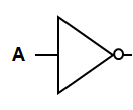
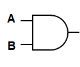
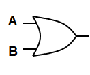
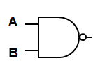
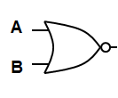
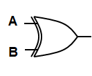
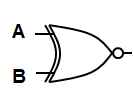

# Objective 2.7

| LO# | Description |
|----------|----------|
| 2.7 | I can relate digital inputs to digital outputs using tools such as fundamental digital logic gates (AND, OR, NOT), truth tables, and Sum of Products (SOP) and Product of Sums (POS) Boolean expressions.  |

## **1. Introduction to Digital Logic**
Digital logic forms the foundation of modern electronic systems and computing. It deals with systems that operate using binary states — TRUE (1) and FALSE (0) — to represent and manipulate data. At the core of digital logic are logic gates, which perform basic operations on binary inputs to produce a binary output.

### **1.1 Why Digital Logic?**
Digital logic enables the design and functioning of various electronic devices and systems, including:
- Microprocessors and microcontrollers
- Digital communication systems
- Signal processing units
- Control systems in industrial and aerospace applications

### **1.2 Binary System**
All digital logic operations are based on the binary number system, which consists of only two possible values:
- **0** – Represents LOW or FALSE
- **1** – Represents HIGH or TRUE

Since binary logic is easy to represent using electrical circuits (voltage levels or current states), digital systems rely heavily on this representation.

---

## **2. Fundamental Logic Gates**
Logic gates are the building blocks of digital systems. They are used to create complex digital circuits by combining multiple gates to form logical functions. The seven basic logic gates include:

### **1. NOT Gate (Inverter)**
- A NOT gate takes a single input and inverts it:
  - Input 0 → Output 1
  - Input 1 → Output 0

In a digital logic circuit diagram, the symbol for a NOT gate is a triangle with a small circle on the front, as shown below. 

| Input (A) | Output (Y) |
|:---------:|:-----------:|
| 0         | 1           |
| 1         | 0           |

### **2. AND Gate**
- An AND gate outputs TRUE only if both inputs are TRUE.

The symbol for an AND gate is shown below.

| A | B | Output (Y) |
|:-:|:-:|:----------:|
| 0 | 0 | 0          |
| 0 | 1 | 0          |
| 1 | 0 | 0          |
| 1 | 1 | 1          |

### **3. OR Gate**
- An OR gate outputs TRUE if at least one input is TRUE.

The symbol for an OR gate is shown below.

| A | B | Output (Y) |
|:-:|:-:|:----------:|
| 0 | 0 | 0          |
| 0 | 1 | 1          |
| 1 | 0 | 1          |
| 1 | 1 | 1          |

### **4. NAND Gate (NOT AND)**
- Outputs the inverse of the AND gate.

The symbol for a NAND gate is shown below. Note the only difference between the AND and NAND symbols is the small circle on the front to indicate the NOT operation after the AND operation.

| A | B | Output (Y) |
|:-:|:-:|:----------:|
| 0 | 0 | 1          |
| 0 | 1 | 1          |
| 1 | 0 | 1          |
| 1 | 1 | 0          |

### **5. NOR Gate (NOT OR)**
- Outputs the inverse of the OR gate.

The symbol for a NOR gate is shown below. Note the only difference between the OR and NOR symbols is the small circle on the front to indicate the NOT operation after the OR operation.

| A | B | Output (Y) |
|:-:|:-:|:----------:|
| 0 | 0 | 1          |
| 0 | 1 | 0          |
| 1 | 0 | 0          |
| 1 | 1 | 0          |

### **6. XOR Gate (Exclusive OR)**
- Outputs TRUE if inputs are different.

The symbol for an XOR gate is shown below.

| A | B | Output (Y) |
|:-:|:-:|:----------:|
| 0 | 0 | 0          |
| 0 | 1 | 1          |
| 1 | 0 | 1          |
| 1 | 1 | 0          |

### **7. XNOR Gate (Exclusive NOR)**
- Outputs TRUE if inputs are the same.

The symbol for an XNOR gate is shown below. Note the only difference between the XOR and XNOR symbols is the small circle on the front to indicate the NOT operation after the XOR operation.

| A | B | Output (Y) |
|:-:|:-:|:----------:|
| 0 | 0 | 1          |
| 0 | 1 | 0          |
| 1 | 0 | 0          |
| 1 | 1 | 1          |

> **Note:** All logic operations can be synthesized using only the **AND**, **OR**, and **NOT** gates, making them the fundamental building blocks of all digital circuits. *Your quiz and exam problems will only use **AND**, **OR**, and **NOT** gates*.

---

## **3. Logic Gate Fabrication**
Logic gates are constructed using two primary semiconductor technologies:

### **1. Transistor-Transistor Logic (TTL)**
- Constructed using **Bipolar Junction Transistors (BJT)**.
- Known as **7400 series** chips.
- High-speed operation but higher power consumption.

### **2. Complementary Metal-Oxide-Semiconductor (CMOS)**
- Constructed using **Field-Effect Transistors (FET)**.
- Known as **4000 series** chips.
- Lower power consumption, suitable for large-scale integration.

TTL is preferred for speed, while CMOS is favored for power efficiency.

---

## **4. Truth Tables and Boolean Expressions**
Understanding how digital logic functions requires a strong grasp of truth tables and Boolean expressions. These tools provide a systematic way to describe and analyze the behavior of logic circuits.

---

### **4.1 Truth Tables**
A truth table is a structured table used to define the behavior of a digital logic circuit by listing:
- **All possible combinations of inputs** (binary values: 0 or 1).
- **The corresponding output** for each combination based on the logical operation being performed.

Truth tables serve as a fundamental tool for analyzing and designing digital logic circuits because they provide a complete specification of how the circuit responds to all input conditions. You've already seen truth tables in a previous section, but here is a repeat of the truth table for an XOR gate:

#### **Example: XOR Gate Truth Table**
An XOR gate (exclusive OR) outputs **1** if the inputs are different:

| Input A | Input B | Output (Y) |
|---------|---------|------------|
| 0       | 0       | 0          |
| 0       | 1       | 1          |
| 1       | 0       | 1          |
| 1       | 1       | 0          |

In this example:
- The output is only **1** when both inputs are different.
- When the inputs are the same, the output is **0**.

---

### **4.2 Constructing Truth Tables for More Complex Circuits**
To construct a truth table for a complex logic circuit:
1. **Identify the inputs** – List all possible binary combinations of the inputs.
2. **Determine the logical operations** – Apply the AND, OR, and NOT rules based on the circuit design.
3. **Compute the output** – Use the logical operations to fill in the corresponding output column for each input combination.

---

#### **Example: Complex Circuit with Two Inputs**
Consider a circuit with two inputs $A$ and $B$, and the following logic:

$$
Y = (A \cdot B) + (\overline{A} \cdot B)
$$

To create the truth table:
- First, compute the intermediate values. We consider inputs without a bar to be **HIGH** or **1**. Inputs with a bar are **LOW** or **0**.
- To compute the final output, we **OR** the two intermediate columns row by row. 

| $A$ | $B$ | $ A \cdot B $ | $\overline{A} \cdot B$ | Output $Y$ |
|:---:|:---:|:--------------:|:----------------------:|:----------:|
| 0   | 0   | 0              | 0                      | 0          |
| 0   | 1   | 0              | 1                      | 1          |
| 1   | 0   | 0              | 0                      | 0          |
| 1   | 1   | 1              | 0                      | 1          |

In this table we included two intermediate columns to show how the output is determined step-by-step by applying Boolean logic rules. These intermediate columns are not required but helpful when first solving these types of problems.

---

#### **Example: Complex Circuit with Three Inputs**
Here is another example, except now we have three inputs $A$, $B$, and $C$. The input-output relationship is defined by the following logic equation:

$$
Y = (A \cdot B \cdot C) + (\overline{A} \cdot B)+ (\overline{B} \cdot C)
$$

To create the truth table:
- First, list out all possible input combinations. With three inputs we have $2^3=8$ combinations. 
- Next, compute the intermediate values.
- Then compute the final output.

| $A$ | $B$ | $C$ | $ A \cdot B \cdot C $ | $\overline{A} \cdot B$ | $\overline{B} \cdot C$ | Output $Y$ |
|:---:|:---:|:---:|:--------------:|:--------------:|:----------------------:|:----------:|
| 0   | 0   | 0   | 0              | 0                      | 0          | 0 |
| 0   | 0   | 1   | 0              | 0                      | 1          | 1 |
| 0   | 1   | 0   | 0              | 1                      | 0          | 1 |
| 0   | 1   | 1   | 1              | 1                      | 0          | 1 |
| 1   | 0   | 0   | 0              | 0                      | 0          | 0 |
| 1   | 0   | 1   | 0              | 0                      | 1          | 1 |
| 1   | 1   | 0   | 0              | 0                      | 0          | 0 |
| 1   | 1   | 1   | 1              | 0                      | 0          | 1 |

All rows with a **1** in the intermediate values columns result in a **1** in the final output.

---

### **4.3 Boolean Algebra**
Boolean algebra provides a mathematical framework for analyzing and simplifying logic circuits. In Boolean algebra:
- The variables represent binary values (**0** or **1**).
- The logical operations are represented by:
  - **AND** – Denoted by $\cdot$ or multiplication.
  - **OR** – Denoted by $+$ or addition.
  - **NOT** – Denoted by an overline or prime ( $\overline{A}$ or $A'$ ).

### **Basic Boolean Laws**
There are laws in Boolean algebra just like in regular algebra. You won't be required to use *all* of these to simplify expressions in this class. However, they can come in handy, so we have listed all of them here. ECE majors will use these more in future ECE courses.

1. **Identity Law**  

$$A + 0 = A,\quad A \cdot 1 = A$$

2. **Null Law**  

$$A + 1 = 1,\quad A \cdot 0 = 0$$

3. **Idempotent Law**  

$$A + A = A,\quad A \cdot A = A$$

4. **Inverse Law**  

$$A + \overline{A} = 1,\quad A \cdot \overline{A} = 0$$

5. **Distributive Law**  

$$A \cdot (B + C) = A \cdot B + A \cdot C$$

6. **De Morgan's Theorems**  

$$\overline{A \cdot B} = \overline{A} + \overline{B}$$

$$\overline{A + B} = \overline{A} \cdot \overline{B}$$

---

### **4.4 Sum of Products (SOP) Form**
A Boolean equation is in **sum of products (SOP)** form when it consists of a series of **AND terms** (products) that are **OR'ed** (added) together. 

To write a SOP:
1. Identify rows in the truth table where the output is **1**.
2. Write a product term for each row using AND. Input terms with a **0** in the row should have an overline, and input terms with a **1** do not have an overline.
3. OR all the terms together.

#### **Example:**
Use the truth table to derive a Boolean expression for the output using SOP form:

| $A$ | $B$ | Output $Y$ |
|:---:|:---:|:----------:|
| 0   | 0   | 0          |
| 0   | 1   | 1          |
| 1   | 0   | 0          |
| 1   | 1   | 1          |

*SOP form*:
You may recognize this table from a previous example, except without the intermediate inputs. We see Rows 2 and 4 have a **1** in the output column. For Row 2 we write $\overline{A}B$, since $A$ is zero on that row. For Row 4 we write $AB$, since both $A$ and $B$ are one on that row. Then we OR both terms together to get:

$$Y = \overline{A}B + AB$$

---

### **4.5 Product of Sums (POS) Form**
A Boolean equation is in **product of sums (POS)** form when it consists of a series of **OR terms** (sums) that are **AND'ed** (multiplied) together.

To write a POS:
1. Identify rows in the truth table where the output is **0**.
2. Write a sum term for each row using OR. Input terms with a **1** in the row should have an overline, and input terms with a **0** do not have an overline. *Note that this is the **opposite** of how you write SOP terms!*
3. AND all the terms together.

#### **Example:**
From the same truth table:

| $A$ | $B$ | Output $Y$ |
|:---:|:---:|:--------:|
| 0   | 0   | 0        |
| 0   | 1   | 1        |
| 1   | 0   | 0        |
| 1   | 1   | 1        |

*POS form*: We see Rows 1 and 3 have a **0** in the output column. For Row 1 we write $A + B$, since both $A$ and $B$ are zero on that row. For Row 3 we write $\overline{A} + B$, since $A$ is one and $B$ is zero on that row. Then we AND both terms together to get:

$$Y = (A + B)(\overline{A} + B)$$

---

### **4.6 Boolean Simplification**
Boolean expressions can often be simplified using Boolean identities, leading to more efficient circuits.

#### **Example:**
In the SOP example, we found $Y = AB + \overline{A}B$. This expression would require two AND gates and an OR gate to build. We can simplify it, though, using the Distributive, Inverse, and Identity Laws as follows:

Simplify:
$$Y = AB + \overline{A}B$$

Using the Distributive Law:
$$Y = B(A + \overline{A})$$

Using the Inverse Law:
$$Y = B(1)$$

Using the Identity Law:
$$Y = B$$

We can verify this answer by looking at the SOP truth table. Anytime $B$ is **1**, the output $Y$ is **1**, regardless of the value of $A$. Now we do not need any logic gates to build the expression! We simply set the output $Y$ equal to the input $B$. Simplification reduces the number of gates and increases the efficiency of the circuit.

Can you show the result we found using the POS form on the same truth table is also equivalent to $Y = B$?

---

## **5. Sequential Logic**
While combinational logic only depends on current inputs, sequential logic considers both current inputs and previous states of the circuit as stored in memory. A simple example is a traffic light, which can only go to yellow after being green. Sequential logic uses devices called flip-flops to store previous states.

### **5.1. Flip-Flops**
Flip-flops are memory elements that store a binary state using a clock. You can learn more about flip-flops 
[here](https://de-iitr.vlabs.ac.in/exp/truth-tables-flip-flops/theory.html#:~:text=A%20flip%20flop%20is%20an,many%20other%20types%20of%20systems).
Types include:

- **RS Flip-Flop** – Set-Reset
- **JK Flip-Flop** – More complex version of RS flip-flop
- **D Flip-Flop** – Stores data based on the clock input
- **T Flip-Flop** – Toggles state on each clock pulse

### **5.2. Finite State Machines (FSM)**
A sequential logic circuit with a finite number of states forms a finite state machine. FSMs are used in:
- Control systems
- Communication protocols
- Computer processors

We will learn more about FSMs in the next objective!

---

## **6. Summary**
Digital logic forms the backbone of modern electronic systems. Understanding the fundamental gates, truth tables, and Boolean algebra is essential for designing complex digital circuits. Moving from combinational to sequential logic introduces memory and state-based behavior, enabling more sophisticated designs like finite state machines and control systems.