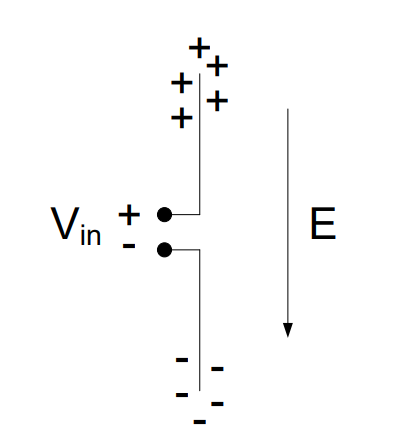

# Objective 3.3

| LO# | Description |
|----------|----------|
| 3.3 | I can calculate the signal wavelength, antenna size, max antenna gain, and basic gain pattern for dipole, monopole, and parabolic dish antennas. |

## Antennas Introduction

Generically, we can divide electronic communications into four steps:

1.  Preparing the message for transmission using an *input transducer*,
    *signal conditioning, and modulator*

2.  Sending the signal through a *communications medium*

3.  Receiving the signal from the *communications medium*

4.  Recovering the message using a receiver *interface, demodulator,*
    *and transducer*

In previous lessons, we learned about steps 1 and 4. We prepare the
message by converting the information to an electrical signal,
conditioning the signal, filtering, and/or digitizing, then modulating
the signal for transmission. Likewise, we recover the message by
demodulating and employing optional signal conditioning techniques, such
as converting to analog, amplifying, and/or filtering, before we send it
to an output transducer.

In the remaining lessons, we will focus on wireless communications. As
we do so, we will use radio communications and RADAR as examples. We
will then explore how this process affects our tactics by taking a look
at Electronic Warfare (EW) techniques. But first, we will look at how we
transmit a signal wirelessly with an antenna.

## General Antenna Theory

Coulomb's Law states an electric force exists between a stationary
positive charge and a stationary negative charge. Since the electric
field is just the force per unit of charge, the electric field pattern
in the following figure can be found by knowing the direction of force
on a positive test charge placed in the vicinity of the two fixed
charges. The arrows indicate the direction of force on a positive test
charge, if one existed. Since positive test charges follow the direction
of electric field lines and negative charges behave in the opposite
manner as positive test charges, we know that negative charges must move
in the direction *opposite* of the arrows on the electric field lines.

In this case, the charges are stationary. However, Ampere's Law states
that if the charges move along a conductor (such as a wire or a sheet of
metal), these moving charges (current) generate a magnetic field around
the current. The charge separation causes an electric field, and the
current causes a magnetic field. Together, we call these interdependent
fields an *electromagnetic field,* which radiates away from the
conductor in waves, much like ripples from a stone thrown in a pond. But
instead of the two-dimensional rings in the pond, the electromagnetic
waves radiate outward in three-dimensional spheres. The radiation of
electromagnetic waves can be explained well with a specific type of
antenna called a dipole antenna, which will be discussed in more detail
later in this reading. Consider a dipole antenna made out of two wires
as shown in the figure below.

Recall that oppositely charged particles attract and similarly charged
particles repel one another. Recall also that metals easily give up
electrons, which can create areas of positive charge (when electrons
have departed) and negative charge (when electrons accumulate).

When we apply a voltage across the input of this antenna, we cause
similarly charged particles to accumulate together:

Therefore, in the bottom half of this antenna, the input, which is the
negative terminal of $V_{in}$, pushes the electrons in the lower wire
away, causing an accumulation of negative charge at the bottom of the
antenna. Similarly, in the top half of the antenna, there is a positive
charge at the input, which draws electrons in the wire towards the
input, leaving behind an area of positive charges at the tip of the
antenna (we can denote positive charge as the *absence* of electrons).
The result is an area of positive charges at one tip of the antenna and
an area of negative charges at the other. The difference in charges
between the two ends of the antenna creates an electric field, labeled E
in the above diagram.

Now what happens if we were to put another antenna inside this electric
field?

In the diagram above, the antenna we applied a voltage to is on the
left, and the new antenna is on the right. As discussed earlier, the
arrows on electric field lines tell us the direction of force on a
positive test charge, and from this, we know that electrons will move in
the opposite direction of the arrows. For this reason, the electric
field, E, created by the antenna on the left moves electons to the top
portion of each half of the antenna on the right, creating an area of
negative charge at the top of the upper half and an area of positive
charge at the bottom of the lower half. Another way to think about this
is about how charges attract and repel. The arrows in an electric field
originate from an area of positive charge, and they end in an area of
negative charge. The positive charge at the top of the electric field
draws electrons to the top of the new antenna. Likewise, the negative
portion at the bottom of the electric field pushes the electrons away,
leaving behind an area of positive charges in the new antenna.

In order for an electric field to propagate (move), the input needs to
change over time. One way we can get it to change is by applying an
alternating current, such as a sinusoidal signal, to the input.

Therefore, when the input signal reverses polarity, the electric field
is reversed. We now have negative charges at the top of the transmitting
antenna and positive charges at the bottom.

In the receiving antenna, the opposite occurs. Positive charges
accumulate at the top of the receiving antenna and negative charges
accumulate at the bottom.

Therefore, as our input signal from the transmitting antenna changes
from positive to negative, the output signal at the receiving antenna
changes from negative to positive. This is how antennas transmit
information!

This also demonstrates an important concept about how antennas radiate
electromagnetic radiation. The electric field travels perpendicular to
the antenna, and the electric field points parallel to the antenna. In
order for the electric field to move the charges in the receiving
antenna, the receiving antenna has to be placed parallel to the incoming
electric field (as is shown in the image above). For this reason,
antennas do not work well when the tips are pointing at each other.

We could just as easily have made the antenna on the right the
transmitting antenna (connected to $V_{in}$) and the antenna on the left
the receiving antenna (connected to $V_{out}$). Because of this, there
is no difference between a receive antenna and a transmit antenna. If an
antenna can be used to transmit, it can also be used equally well to
receive.

## Types of Antennas

There are many types of antennas, but we will discuss four main types:
the dipole, monopole, parabolic dish, and array antenna.

**Dipole:** The basic dipole is one of the most common types of
antennas. Its radiation characteristics, simplicity of deisgn, and ease
of construction make it useful for a wide variety of applications.
Although there are many types of dipoles, the most common type of
antenna is the half wavelength dipole (also know as half-wave dipole),
where the length of the antenna is given by:

$$Length = \ \frac{\lambda}{2}$$

In the above equation, λ is the wavelength of the electromagnetic wave
that the antenna is designed to transmit and/or receive. In calculating
the length of antennas, it is useful to recall the relationship between
wavelength (λ) and frequency:

$$\lambda = \ \frac{c}{f}$$

The following example illustrates how to calculate the length of a
half-wave dipole.

**Example Problem 1:** The carrier frequency of an FM broadcast station
is 100.7 MHz. How long of a dipole antenna should we use to receive this
signal?

**Understand:** The length of the antenna is inversely proportional to
the frequency of the signal.

**Identify Key Information:**

-   **Knowns:** We know the broadcast frequency (100.7 MHz).

-   **Unknowns:** The wavelength and the length of the dipole antenna.

-   **Assumptions:** None.

**Plan:** A dipole antenna is half of a wavelength, so we need to
calculate the wavelength and then divide the wavelength by 2.

**Solve:** To find the wavelength of a signal, we use the following
equation:

$$\lambda = \ \frac{c}{f}$$

$$\lambda = \ \frac{c}{f}\  = \ \frac{3*\ 10^{8}\ m/s}{100.7\ MHz}\  = \ 2.979\ m\ $$

Therefore, this signal has a wavelength of just under 3 meters. A
half-wave dipole antenna is one half of the wavelength of the signal.
Therefore,

$$Length = \ \frac{\lambda}{2}\  = \ \frac{2.979\ m}{2}\  = 1.490\ m$$

**Answer:** The dipole antenna needs to be 1.490 m (4.6 ft) long. Many
cars embed a dipole antenna in the car window to receive FM signals.
These antennas are roughly 1.5 meters in length (or just under 5 feet)
to maximize reception of the frequencies used for FM stations.

**Monopole:** Another very common antenna is the quarter-wave monopole.
As its name suggests, the length of a quarter-wave monopole is equal to
one-quarter of the wavelength it is designed to transmit or receive. In
order for a monopole antenna to work, it needs to have a reflective
surface called a *ground plane*. This ground plane acts like a mirror to
the electromagnetic field, which reflects the "mirror image" of the
incident electromagnetic field. Then, the field from the top half and
"mirror image" from the bottom half interfere constructively, meaning
they add together. Using this phenomenon, the ground plane "fools" the
quarter-wave monopole into behaving like a half-wave dipole.

The radiation characteristics of the quarter-wave monopole are the same
as that of the half-wave dipole from the ground plane up. Radio antennas
mounted on cars are monopoles. This antenna works the same as if the
sheet metal of the car under the antenna, functioning as the ground
plane, were replaced by the bottom half of a half-wave dipole.

**Example Problem 2:** The carrier frequency of an FM broadcast station
is 100.7 MHz. How long of a *monopole* antenna should we use to receive
this signal.

**Understand**: We are recalculating the previous example problem using
a monopole antenna to broadcast. However, since a monopole is half the
length of a dipole, we know the monopole length will be shorter than the
dipole.

**Identify Key Information**:

-   **Knowns:** We know the broadcast frequency (100.7 MHz).

-   **Unknowns:** The wavelength and the length of the monopole antenna.

-   **Assumptions:** None.

**Plan**: Since we calculated the wavelength of this signal in the
problem above, we can start from there and divide by 4 to calculate a
quarter of a wavelength. The antenna length is therefore:

$$Length = \ \frac{\lambda}{4}\  = \ \frac{2.979\ m}{4}\  = 0.7448\ m = \ 744.8\ mm$$

**Answer**: The required length of a monopole antenna is 744.8 mm. The
antennas that you see sticking out of car hoods are monopoles. 744.8 mm
is about 2.5 feet, which is the approximate length of car antennas.

**Example Problem 3**: An AM radio station transmits at 740 kHz. If the
station broadcasts using a monopole antenna, how tall should the antenna
be?

**Understanding**: A monopole antenna needs to be 1/4 of the wavelength.

**Identify Key Information**:

-   **Knowns:** We know the broadcast frequency (740 kHz).

-   **Unknowns:** The wavelength and the length of the monopole antenna.

-   **Assumptions:** None.

**Plan:** We will use the same process as before, calculating the
wavelength of the signal and then dividing it by 4.

**Solve**: Calculating the wavelength of this signal:

$$\lambda = \ \frac{c}{f}\  = \ \frac{3*\ 10^{8}\ m/s}{740\ kHz}\  = \ 405.4\ m.\ $$

Recognize how large this wavelength is. In fact, the wavelength for this
signal is more than 4 football fields long. Even with a quarter-wave
dipole, the required antenna height is still:

$$antenna\ length = \ \frac{405.4\ m}{4}\  = 101.4\ m.$$

**Answer**: A monopole antenna broadcasting a 740 kHz signal needs to be
101.4 m (332.7 ft) tall.

Remember a monopole antenna requires a ground plane in order to work.
For an AM monopole antenna, the ground itself is used as the ground
plane (sometimes metal bars are buried in the dirt to increase the
reflectivity).

You might also wonder about the answer to the above question. If we need
such a long transmission antenna, we need an equally long receiving
antenna, which is impractical for many space-limited applications.
Fortunately, there are some convenient ways to make antennas more
usable. In fact, many AM antennas are not just one length of wire.
Instead, a typical AM antenna is actually a thin copper wire wrapped
around a frame hundreds of times. This wrapping allows us to create a
necessarily long antenna while conserving space.

**Parabolic Dish:** A parabolic dish antenna (shown below) focuses
signals in a specific direction, which allows them to travel farther.
Recall that a parabola focuses parallel rays to its focal point. The
actual antenna element, called the feed, is usually a dipole or horn
antenna placed at the focal point. The feed acts as either a collector
(receiver) or emitter (transmitter) for the antenna. In the receiving
case, the feed collects all the rays focused by the parabolic reflector
dish. In this way, the antenna can capture much more of the energy than
just the feed antenna by itself. However, this is limited to a very
small spatial area. In the transmitter case, the feed directs the energy
towards the dish, where the energy is then focused in the direction the
antenna is pointing. Note spherical and parabolic antennas are very
similar but differ slightly in the way they focus energy.

## Antenna Parameters

In what directions do antennas radiate energy and how much energy do
they radiate in each direction? In what directions do antennas transmit
or receive energy and how much energy do they transmit or receive in
each direction? Thankfully, the concepts are the same whether the
antenna is transmitting or receiving. In order to answer these
questions, we graph the radiation patterns of an antenna. This provides
a pictorial representation of the amount of energy the antenna radiates
(or receives) in all directions for some arbitrarily chosen fixed
distance. Consider once again the dipole antenna. If we want to know how
much relative power is radiating in all directions from the antenna, we
can create a radiation pattern graph.

Consider what would happen if we placed the dipole vertically and walked
around the dipole in a circle, keeping our distance to the antenna
constant. In this case, we would find all of the received power
measurements are equal. So the radiation pattern around the axis
parallel to the orientation of the dipole would be a circle as shown in
Figure 1. For the radiation pattern, the outward distance from the
center of the dipole represents power and not distance in meters.
Therefore, if the radiation pattern is closer to the antenna, less power
is being radiated in that direction.

Next, we can place the dipole antenna in a horizontal position walk
around it in a circle while taking power measurements. The radiation
pattern for this case is shown in Figure 2. We see the maximum power
radiates from the two points on the circle farthest away from the side
of the antenna. We also see no energy radiates off the end, where there
is a null in the pattern. In addition, as we go from the null to the
maximum on the circle, the energy gradually increases.

|Figure 1: Vertical dipole radiation pattern|Figure 2: Horizontal dipole radiation pattern|
|:---------------:|:---------------:|
|||

Combining the radiation patterns shown above, the three-dimensional
radiation pattern is shaped as a toroid, the shape of a doughnut, as
shown in Figure 3. This radiation pattern explains why you never point
the top of a radio antenna in the direction from which you are trying to
receive signal. Instead hold the radio upright so the entire length of
the antenna can capture radiation.

Figure 3: 3-D radiation pattern for a simple dipole antenna.

A parabolic dish has a different radiation pattern because of its
ability to focus radiation in one direction. The pattern is narrower and
longer as shown below. This means a parabolic dish radiates and receives
extremely well in a specific direction at the expense of poor
performance in every other direction.

*Antenna gain* refers to the antenna's ability to focus energy in a
specific direction. You might be familiar with flashlights that can
focus the light beam by turning the head of the flashlight. As the
beamwidth becomes narrower, the light intensity becomes brighter. The
brightness of the bulb is constant; however, as the light from the bulb
is focused, it can be concentrated into one direction. In antenna
terminology, we would say the brighter, narrower beam has more *gain*.

Antenna gain is defined as the ratio of the energy focused in a
direction as compared to a standard. The standard is a radiating point
source, which is simply an antenna that radiates equally in all
directions. This is called an isotropic source and is only a theoretical
concept. The 3-D radiation pattern from a point source is simply a
sphere, meaning it radiates energy equally in all directions. If the
antenna does nothing to focus energy in a specific direction, its gain
is simply one.

When we compare the radiation pattern of a dipole antenna (two circles
in the figure below) to that of a point source (grey circle in the
figure below), we find the dipole antenna has more power radiated in
some directions than the point source (Gain \> 1) while in some
directions, no power is radiated (Gain = 0 or a null zone).

Both the dipole and monopole have modest gain. Ideally, a half-wave
dipole has a gain of G = 1.64. The quarter-wave monopole ideally has
twice the gain of a half-wave dipole (G = 3.28). However, this is only
true if the monopole is directly over a perfectly conductive ground
plane that extends to infinity, which is rarely the case.

Since gain is typically a power ratio, it is usually discussed in terms
of the ratio of the actual antenna power pattern gain compared to the
power pattern gain of the point source. As stated above, this ratio is
1.64 for a half-wave dipole. We can also relate this in terms of
decibels, or dB using the following relationship:

$$Gain\ (dB) = 10\log_{10}{(1.64) = 2.15\ dB\ }$$

Remember, dB is a power ratio.

In contrast to a dipole or monopole, a parabolic dish antenna would
typically have a gain ranging from hundreds to even thousands of times
that of a point source and depends on both how the dish is built and the
frequency of the transmitted signal. We can calculate the gain of a dish
antenna using the following equation:

$$G = \ \frac{{(2\pi r)}^{2}}{\lambda^{2}}*\eta$$

In this equation, *r* is the radius of the circular dish (in meters),
*λ* is the wavelength of the transmitted signal (in meters), and *η* is
the efficiency of the antenna.

**Example Problem 4**: A dish antenna with a radius of 250 mm is used to
send a microwave communication signal at 2.7 GHz. The dish has an
efficiency of 91%. What is the antenna's gain?

**Understand**: A dish antenna has a high gain, but this gain depends on
the relationship between the radius of the dish and wavelength of the
transmitted or received signal.

**Identify Key Information**:

-   **Knowns:** We know the radius of the dish, the efficiency, and the
    frequency.

-   **Unknowns:** The wavelength and gain of the antenna.

-   **Assumptions:** None.

**Plan:** Since we have the dish's radius and efficiency, we can
calculate its gain for 2.7 GHz transmission using the gain equation. But
first, we should calculate the wavelength.

**Solve**: The wavelength of the transmitted signal is

$$\lambda = \ \frac{c}{f}\  = \ \ \frac{3*\ 10^{8}\ m/s}{2.7GHz}\  = 0.1111\ m\  = \ 111.1\ mm$$

We can now calculate the gain:

$$G = \ \frac{{(2\pi r)}^{2}}{\lambda^{2}}*\eta\  = \ \frac{{(2\pi*.25\ m)}^{2}}{{(0.1111\ m)}^{2}}*0.91\  = \ \ 181.9$$

**Answer:** The dish's gain is 181.9.

## Phased Array Antennas

Now that we have discussed the three basic types of antennas and their
associated parameters, it is worth looking at one more type of antenna
-- the phased array antenna. Although dish antennas focus their energy
in one direction, one of their drawbacks is the need to physically turn
the antenna in the direction of the corresponding transmitter or
receiver. However, it is possible to construct an *array* of antennas to
create an electronically controlled beam. Consider the arrangement of
transmitting antenna elements shown in Figure 4, where 8 antenna
elements are connected to a single transmitter/exciter. In this case,
the direction of the combined beam appears to be moving at some angle θ
off the "straight ahead" direction (boresight). To do this, each
radiating element (antenna) is progressively delayed in phase (which is
really just a time delay). For Figure 4, this delay increases as we move
up the chain of antennas. Recall that as waves propagate, they spread
out spherically. Therefore, by introducing this progressive delay, the
*peaks*, or strongest parts of the waves, interfere constructively. The
peaks of the overall wave from the array antenna define the direction
the beam appears to be propagating. As such, the beam appears to be
moving away from the array at the desired angle θ. Therefore, we can
change the angle by changing the time delay between each element.

Figure 4: A phased array of antennas elements.

Taking advantage of this abilty to change the direction of the "beam" by changing the time delay of the antenna elements allows us to build a completely flat antenna. Many modern antennas in aircraft, satellites, and other weapon systems use such phased array technology. One example is the Northrop Grumman AN/APG-83 Scalable Agile Beam Radar (SABR) used in the nosecone of the F-16 (Figure 5). Technology in the area of phased arrays has improved such that we can realize relatively high gain antennas and also steer the beams in both azimuth and elevation (2-D steering).

Figure 5: The AN/APG-83 SABR installed in the nosecone of an F-16.
