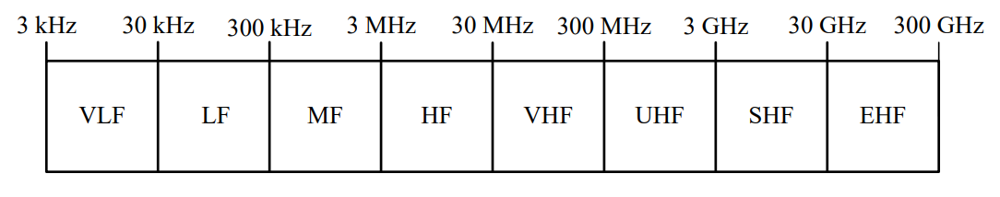
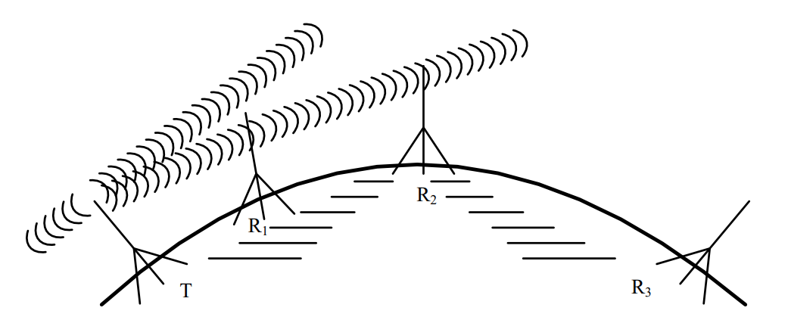
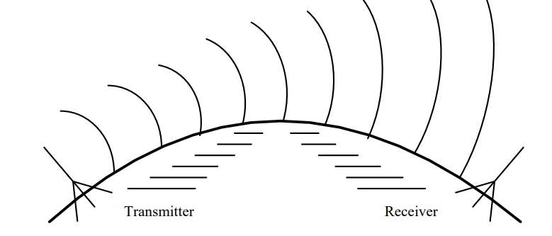
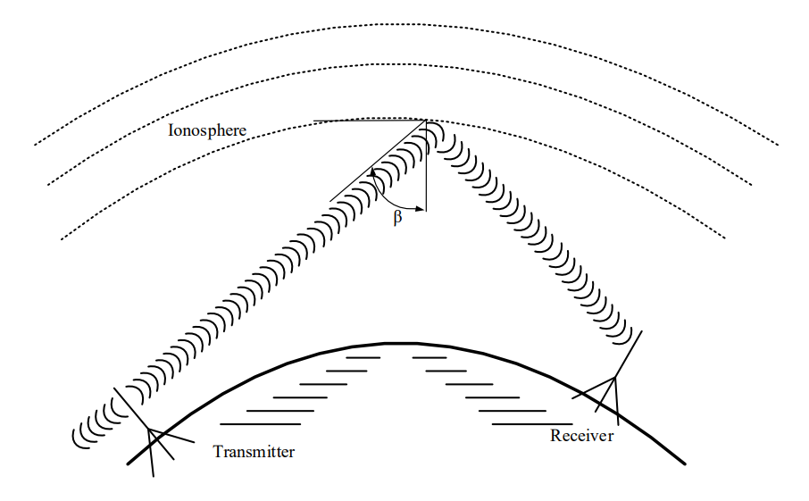
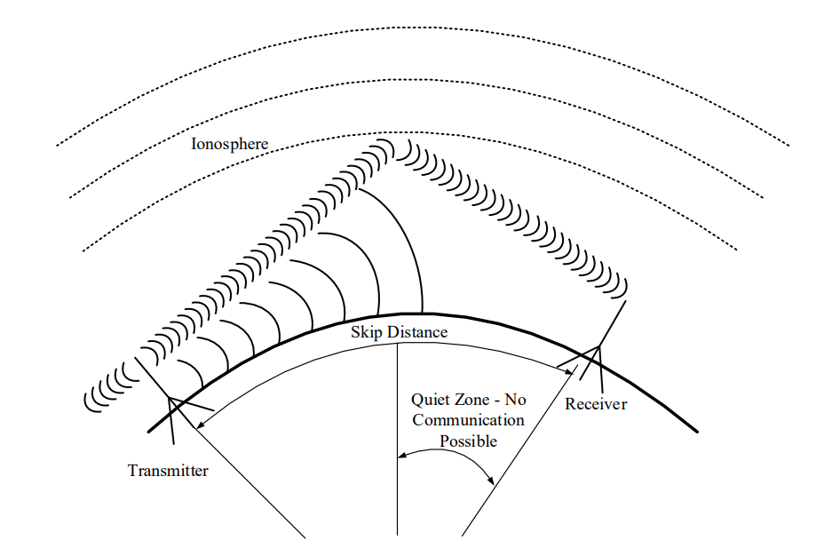
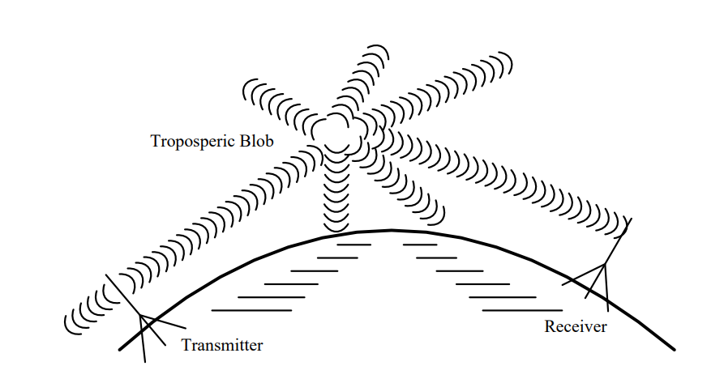
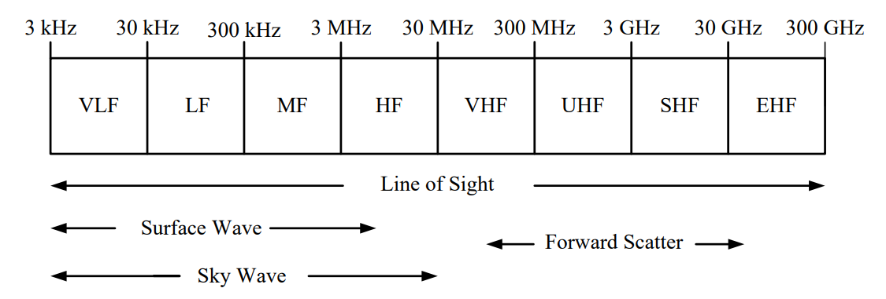
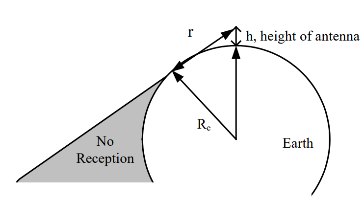
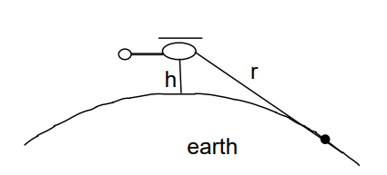
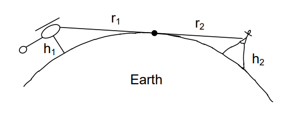

# Objective 3.4

| LO# | Description |
|----------|----------|
| 3.4 | I can calculate the maximum line-of-sight (LOS) distance between two terrestrial objects.  |

## Communications Introduction

Today, communication affects our lives in so many different ways. Given
the ubiquity of smart phones and other connected devices, we can
communicate with anyone at any given time. In the civilian world, we can
request an Uber, buy tickets to a Denver Broncos game, or have
near-instantaneous communication with someone across the country. In
military operations, communication is even more important, as it
provides critical information across the battlefield in near-real time.
Delivering information using electromagnetic signals from one location
to another requires some form of pathway or medium. These pathways can
be broadly categorized as either wired (such as a transmission line) or
wireless. We call these pathways *communication media*. Some people
refer to them as communications channels, so you may hear these two
terms used synonymously. In this lesson, we will discuss
four types of wireless radio frequency (RF) propagation methods and compute the distance at which terrestrial objects can communicate with RF using Line of Sight.

## Wireless Communications

*Wireless* communications use the electromagnetic spectrum to transmit
and receive information without the use of wires, waveguides, or other
conductors. Typically, a wireless signal is transmitted from an antenna,
then it travels through free space until it is acquired by the receiving
antenna. This is exactly what happens every time you use your cell
phone. Even though radio frequencies and antennas are commonly
associated with wireless communications, laser beams can also be used to
communicate. A great example of this is the Lunar Laser Communications
Demonstration (LLCD) developed by MIT Lincoln Laboratory. The LLCD used
lasers to successfully transmit at a data rate of 622 Mbps from lunar
orbit to Earth!

The primary advantages of using wireless communications are flexibility
and cost. Wireless communications can be used virtually anywhere, as
long as the transmitter and receiver have the required equipment. There
is no need to install or repair wires over long distances, so they are
relatively cheap to use and maintain.

The primary disadvantages of wireless communications are that they have
limited bandwidth and are not as reliable as the other communications
media. As we discussed earlier in this class, the radio frequency
spectrum in the United States is full, meaning there is no more
bandwidth available at radio frequencies for wireless communications.
Additionally, wireless communications are not as reliable as the other
communications media. For example, satellite TV, which uses wireless
communications, can lose service during severe storms whereas cable TV,
a transmission line, does not. Despite these disadvantages, wireless
communications are widely used in today's world, and for that reason,
various wireless communications will be the focus of the rest of this
block.

>Imagine this scenario: you are stranded behind enemy lines, a few
kilometers from the smoking remains of your airplane. From intelligence
briefs received before the mission, you know you're in a safe area, with
only a very slight chance of capture. Still, you find a reasonably
sheltered spot and pull out your survival radio, hoping to contact a
rescue helicopter.
>
>In order to communicate with the helicopter, you will need to
communicate wirelessly. In your situation, though, how does it work? To
be successful, you will need to understand how wireless communications
work and what factors affect your communication system's performance.

### Radio Frequency (RF) Spectrum

The lower end of the electromagnetic spectrum, called the RF spectrum,
is subdivided into eight bands spanning from 3 kHz to 300 GHz. Each band
has a name, as shown in Figure 1. Civilian applications, such as
commercial AM and FM radio, television, cellular telephony, civilian
aviation navigation, and air traffic control frequencies are found in
this portion of the electromagnetic spectrum. These bands are also used
in many military applications: global positioning system (GPS); RADAR;
munitions guidance and fusing systems; strategic and tactical
communications systems; and intelligence, surveillance, and
reconnaissance (ISR) systems.

Figure 1: The RF spectrum.

### RF Propagation methods

There are four different kinds of wireless RF propagation methods. They
are:
1.  Direct or line-of-sight (LOS)
2.  Surface wave
3.  Sky wave
4.  Forward scatter

Each of these pathways involves a propagation path. Since it is possible
for a signal to be transmitted over several paths simultaneously, this
may cause interference. However, some of the pathways only work for
certain bands within the RF spectrum.

1.  **Line-of-sight (LOS) Propagation:** All electromagnetic energy (to
    include all the RF bands) will propagate by LOS. If you, the
    transmitter, are in view of the receiver, then line-of-sight is
    established, thus the name. In practice, this means that if nothing
    can obstruct the waves traveling directly between the transmitter
    and receiver, then line-of-sight propagation can occur. As shown in
    Figure 2, LOS communications on the earth are limited by the
    curvature of the earth and the heights of transmitting and receiving
    antennas. Of course, transmitter power is also a limiting factor.
    The signal transmitted from point *T* reaches the receiving antennas
    *R­1­* and *R­2­*. However, *R­3­* is not in the LOS path of the
    signal and cannot receive any of the radio's energy. For
    communication and telemetry between earth and space vehicles, LOS
    propagation is used. At short distance, secure military
    communications commonly occur through LOS microwave links. Some
    telephone company "trunks" and cell phone towers also use LOS.

    

    Figure 2: Line-of-sight (LOS) propagation between several repeater
    stations.

2.  **Surface Wave Propagation:** In surface wave propagation, the radio
    wave travels from the transmitting antenna to the receiving antenna
    along the surface of the earth. This wave essentially diffracts
    around the surface of the earth, so you can reach distances greater
    than LOS. In this waveguiding process, minute eddy currents are
    induced in the ground directly beneath the surface wave. Although
    the ground is a fairly good conductor, it does have some resistance
    and the energy required for these currents to flow is absorbed from
    the wave. This in turn limits how far the wave can effectively
    travel.

    As frequency increases, losses due to the conductivity of the ground
    also increase and greatly attenuate the surface wave. This means
    surface waves cannot travel as far at higher frequencies. Surface
    waves are very effective for signal propagation in the VLF and LF
    bands. However, near the MF band, this effectiveness decreases
    rapidly. Surface waves are not generally useful above about 3 MHz.
    Commercial AM broadcasting stations typically use surface waves to
    transmit their signals - this is one of the main reasons AM radio
    signals can travel much further than FM radio signals.

    

    Figure 3: Surface wave propagation.

3.  **Sky Wave Propagation:** Radio energy reflected or refracted from
    the ionosphere back to Earth is known as a sky wave. To understand
    how the ionosphere affects radio waves of different frequencies,
    think of the ionosphere as a huge mesh sieve surrounding the earth.
    Whether or not a wave passes through this sieve depends partially
    upon the relative dimensions of the wavelength and of the mesh
    openings. Therefore, radio energy with a long wavelength (low
    frequency) is more likely to be reflected back to Earth than that
    with a short wavelength (high frequency), which will pass through
    the mesh. In addition to frequency, the angle of incidence, *β* in
    Figure 4 below, plays a role in determine if the radio energy will
    be reflected back to Earth.

    

    Figure 4: Sky wave propagation.

    In general, the larger the angle, *β*, the greater the probability the
    wave will be reflected. However, if *β* is too large, the layers of
    the ionosphere will act like a waveguide and the wave will effectively
    remain in the ionosphere and not be returned to Earth. As with the
    other wireless RF propagation methods, there is often a tradeoff
    between this angle of incidence and frequency. That is, for a given
    angle, there is some maximum frequency that can be used for sky wave
    propagation. Likewise, for a given frequency (within certain limits),
    there is some maximum angle that will produce a sky wave.

    Maximum usable frequencies usually lie in the HF band; waves whose
    frequencies are above this are refracted slightly by the ionosphere
    but propagate through it. A peculiarity of the ionosphere is that its
    lower layers readily absorb energy in the MF band. Thus, sky waves in
    this band are possible only at night when the lower ionospheric layers
    are less dense. Narrowband long haul communications are often
    conducted in the HF band via sky wave.

    Sky wave propagation has a significant limitation. At the point where
    a sky wave returns to Earth, you can detect a very strong signal.
    However, between this point and the transmitter, there is essentially
    no energy from the sky wave at all. The distance between the
    transmitting antenna to the spot where the reflected wave strikes the
    earth is called the *skip distance*. At all locations less than the
    skip distance from the transmitting antenna, none of the sky wave
    signal is received. Therefore, the only way to communicate at points
    less than the skip distance is through LOS or surface wave
    communications.

    In the HF band, where surface wave propagation is somewhat less than
    200 miles, there is often a considerable distance in which essentially
    no radiated energy from either the surface wave or the sky wave is
    present and no communication is possible. This region is called the
    *quiet zone*. Figure 5 below illustrates the concepts of skip distance
    and quiet zone.

    

    Figure 5: Skip Distance and Quite Zone.

4.  **Forward Scatter Propagation:** When a radiated signal strikes the
    discontinuous "blobs" of air in the troposphere, it is scattered in
    various directions. Some of this scattering is in the forward
    direction, and the resulting radio signal, although relatively weak,
    can be received at a point that is beyond the horizon from the
    transmitter. Most of the Air Force's non-satellite wideband long
    haul communications use forward scatter (with carriers in the 300 to
    400 MHz range).

    Although the scatter is dependent upon atmospheric conditions, it is
    possible to achieve reliable communications using high-power
    transmitters and sensitive receivers. Tropospheric forward scatter is
    effective in the VHF, UHF, and SHF bands. These tropo links use large
    rectangular "billboard" antennas and typically transmit about 100 kW
    of power. Before satellite communication became prevalent, much
    in-theater military communication was accomplished using this type of
    propagation.

    

    Figure 6: Forward scatter propagation.

### Range and Bandwidth Considerations

At higher carrier frequencies, more bandwidth is available for use. As a
rough estimate, the available bandwidth for a signal is about 1% of the
carrier frequency.

AM radio stations, operating around 1 MHz, only have 10 kHz of bandwidth
available. Fiber optics, however, use beams of light with carrier
frequencies on the order of 100 THz (100 trillion cycles per second).
These light beams have available bandwidths up to 1 THz. In other words,
we can transmit approximately 100 Million times more information over a
light beam than we can over a radio signal.

Unfortunately, the transmission range of signals also depends on the
frequency. AM radio stations can easily transmit signals hundreds of
miles, and as said earlier, these signals can even follow the curvature
of the earth to reach beyond line of sight (surface waves). Light beams,
on the other hand, are quickly attenuated by atmospheric effects. In
order to overcome this limitation while still reaping the benefits of
the huge bandwidth available in beams of light, optical fibers are
generally used. We'll discuss how frequency affects a signal's range in
more depth in future lessons.

### RF Summary

Let's quickly summarize which types of wireless communication pathways
are used by different radio frequency bands. This information is
identified below in Figure 7. The ITU (International Telegraphic Union)
designation of frequency bands (e.g., VHF, UHF) and the frequency ranges
for some of the more common uses of radio waves are indicated. Since the
transmitted signal in a communication system usually has a relatively
narrow bandwidth, the propagation characteristics are determined almost
exclusively by the carrier frequency. This figure also summarizes which
radio frequencies are best suited to the four primary pathways that
radio frequency waves propagate through the air and space: direct or
line-of-sight (LOS), surface wave, sky wave, and forward scatter.

Figure 7: The RF spectrum and the associated wireless RF propagation
methods.

-   **VLF and LF (Very Low Frequencies and Low Frequencies):** At these
    lower frequencies, surface waves are attenuated very little and may
    be used for signal propagation of a thousand miles or more. This
    maximum distance gradually decreases with increasing frequency and
    is about 400 miles at 300 kHz. The sky wave does exhibit slight
    fluctuations with changes in the ionosphere, but it is still fairly
    reliable. Sky waves can be used for communication over distances
    from about 500 to 8000 miles in the LF band. In the VLF range, the
    combination of the surface and sky wave mechanisms make worldwide
    signal propagation possible with radiated power levels of about 1
    MW.

-   **MF (Medium Frequencies):** In this band, the maximum distance for
    surface wave propagation varies from about 400 miles at 300 kHz to
    about 200 miles at 3MHz. Ionospheric absorption of electromagnetic
    energy in this band (maximum absorption occurs at 1.4 MHz) makes sky
    wave propagation impossible during the day. At night, sky waves
    furnish reception at distances from about 100 to 3000 miles.

-   **HF (High Frequencies):** The attenuation of surface waves above
    about 3 MHz is so great that the surface wave is effectively of no
    use for communication in this band. Sky waves are used extensively,
    and their behavior is mostly governed by ionospheric conditions.
    Although sky wave propagation is not always reliable, it is possible
    over distances of 12,000 miles and more. For distances such as this,
    frequencies from 5 to 20 MHz have proven most effective. Many
    military aircraft have HF radios onboard used for long-range
    communication. Also, amateur radio (ham radio) operates primarily in
    this part of the spectrum. Amateur radio is primarily used by
    hobbyists who are interested in RF communications.

-   **VHF (Very High Frequencies):** Although sky waves may occur at
    lower VHF frequencies, their reliability is so poor in the VHF band
    that they are virtually useless for communication. The predominant
    form of propagation in this band is line-of-sight. The effectiveness
    of forward scatter becomes increasingly important as frequencies
    reach 50 MHz and above.

-   **UHF and SHF (Ultra High Frequency and Super High Frequency):**
    Line-of-sight propagation is widely used at these frequencies since
    excellent low-noise reception is possible. Ranges of a few hundred
    miles can be realized up to about 10 GHz. Most forward scatter
    applications use frequencies well below this. Many space assets use
    this frequency band for communications.

-   **EHF (Extremely High Frequency):** Line-of-sight is the only
    propagation method used with EHF. Radio waves at these frequencies
    attenuate quickly in many uses, such as RADAR and wireless
    communications, so range is limited for these frequencies.
    Additionally, the atmosphere absorbs energy from waves, further
    attenuating them while in the atmosphere. However, EHF is still
    used. Each satellite in the Advanced Extremely High Frequency (AEHF)
    satellite constellation uses EHF for uplink communications.
    Additionally, 5G cellular networks will use frequencies in the lower
    portion of the EHF band. Specifically, Verizon has stated that they
    use 28 GHz (SHF) and 39 GHz (EHF) for their 5G network.

## Line-of-sight Communications

Returning to our original question, "What kind of wireless RF
propagation method would you use between you and a rescue helicopter?"
Realistically, you'll most likely find yourself trying to establish a
LOS link. A survival radio does not have the power required to use the
more specialized forms of wireless communications (surface waves, sky
waves, and forward scatter). In LOS, the key to establishing
communications is actually being able to "see" the helicopter and having
enough transmission power.

Obviously, there are a number of variables associated with determining
the LOS between you and the helicopter. Are you on a hill or in a
valley? How high is the hill? Is the terrain flat or bumpy? How high is
the helicopter?

If we assume the terrain is relatively flat, we can use a simple
equation to give us a good idea of how far the helicopter (or anything
else) can see. Consider an antenna sitting at height, *h*, above sea
level. The maximum range, *r*, between transmit and receive antennas is
calculated as the distance from the transmit antenna to the point that
is tangential to the surface of the earth as shown in Figure 8.

Figure 8: Line-of-sight communication range.

Since $R_{e}$ and *r* make two sides of a right triangle, with
($R_{e}$ + *h*) as the hypotenuse, we can use the Pythagorean theorem
($a^{2} + b^{2} = c^{2}$) to find:

$$R_{e}^{2} + r^{2} = \left( R_{e} + h \right)^{2}$$

$${(R_{e} + h)}^{2} = R_{e}^{2} + 2R_{e}h + h^{2}$$

$$R_{e}^{2} + r^{2} = R_{e}^{2} + 2R_{e}h + h^{2}$$

$$r^{2} = R_{e}^{2} + 2R_{e}h + h^{2} - R_{e}^{2}$$

$$r^{2} = 2R_{e}h + h^{2}$$

$$r = \sqrt{2R_{e}h + h^{2}}$$

For terrestrial and even some airborne applications (i.e., non-space),
we can assume that $R_{e}$ is much greater than the antenna height
($R_{e} \gg h)$, so the $h^{2}$ can safely be ignored. This results in a
maximum LOS range equation of:

$$r_{\max} = \ \sqrt{2R_{e}h}$$

Furthermore, the radius of the Earth is adjusted to account for
atmospheric effects (decreasing atmospheric pressure helps bend radio
waves downward thus increasing range). The resultant radius is increased
from 3960 miles to 5280 miles, using the common 4/3 radius model.
Coincidentally, there are 5280 feet in a mile. As a result, we can
employ a "mixed units" equation, entering the antenna height (*h*) in
feet to find the range in miles. This makes our LOS equation:

$$r = \ \sqrt{2h}$$

In this equation, *h* is the height (***in feet***) of the observer, and
*r* is the distance (***in miles***) the observer can see before the
horizon gets in the way. Notice this is an "improper" equation, which is
to say the units don't match - if we take the square root of feet, we
should not end up with miles. As engineers, we're willing to overlook
this discrepancy and use this improper equation because it is useful,
and its derivation produces a mathematically logical result.

### Example Problem 2
A helicopter is searching for a downed airman
from 2000 feet AGL (above ground level). Assuming relatively flat
terrain, how close will it have to get to the airman before it can
establish line-of-sight?

**Understand**: Military survival radios require line-of-sight to
communicate, so we need to calculate the maximum LOS distance.

**Identify Key Information**:

-   **Knowns:** We know the height of the CSAR helicopter.

-   **Unknowns:** The maximum line of sight distance.

-   **Assumptions:** We assume the terrain is flat (mountains cause
    significant problems).

**Plan:** We will use the LOS equation to solve for the maximum LOS
distance.

**Solve:** We know the helicopter is 2000 feet above the earth. Plugging
this into the LOS equation gives:

$$r = \ \sqrt{2h} = \ \sqrt{2*2000} = \ \sqrt{4000} = 63.25\ miles.$$

Recall, we put feet into the equation and the answer will be given in
miles.

**Answer**: At 2000 feet AGL, the helicopter can see for approximately
63.25 miles. Therefore, it needs to be within 63.25 miles to see an
airman on the ground.

### Example Problem 3
The helicopter in the previous example is still
flying at 2000 feet AGL. If the airman climbed to the top of a 50-foot
tall hill, how far away could the helicopter establish line-of-sight?

**Understand**: We have to use the LOS equation twice because the airman
has raised himself above the surface, as shown below.

**Identify Key Information**:

-   **Knowns:** We know the height of both the helicopter and the
    stranded airman.

-   **Unknowns:** The maximum LOS distance.

-   **Assumptions:** The terrain is flat and no mountains are in the
    way.

**Plan:** Recall, we are trying to determine the *maximum* distance the
helicopter can see the airman. As the picture above hopefully shows,
this occurs when the airman climbs high enough to just barely be in the
helicopter's line-of-sight. At this point, the helicopter will see the
airman on the horizon, not even knowing the airman is standing on a hill
(since the hill is below the helicopter's horizon). From the point of
view of the airman, the helicopter will also appear right at the
horizon. Calculating this maximum LOS distance is very straightforward.
We first figure out how far the horizon is from the helicopter, and
then, we figure out how far the horizon is from the airman. If we add
these two distances, we get the maximum distance they can see each
other.

**Solve**: We already calculated the distance from the helicopter to the
horizon in the previous problem. It is 63.25 miles. Since the airman is
on a 50-foot hill, the distance for him to the horizon is:

$$r = \ \sqrt{2h} = \ \sqrt{2*50} = \ \sqrt{100} = 10\ miles$$

Adding these distances together gives us our answer:

$$r_{total} = 63.25\ miles + 10\ miles\  = 73.25\ miles$$

**Answer:** The airman and the helicopter now have a maximum LOS
distance of 73.25 miles, which is 10 miles farther than before.
