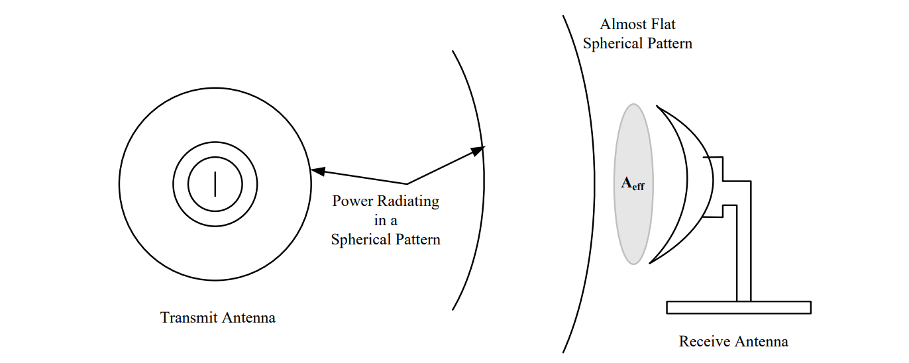
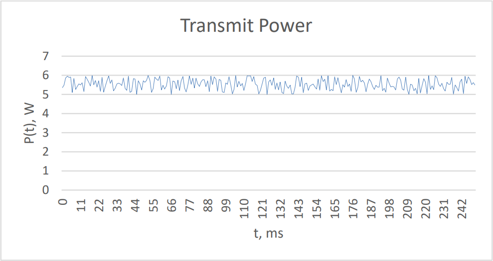
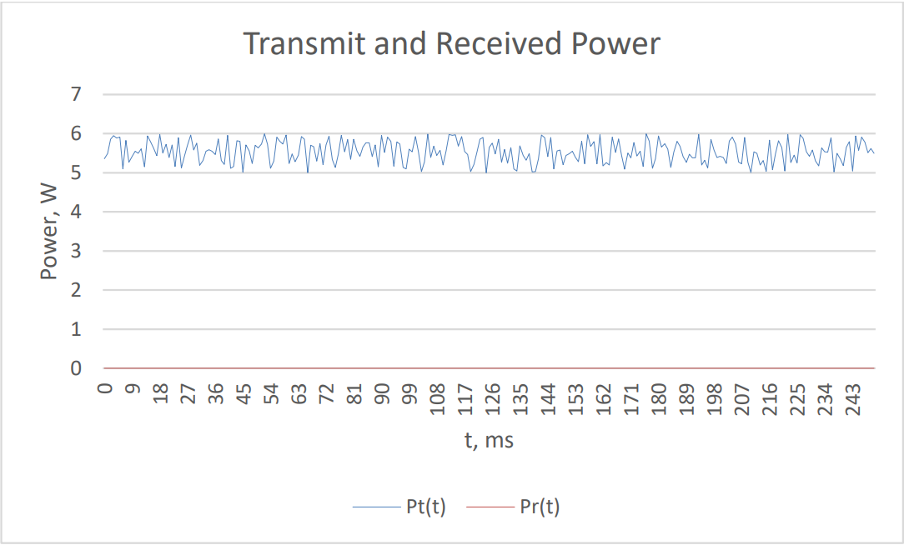
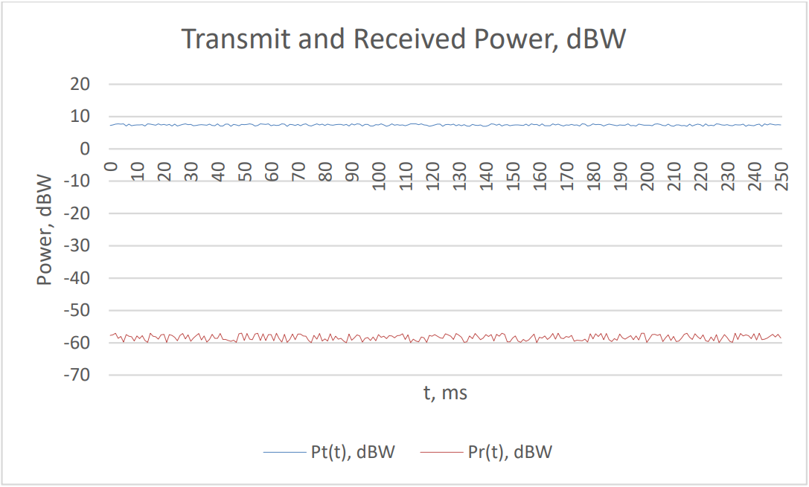

# Lesson 32 -- The Friis Equation

## Learning Outcomes

1.  Articulate the limiting factors that determine if communication
    between two locations is possible.

2.  Use the Friis and Line-of-Sight equations to calculate the maximum
    communication distance between a transmitter and receiver.

3.  Understand the concepts of signal-to-noise ratio (SNR), receiver
    bandwidth, and noise temperature.

4.  Articulate how the parameters in the Friis and SNR equations affect
    a communication system's power budget.

5.  Understand the concept of decibels.

## Friis Equation

### Introduction

Previously, we discussed the four wireless RF propagation methods. We
left off with a fairly simple equation to calculate the maximum line of
sight (bLOS) range for two communication systems. However, LOS is not
the only factor that determines whether or not those two systems can
communicate. In fact, just because two antennas are within the maximum
LOS range doesn't mean they can actually communicate. Electrical signals
attenuate (become weaker) as they propagate over a distance. If the
received signal is too weak, the receiving radio will not be able to
detect or process it. In fact, every radio has a certain threshold for
received power, or Signal-to-Noise Ratio (SNR), which must be met in
order to establish a communications link. The Friis equation provides
the means to calculate received power, given a number of attributing
factors. If the received power, or the SNR, is above the threshold,
**and** the radios are within the maximum LOS range, they can
effectively communicate.

### Friis Equation

The equation for determining how much power actually reaches the
receiving antenna is called the Friis (rhymes with Greece) equation:

$$P_{R} = \ P_{T}G_{T}G_{R}\frac{\lambda^{2}}{{(4\pi R)}^{2}}$$

where the variables are as follows:

-   *P­R­*: The power collected by the receiving antenna (in Watts)

-   *P­T­*: The power sent by the transmitting antenna (in Watts)

-   *G­T­*: The gain of the transmitting antenna (unitless)

-   *G­R­*: The gain of the receiving antenna (unitless)

-   *λ*: The wavelength of the radio signal (in meters)

-   *R*: The distance between the two antennas (in meters)

Let's look at these variables and how they affect the strength of the
signal that gets to our receiving antenna.

**Power Transmitted, *P­T­*:** The power transmitted, *P­T­*, clearly
affects received power. In fact, *P­T­* and *P­R­* are directly
proportional, so as *P­T­* increases, *P­R­* also increases.

**Distance (or Radius) between Antennas, *R*:** To understand the effect
of distance on the amount of received power, consider a point source
radiating *P­T­* Watts of power equally in all directions, which is
effectively a sphere. At any point on a sphere of radius, *R*, away from
the transmitting point source, we can define the power density, *S*, in
Watts/m^2^, as the total power radiated, *P­T­*, divided by the surface
area of the sphere, 4π*R*^2^. That is,

$$S = \frac{P_{T}}{4\pi R^{2}}$$

From this, we see the power density is proportional to
$\frac{1}{R^{2}}$. Soon, we will see the received power, *P­R­*, is
proportional to the power density. As a result, received power is
proportional to $\frac{1}{R^{2}}$.

**Gain of the Transmitting Antenna, *G­T­*:** The gain of the
transmitting antenna, *G­T­*, is its ability to focus energy in one
direction; therefore, the gain acts as a multiplier of the transmitted
power. As a result, the power density, *S*, on a sphere at a distance,
*R*, in the direction of maximum gain, for any type of antenna is:

$$S = P_{T}G_{T}\frac{1}{4\pi R^{2}}$$

where the gain, *G­T­*, is unitless. Therefore, when the receiving
antenna is placed in the direction of maximum gain, the power density
will also be maximized. We will often rely on this assumption to
determine whether two radios can communicate. Since *P­R­* is
proportional to *S*, we see *P­R­* is also proportional to *G­T­*.

**Gain of Receiving Antenna:** The receiving antenna also has a gain,
which describes how much energy it collects from the transmitted signal.
In order to see how the gain of the receiving antenna affects how much
power we receive, recall the transmitted signal propagates through free
space in the shape of a sphere. As we get farther and farther from the
transmitting antenna, the surface of the sphere starts to appear flat to
the receiving antenna -- this is called a "plane wave". This idea is
shown in the figure below, and is similar to the perception of a flat
earth due to its large radius compared to the limited surface area that
we perceive.

Figure 1: The propagation of a signal from the transmitter to receiver.
Note how the spherical wave appears nearly flat at the receiver.

The amount of power the receiving antenna can capture from free space
depends on the effective area of the antenna, *A­eff­*. Although this
can be thought of as the physical size of the antenna, they are not
quite the same, as the effective area is actually the size of the
antenna relative to the wavelength of the signal and proportional to the
inherent gain of the antenna (G­R­). As an example, parabolic antennas
have an effective area that is slightly smaller than their physical
area. The power received then is the effective area of the receiving
antenna times the power density.

$$P_{R} = SA_{eff} = P_{T}G_{T}\frac{A_{eff}}{4\pi R^{2}}$$

As discussed, the effective area of the receiving antenna is related to
the wavelength of the signal:

$$A_{eff} = \frac{\lambda^{2}}{4\pi}G_{R}$$

Substituting this equation into the one above gives us the final Friis
equation as introduced earlier,

> **Key Concept -- Friis Equation**
> 
> $$P_{R} = P_{T}G_{T}G_{R}\frac{\lambda^{2}}{(4\pi R)^{2}}$$

Here is a quick summary of how the variables affect the power received:

-   Doubling the transmitted power (P­T­), doubles the received power
    (P­R­).

-   Doubling the gain of either the transmitting or receiving antenna
    (G­T­ or G­R­) doubles the received power. If both are doubled, the
    received power quadruples.

-   Doubling the wavelength of the signal quadruples the received power!
    Doubling the wavelength is equivalent to halving the frequency.
    Although we have alluded to the fact that lower frequencies travel
    further than higher frequencies, the Friis equation is the proof.
    For example, broadcasting a lower frequency means we transmit more
    power to the receiver.

-   Doubling the distance reduces the received power (P­R­) by a fourth.
    The strength of an electromagnetic wave is inversely proportional to
    the square of the distance. This is intuitive, as the farther you
    are from a transmitter, the weaker the signal is.

When using the Friis equation, your calculator is your friend, but
because of the form of the equation, be sure to avoid the following
errors:

-   Calculating λ incorrectly. If you neglect to include the speed of
    light, your answer will be off by a factor of 90 x 10^15^.

-   Using the wrong distance. Remember that the distance is in meters,
    not kilometers. Therefore, in the problem below, R = 50,000 m.

-   Not squaring the 4 or the π in the denominator.

### Example Problem 1
A search and rescue helicopter is at 450' AGL
because of clouds, while the airman they are trying to find is on a
50-foot hill. The airman's survival radio transmits 6 W of power at
121.5 kHz, and uses an antenna with a gain of 3.0. The helicopter's
radio has a gain of 3.2 and requires a minimum ofs 50 μW of power to
receive the transmission. If the helicopter is 50 km away from the
airman, will the helicopter crew be able to hear the airman?

**Understand**: To ensure the helicopter and the airman can communicate,
they must have both LOS *[and]{.underline}* sufficient power.

**Identify Key Information:**

-   **Knowns:** We know the height of both the helicopter and airman and
    we know the specifications of each radio. Since these types of
    problems often have quite a few unknowns, it is useful to write them
    explicitly as follows:

    | Symbol               | Value                |
    |:--------------------:|:--------------------:|
    |h­helo­      | 450 feet             |
    |h­airman­    | 50 feet              |
    |f                     | 121.5 kHz            |
    |P­T­         | 6W                   |
    |P­R, min­    | 50 μW                |
    |G­T­         | 3                    |
    |G­R­         | 3.2                  |
    |R                     | 50 km                |

-   **Unknowns:** The maximum LOS range and the maximum range based on
    the minimum power. Note that we are given the *minimum* power the
    receiver needs to process the signal. Since the power is at a
    minimum far away from the transmitter, this will give us the
    *maximum* distance the two radios can communicate across.

-   **Assumptions:** The communications link relies solely on LOS and
    not any of the other means (forward scatter, ground wave, or sky
    wave). Additionally, we can assume the beams of the transmitting
    antenna and receiving antenna are aligned such that their maximum
    gains overlap.

**Plan:** There are three key steps to this problem:

-   First we must calculate the maximum LOS range, based on the heights
    of each radio. If LOS is established (i.e., the *actual* range is
    less than the LOS range), we can move on. Note, we calculate the
    line of sight in miles, but the distance is given in kilometers. We
    must therefore convert (use 1 mile = 1.61 km).

-   Then, we calculate the received power, using the Friis equation,
    based on the *actual* range.

-   Finally, we compare the received power to the minimum power that the
    receiver needs to process the signal.

**Solve**: First, we calculate the LOS of the helicopter and the airman
by:

$$r = \ \sqrt{2h_{helo}} + \sqrt{2h_{airman}} = \ \sqrt{2*450} + \ \sqrt{2*50} = \ \sqrt{900} + \ \sqrt{100} = 40\ miles$$

Converting this distance to kilometers:

$$40\ miles*\ \frac{1.61\ km}{1\ mile}\  = \ \ 64.4\ km.$$

The actual separation of 50 km is well within the 64.4 km maximum LOS
range, so LOS is established. Therefore, we can move on to solving for
power received.

Before using the Friis equation, we need to find the wavelength:

$$\lambda = \ \frac{c}{f}\  = \ \ \frac{3*10^{8}\ m/s}{121.5*10^{3}\ Hz}\  = 2.469\ km$$

Notice this is a huge wavelength, more than 1.5 miles. Now, using the
Friis equation:

$$P_{R} = \ P_{T}G_{T}G_{R}\frac{\lambda^{2}}{{(4\pi R)}^{2}}\  = (6\ W)(3)(3.2)\frac{(2469\ m)^{2}}{(4\pi*50,000\ m)^{2}} = 889\ \mu W\ $$

Since the receiver only needs 50 μW of power, the actual signal is more
than strong enough to allow the helicopter crew to hear the airman.

**Answer**: Yes, the helicopter crew will be able to hear the airman.
LOS is established and the power received is 889 μW, which is much
greater than the required 50 μW.

### Example Problem 2
Two circular parabolic dishes, each with a radius
of 250 mm, are used to send a microwave communication signal at 2.7 GHz.
Both dishes have an efficiency of 91%. If the transmit power is 1.2 kW,
how much power is received if the antennas are 120 km apart?

**Understand**: We have two parabolic antennas trying to communicate.

We need to first calculate the gain of the two antennas.

**Identify Key Information**:

-   **Knowns:** We know the following quantities:

    | Symbol                               | Value                                |
    |:------------------------------------:|:------------------------------------:|
    | Antenna 1 Radius $(r_{1})$           | 250 mm                               |
    | Antenna 1 Efficiency $(η_{1})$       | 91%                                  |
    | Antenna 2 Radius $(r_{2})$           | 250 mm                               |
    | Antenna 2 Efficiency $(η_{2})$       | 91%                                  |
    | $(P_{T})$                            | 1.2 kW                               |
    | Range $(R)$                          | 120 km                               |
    | Frequency $(f)$                      | 2.7 GHz                              |

-   **Unknowns:** We need to calculate the received power, given the
    constraints above. We also don't know the gains for the antennas.

-   **Assumptions:** The communications link relies solely on LOS and
    not any of the other means (forward scatter, ground wave, or sky
    wave). Additionally, we can assume the beams of the transmitting
    antenna and receiving antenna are aligned such that their maximum
    gains overlap. Lastly, we can assume LOS is established.

**Plan**: First, we will calculate the wavelength of the signal, then
calculate the gain of each antenna, and, finally, use the Friis equation
to calculate the received power.

**Solve**: The wavelength of the transmitted signal is

$$\lambda = \ \frac{c}{f}\  = \ \ \frac{3*10^{8}\ m/s}{2.7*10^{9}\ Hz}\  = 0.1111\ m\  = \ 111.1\ mm$$

We can now calculate the gain of each antenna:

$$G = \ \frac{{(2\pi r)}^{2}}{\lambda^{2}}*\eta\  = \ \frac{{(2\pi*.25\ m)}^{2}}{{(0.1111\ m)}^{2}}*0.91\  = \ \ 181.9$$

Since the gain is the same for both transmitting and receiving, this
gain will work for both antennas.

We can now use the Friis equation to calculate the received power.

$$P_{R} = (1.2*10^{3}\ W)(181.9)(181.9)\frac{(0.1111\ m)^{2}}{(4\pi*120,000\ m)^{2}} = 215.5\ nW\ $$

**Answer**: The receiving antenna receives 215.5 nW of power.

### Example Problem 3
A control station uses a monopole antenna on top
of a 15' tower to control an unmanned surveillance aircraft which will
be orbiting at an altitude of 3000' AGL. The station broadcasts an 800 W
control signal at a frequency of 300 MHz. The transmitting antenna has a
gain of 3.2 and the receiving antenna on the aircraft has a gain of 3.0.
If the aircraft needs a minimum of 3.3 nW of power to process the
signal, what is the maximum distance the aircraft can be controlled by
the ground station?

**Understand:** The ground control station (GCS) is broadcasting to a
UAS in the area and we need to know how far away the UAS can be and
still remain under positive control. Note, we are using the *minimum*
required power to solve for the *maximum* acceptable distance.

**Identify Key Information**:

-   **Knowns:** We know the following quantities

    | Symbol                            | Value                             |
    |:---------------------------------:|:---------------------------------:|
    | P­T­                     | 800 W                             |
    | h­UAS­                   | 3000 feet                         |
    | h­GCS­                   | 15 feet                           |
    | f                                 | 300 MHz                           |
    | G­T­                     | 3.2                               |
    | G­R­                     | 3                                 |
    | P­R,min­                 | 3.3 nW                            |

-   **Unknowns:** We don't know the maximum range or the wavelength.

-   **Assumptions:** The communications link relies solely on LOS and
    not any of the other means (forward scatter, ground wave, or sky
    wave). Additionally, we can assume the beams of the transmitting
    antenna and receiving antenna are aligned such that their maximum
    gains overlap.

**Plan:** We must solve for both maximum LOS range and the maximum range
that the antennas can still communicate with. The second part is a Friis
problem, but we need to solve for R, rather than P­R­.

**Solve**: First, we calculate the maximum LOS range:

$$r_{max,\ \ total} = \ \sqrt{2h_{station}} + \sqrt{2h_{UAS}}\  = \ \sqrt{2*15} + \ \sqrt{2*3000} = \ 82.94\ miles = 133.5\ km.$$

Now, we rearrange the Friis equation, solving for *R*:

$$\mathbf{R} = \ \frac{\lambda}{4\pi}\sqrt{\frac{P_{T}G_{T}G_{R}}{P_{R}}}$$

Then, we use the other variables to find our answer. In this case,
instead of explicitly solving for the wavelength, we can substitute
$\lambda = \ \frac{c}{f}\ $ to find:

$$\mathbf{R} = \ \ \frac{c}{4\pi f}\sqrt{\frac{P_{T}G_{T}G_{R}}{P_{R}}}$$

Now we can plug in all our numbers and solve for R:

$$\mathbf{R} = \ \ \frac{c\sqrt{P_{T}G_{T}G_{R}}}{4\pi f\sqrt{P_{R}}} = \frac{(3 \times 10^{8}\frac{m}{s})\ \sqrt{800\ W*(3.2)(3.0)}}{(4\pi)(300\ MHz)\sqrt{3.3*\ 10^{- 9}\ W}}\  = \ \ 121.4\ km$$

So, now, w have calculated two ranges: a maximum LOS range of 132.7 km
and a maximum power range of 121.4 km. The maximum range the UAS can
remain under positive control is the smaller of the two distances, or
121.4 km.

**Answer**: The maximum distance the aircraft can be controlled is 121.4
km.

### Signal-to-Noise Ratio (SNR)

Let's discuss one final topic for this lesson. Imagine yourself trying
to have a conversation with someone in a very noisy room. We can use the
signal-to-noise ratio (SNR) to describe how well the other person can
hear you:

$$SNR = \frac{signal}{noise} = \ \frac{how\ loud\ you\ are\ talking}{how\ loud\ everyone\ else\ is\ talking}$$

If the other person can understand you, then the SNR is acceptable. If
she can't hear you, the SNR is too low. In this case, you have two
options: either increase the signal (talk louder) or decrease the noise
(tell everyone else to be quiet). Either option will effectively
increase the SNR. In electrical engineering, we describe SNR in terms of
power:

$$SNR = \ \frac{P_{signal}}{P_{noise}}$$

In the above example, the noise came from everybody else talking. But,
in wireless transmissions, there are several sources of noice: jamming,
ambient noise from other signals, and thermal noise. We will discuss
jamming in the lesson on Electronic Warfare, and for our purposes, we
can assume the ambient noise is small compared to other sources.
*Thermal noise* is caused by the thermal agitation of charge carriers.

Recall that temperature is actually a measurement of the energy of
particles in a system. Inside a wireless system, this inherent particle
movement manifests as noise, and can interfere destructively as noise.
The equation to calculate the power of thermal noise is:

$$P_{noise} = k\left( T_{sys} \right)BW$$

In this equation,

-   *k* is the Boltzmann constant of 1.38 \* 10^-23^ J/K.

-   *T­sys­* is the effective noise temperature of the system in Kelvin.

-   *BW* is the bandwidth of the signal.

Since we know how to calculate the noise power, the signal-to-noise
ratio is therefore:

$$SNR = \ \frac{P_{signal}}{P_{noise}} = \ \frac{P_{R}}{k\left( T_{sys} \right)BW}$$

### Example Problem 4
A 500 mm-radius antenna receives 166.0 fW of
power. If the received signal has a bandwidth of 10 MHz and the system
has an effective temperature of 310 K, what is the signal-to-noise
ratio?

**Understand**: In this situation, we already know how much power
arrives at the reciver, but we want to know how the inherent thermal
noise of the system affects system performance. In other words, SNR
measures how hard we have to work to process the signal.

**Identify Key Information:**

-   **Knowns:** We know the received power, the radius of the antenna
    (which is irrelevant, since we already know the received power), the
    bandwidth of the signal, and the effective temperature of the
    system.

-   **Unknowns:** Signal-to-noise ratio (SNR).

-   **Assumptions:** Thermal noise is the only appreciable source of
    noise in the system. Although the effective noise temperature is 310
    K, which is equivalent to 98.3° F, this does not mean that the
    temperature of the antenna is necessarily 98.3°F. Instead, it means
    that all the energy in the system is equivalent to thermal noise at
    a temperature of 98.3°F.

**Plan:** We simply employ the SNR equation to calculate the SNR.

**Solve**: The SNR equation gives us,

$$SNR = \ \frac{P_{R}}{k\left( T_{sys} \right)BW} = \ \frac{166.0*\ 10^{- 15}W}{\left( 1.38*10^{- 23}\frac{J}{K} \right)(310\ K)(10\ MHz)} = 3.88$$

**Answer**: For the given system, the signal-to-noise ratio is 3.88,
which is very good.

### Example Problem 5
You are designing a communication system to
receive a signal with a bandwidth of 12 MHz. In order to process the
signal, your receiver requires a SNR of 3.5. Assuming the effective
noise temperature will not be higher than 320 K, what is the minimum
received power required by your system?

**Understand**: In earlier examples, we knew the minimum received power.
Now, however, we need to calculate it.

**Identify Key Information**:

-   **Knowns:** We know the required SNR, the maximum system
    temperature, and the bandwidth of the system.

-   **Unknowns:** The minimum received power required to process the
    signal.

-   **Assumptions:** Thermal noise is the only appreciable source of
    noise in the system.

**Plan:** We can rearrange the SNR equation to solve for the received
power, P­R­. Since we know the maximum system temperature and the
minimum required SNR, this gives us the worst case scenario, which is
the minimum required receive power.

**Solve**: First, we need to solve the SNR equation for P­R­:

$$P_{R} = SNR*k\left( T_{sys} \right)BW$$

$$P_{R} = \ 3.5*\left( 1.38*\frac{10^{- 23}J}{K} \right)(320\ K)*12\ MHz = \ 185.5\ fW$$

**Answer**: The minimum power required by the system is 185.5 fW.

### Decibels

While engineering often involves solving complicated mathematical
problems, it also often requires representing the results of those
problems in graphical form, to make sense of the answers. In electrical
engineering, we often deal with units that are several orders of
magnitude apart. Consider a radio link, where a radio transmits between
5W and 6W. If we graph the transmit power over time (blue line in Figure
2), it will look like this:

Figure 2: Linear graph of transmit power

The received power on the other end of the communciations link may range
between 1μW and 2μW. If we graph the received power on the same graph
(red line in following graph), it looks like this:

Figure 3: Linear graph of transmit and received power

From this graph, it is impossible to see the variation in the received
power. In fact, just by looking at this graph, we might erroneously
conclude that no power was received even though the power received is
sufficient for communications. If we want to see the variance in
received power at the same time as the variance in transmitted power, we
need to represent this data in another form.

The solution to this problem in many engineering applications is to
change to a logarithmic scale. This value is known as the Decibel. A
decibel (dB) is a logarithmic representation of a *power ratio*[^1]. If
we have a ratio of powers, which is can be expressed as a gain
$\left( G = \frac{P_{out}}{P_{in}} \right)$, we can convert that ratio
to a dB value using the following equation:

$$G_{dB} = 10\ \log_{10}(G)$$

Returning to the radio example above, you might notice that neither the
received power nor the transmitted power are ratios. This begs the
question of how we can convert such "absolute" quantities to dB. For
values that are not ratios, we can still use dB, but we need to
establish a reference power. For power, that reference is usually 1W.
So, we can represent the transmit power as a dB referenced to a Watt, or
a dBW. Sometimes, when dealing with lower powers, we will use 1mW as our
reference and the units will be in dBm. To show the applicability, let's
convert the transmitted and received powers above to dBW, which will
make the variability in the transmitted and received powers much
clearer.

Figure 4: Logarithmic graph of transmit and received power

[^1]: In other classes, you may see dB used for voltage ratios, and the
    equation will be slightly different. In order to avoid confusion in
    this class, we will only use power ratios because this is the strict
    definition of dB.
