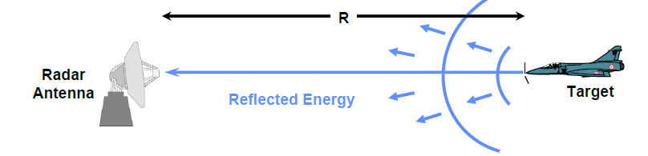

# Objective 3.6

| LO# | Description |
|----------|----------|
| 3.6 | I can calculate the distance from a monostatic radar to a stationary target based on pulse timing, assuming a direct line-of-sight path. |

## Radio Ranging Introduction

The fundamental principles of RADAR are fairly straightforward -- the
system sends energy out into the world and measures what comes back.
Based on the *returns* from the transmitted signal, the RADAR identifies
where objects are and how far away they are. Additionally, RADAR is an
acronym, standing for **RA**dio **D**etection **A**nd **R**anging.
Simply put, with RADAR we use radio signals to tell if anything is there
(detection) and to tell how far away it is when we find something
(ranging). Modern RADARs have many more capabilities that fall outside the scope of this course, but you'll likely see it in your career (or in your higher level courses if you major in ECE).

## RADAR Range to Target

Calculating the range to a target is a fairly straightforward matter and
uses basic physics principles. Since we know that electromagnetic waves
travel at the speed of light, the amount of time between sending an
energy pulse and receiving its echo is all we need to determine the
range to the target. Note that this assumes your target it unmoving and your radar transmitter and receiver are colocated.

Figure 1: A basic RADAR scenario.

Therefore, if *t* is the elapsed round-trip time for the signal to
travel to the target, reflect from it, and then return to the RADAR
receiver, then the range to the target is:

$$R = \frac{c\Delta t}{2}$$

where *c* is the speed of light. The factor of two in the denominator
converts the round-trip time into a one-way time between the RADAR and
the target.

### Example Problem
A RADAR signal returns 573.4 μs after being
transmitted. How far away is the detected object?

**Understand**: RADAR signals travel at the speed of light, and we can
determine how far they've travelled based on how long it takes them to
make the round trip. It is important to remember RADAR involves a
two-way trip.

**Identify Key Information**:

-   **Knowns:** The signal's round trip time.

-   **Unknowns:** distance to the target.

-   **Assumptions:** We are receiving the signal directly reflected from
    the target and not one that has bounced around off of other objects.

**Plan**: We will calculate how far the signal travelled and then divide
by two for the two-way trip.

**Solve:**

$$R = \frac{c\Delta t}{2} = \frac{\left( 3\ x\ 10^{8}\ m/s \right)\left( 573.4\ x\ 10^{- 6}\ s \right)}{2} = 86\ km$$

**Answer**: The object is 86 km away.

